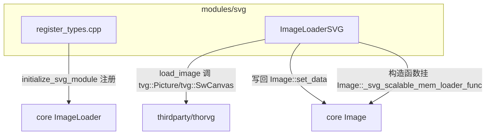
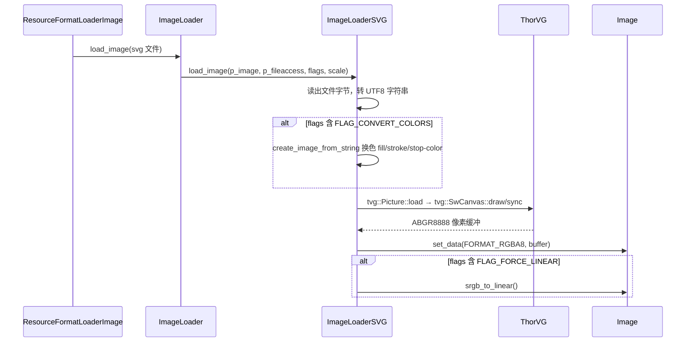

# svg（modules）

> 一句话：它是「SVG 图片格式的接线员」——不自己画矢量图，只把 ThorVG 第三方库接进 Godot 的 `Image` 加载体系。

**结论**：`svg` 模块是一个**薄封装**，只做一件事：把 ThorVG 库包装成 Godot 的一个 `ImageFormatLoader`（`ImageLoaderSVG`），让引擎能像读 PNG 一样把 `.svg` 文件光栅化成 `Image`。它为「运行时按任意倍率重新渲染 SVG」提供钩子，代价是引入约 50 个第三方 `.cpp` 的编译量（`modules/svg/SCsub:14-56`）。

## 是什么 / 不是什么

- **是**：一张「接线板」——对接第三方 ThorVG 库和 Godot 核心 `ImageLoader` 体系。
- **不是**：SVG 解析器本身。真正的 XML 解析、路径构建、软件光栅化全在 `thirdparty/thorvg/` 里，本模块一行都不碰。
- **不是**：编辑器专用的图标加载器。它同时服务于编辑器（图标变色）和运行时（任意倍率缩放），两者共用同一条加载链路。

## 在引擎里的位置

- 依赖第三方 `thorvg`（`image_loader_svg.cpp:35`），以及核心 `Image` / `ImageLoader` / `FileAccess`。
- 被核心的 `Image::load_svg_from_buffer`（`core/io/image.cpp:4481`）反向依赖：它调用的正是本模块在构造函数里挂上的 `_svg_scalable_mem_loader_func` 钩子（`image_loader_svg.cpp:187`）。

## 关键概念

- **图像格式加载器（`ImageFormatLoader`）**：Godot 核心里「一个格式一个 loader」的抽象基类（`core/io/image_loader.h:42`）。本模块的 `ImageLoaderSVG` 继承它，并实现两个纯虚函数 `load_image` / `get_recognized_extensions`（`image_loader_svg.h:50-51`）。
- **注册表（`ImageLoader`）**：所有 loader 挂载的静态清单 `ImageLoader::loader`（`core/io/image_loader.h:86`）。`add_image_format_loader` / `remove_image_format_loader`（`core/io/image_loader.h:95-96`）负责插拔。
- **可缩放内存加载函数（`ScalableImageMemLoadFunc`）**：核心 `Image` 里的一个函数指针，签名带 `p_scale` 倍率（`core/io/image.h:53`）。`ImageLoaderSVG` 构造函数把自己塞进去，让 `Image::load_svg_from_buffer` 能在运行时按任意倍率重光栅化（`image_loader_svg.cpp:187`）。
- **强制换色表（`forced_color_map`）**：一张 `HashMap<Color, Color>`，把 SVG 里的 `fill`/`stroke`/`stop-color` 颜色替换成主题色，用于编辑器图标跟随主题换肤（`image_loader_svg.h:36`、`image_loader_svg.cpp:39`）。

## 核心文件（按阅读顺序）

1. `modules/svg/register_types.cpp` — 模块入口：在 `SCENE` 初始化级初始化 ThorVG、实例化 loader、挂进 `ImageLoader`（71 行）。
2. `modules/svg/register_types.h` — 只声明 `initialize_svg_module` / `uninitialize_svg_module` 两个函数。
3. `modules/svg/image_loader_svg.h` — `ImageLoaderSVG` 类的公共接口：静态工具函数 + 两个虚函数覆写。
4. `modules/svg/image_loader_svg.cpp` — 全部胶水实现：调 ThorVG 光栅化、换色、读文件。
5. `modules/svg/SCsub` — 编译脚本：编第三方 thorvg 源 + 本模块 `*.cpp`，按需加 jpg/webp 嵌入支持。
6. `modules/svg/config.py` — 声明本模块依赖 `jpg`、`webp` 模块（`config.py:2`）。

## 数据流 / 调用链

一次典型的「读 `.svg` 文件 → 得到 `Image`」：

- 换色入口在 `load_image`（`image_loader_svg.cpp:168`）→ `create_image_from_string`（`image_loader_svg.cpp:140`）→ `_replace_color_property`（`image_loader_svg.cpp:43`）。
- ThorVG 光栅化主流程在 `create_image_from_utf8_buffer`（`image_loader_svg.cpp:79-134`）：`gen` → `load` → `size` → `target` → `add` → `draw` → `sync` → `set_data`。
- 运行时按倍率重绘走另一条路：`Image::load_svg_from_buffer`（`core/io/image.cpp:4481`）直接调用挂载好的 `_svg_scalable_mem_loader_func`（即 `load_mem_svg`），不经过文件 loader。

## 中文口诀

- 接线板模块，不画图，只把 ThorVG 接进 ImageLoader。
- 一个类 `ImageLoaderSVG`，两个虚函数：`load_image`、`get_recognized_extensions`。
- 构造函数挂钩子，`Image` 里留指针，运行时按倍率重光栅化。
- 换色靠 `forced_color_map`，图标跟着主题走。
- `fill`、`stroke`、`stop-color`，三个属性挨个替换。

## 练习（15 分钟）

1. 打开 `modules/svg/register_types.cpp`，找到 `MODULE_INITIALIZATION_LEVEL_SCENE` 判断，确认 loader 只在哪个初始化级注册。
2. 在 `image_loader_svg.cpp` 里找到 `create_image_from_utf8_buffer`，数一数 ThorVG 的 `tvg::SwCanvas` 一共被调了几个方法（`gen`/`target`/`add`/`draw`/`sync`）。
3. 打开 `core/io/image.cpp:4481` 的 `load_svg_from_buffer`，对比它和文件 loader 走的路径有什么不同。
4. 在 `image_loader_svg.cpp` 里找 `_replace_color_property`，写出 `fill="#5abbef"` 这条字符串在换色后变成什么样。

## 自测

- [ ] `ImageLoaderSVG::get_recognized_extensions` 里 push 的扩展名字符串是什么？（`image_loader_svg.cpp:153`）
- [ ] 为什么 `load_image` 里要先 `append_utf8` 再走 `create_image_from_string`，而不是直接吃字节缓冲？
- [ ] `forced_color_map` 换色时跳过 `none` 和 `url(...)` 两种值，为什么？（`image_loader_svg.cpp:58`）
- [ ] `Image::_svg_scalable_mem_loader_func` 默认值是 `nullptr`，那 Godot 在没有 svg 模块时调用 `load_svg_from_buffer` 会发生什么？（`core/io/image.cpp:4482-4485`）

## 一句话总结

> `svg` 是 ThorVG 与 Godot `Image` 加载体系之间的一张薄接线板：用 `ImageLoaderSVG` 这一个类，把 `.svg` 的解析与光栅化外包给第三方库，再通过 `ImageFormatLoader` 注册和 `_svg_scalable_mem_loader_func` 钩子，让 SVG 既能当普通图片加载，也能在运行时按任意倍率重绘。
