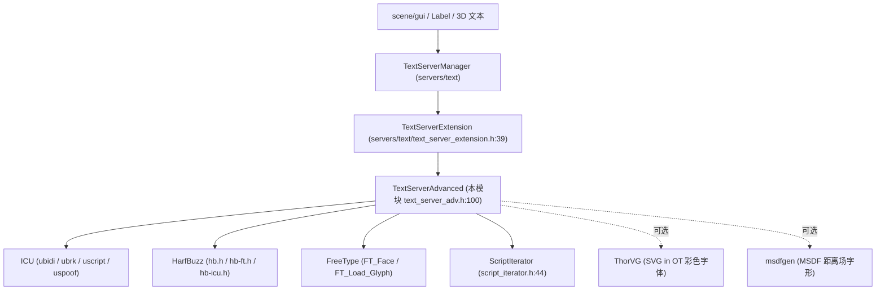
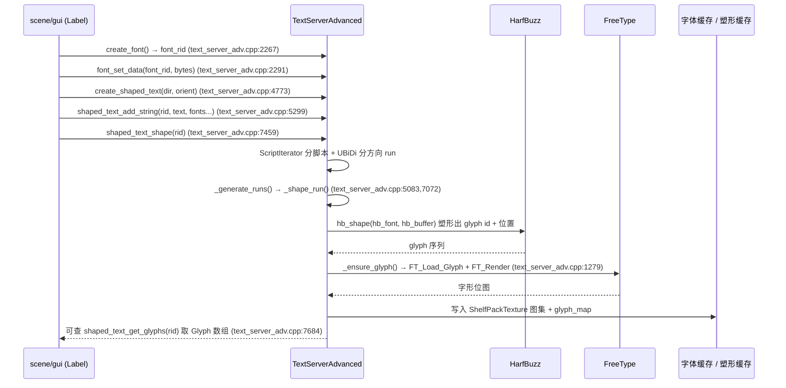

# text_server_adv（modules）

> 一句话：Godot 的「高级字体排版引擎」——把一串 Unicode 字符交给 ICU（断词/双向排版）和 HarfBuzz（塑形）拆成按顺序排好的字形，再让 FreeType 把每个字形画进纹理图集里缓存起来，供渲染层直接贴图。

**结论**：`text_server_adv` 是 Godot 默认的、功能最全的 `TextServer` 后端，为所有 UI 与 3D 文本提供「塑形（shaping）→ 栅格化（rasterization）→ 缓存（caching）」这条主线；它借 ICU + HarfBuzz + FreeType 三个 C 库干活，代价是编译慢、二进制大（SCsub 里单 ICU 静态库就列了约 270 个源文件）。

## 是什么 / 不是什么

- **是**：`TextServer` 契约的一个实现，注册成引擎唯一的「高级」文本服务器（`TextServerAdvanced`，`text_server_adv.h:100`）。它负责把字符串变成排好版、能画到纹理上的字形序列。
- **不是**：它不负责把字形画到屏幕——那是 `servers/rendering` 的事；它只产出 `Glyph` 数组和纹理图集（`font_owner` 里的 `ShelfPackTexture`）。它也不解析字体文件格式本身，解析交给 FreeType。
- **不是**：它不管「哪个字体被选中显示」，只管「给定字体后怎么塑形和画」。字体回退选择是它内部的 `FontPriorityList`（`text_server_adv.h:692`）干的，但字体资源的管理在 `servers/text` 与 `scene/resources` 层。

## 在引擎里的位置

注册发生在 `initialize_text_server_adv_module`（`register_types.cpp:37`）：只在 `MODULE_INITIALIZATION_LEVEL_SERVERS` 阶段执行，`GDREGISTER_CLASS(TextServerAdvanced)` 后 `new` 一个实例塞进 `TextServerManager::get_singleton()->add_interface(ts)`（`register_types.cpp:42-48`）。

## 关键概念

- **塑形（shaping）**：像「给一段歌词排和弦」——把一串字符按语言/书写方向拆成 run，再决定每个字符该用哪个字形（glyph）和放哪儿。术语上叫 text shaping，落点是 `_shape_run`（`text_server_adv.cpp:7072`）与 HarfBuzz 的 `hb_buffer_t`。
- **双向文本（BiDi）**：像「把一列左右穿插的队伍重新排队」——阿拉伯语/希伯来语从右往左写，但数字和拉丁文又从左往右。用 ICU 的 `UBiDi` 切出方向一致的 run（`_shaped_text_shape` 里 `ubidi_countRuns`，`text_server_adv.cpp:7573`）。
- **字形栅格化（rasterization）**：像「把矢量轮廓用像素点亮」——FreeType 的 `FT_Load_Glyph` + `FT_Render_Mode` 把轮廓渲染成位图，写进图集（`_ensure_glyph`，`text_server_adv.cpp:1279`）。
- **缓存（cache）**：像「把烤好的饼干按尺寸分格装盒」——`FontAdvanced`（一份字体）→ `FontForSizeAdvanced`（某个字号，`text_server_adv.h:238`）→ `glyph_map` 存字形位图 + `textures` 存图集；塑形结果也缓存进 `ShapedTextDataAdvanced` 的 `glyphs`（`text_server_adv.h:480`），用 `SafeFlag valid` 标记是否已塑形。
- **脚本迭代（script iteration）**：像「按语种把句子切段」——`ScriptIterator`（`script_iterator.h:44`）把整串文本按 Unicode 脚本（拉丁/阿拉伯/天城文…）和 emoji 切成 `ScriptRange`，再决定每段交给哪个 shaper。

## 核心文件（按阅读顺序）

1. `modules/text_server_adv/register_types.cpp` — 模块入口，注册 `TextServerAdvanced` 到 `TextServerManager`。
2. `modules/text_server_adv/text_server_adv.h` — 整个类声明（1143 行）：三个核心数据结构和全部 `MODBIND` 接口。
3. `modules/text_server_adv/text_server_adv.cpp` — 实现（8456 行），塑形/栅格化/缓存全在这里。
4. `modules/text_server_adv/script_iterator.h/.cpp` — 按 Unicode 脚本切分文本的小工具。
5. `modules/text_server_adv/SCsub` — 编译脚本，把 HarfBuzz/ICU/Graphite 编成第三方静态库再链进来。
6. `modules/text_server_adv/thorvg_svg_in_ot.h/.cpp` — 用 ThorVG 渲染 OpenType 里的 SVG 彩色字形（可选）。

## 数据流 / 调用链

## 中文口诀

- 一行文字三道关：塑形、画图、进缓存。
- ICU 管方向，HarfBuzz 管形状，FreeType 管上墨。
- 字符进 `hb_buffer`，字形出 `Glyph` 表。
- 一份字体一份号，`FontForSizeAdvanced` 记住每个字。
- 图集里塞满字，渲染只贴不重画。

## 练习（15 分钟）

1. 打开 `text_server_adv.cpp:7459`，顺着 `_shaped_text_shape` 往下读 30 行，找出它在哪一行调用 ICU 的 `ubidi_setPara` 切方向。
2. 跳到 `_shape_run`（`text_server_adv.cpp:7072`），找到塑形失败时「换回退字体重试」的那行递归调用，确认它的 `p_fb_index + 1` 含义。
3. 打开 `text_server_adv.h:238`，画出 `FontAdvanced` → `FontForSizeAdvanced` → `glyph_map`/`textures` 三级缓存的关系，数一数一个字号对应几张图集纹理。

## 自测

- [ ] `_ensure_glyph` 里，当 `glyph_index == 0` 时为什么直接返回而不渲染？（读 `text_server_adv.cpp:1305`）
- [ ] 塑形结果缓存在哪个结构、用哪个字段标记「已塑形」？（读 `text_server_adv.h:480-526`）
- [ ] `TextServerAdvanced` 的基类链是什么？契约方法 `create_font`/`shaped_text_shape` 在哪个头文件里声明为纯虚？（读 `text_server_adv.h:100` 与 `servers/text/text_server.h:273,531`）

## 一句话总结

> `text_server_adv` 是 Godot 默认的完整 `TextServer` 实现：ICU 断句定方向、HarfBuzz 塑形、FreeType 栅格化、自建图集缓存，把「字符串」变成「可贴图渲染的字形序列」。
