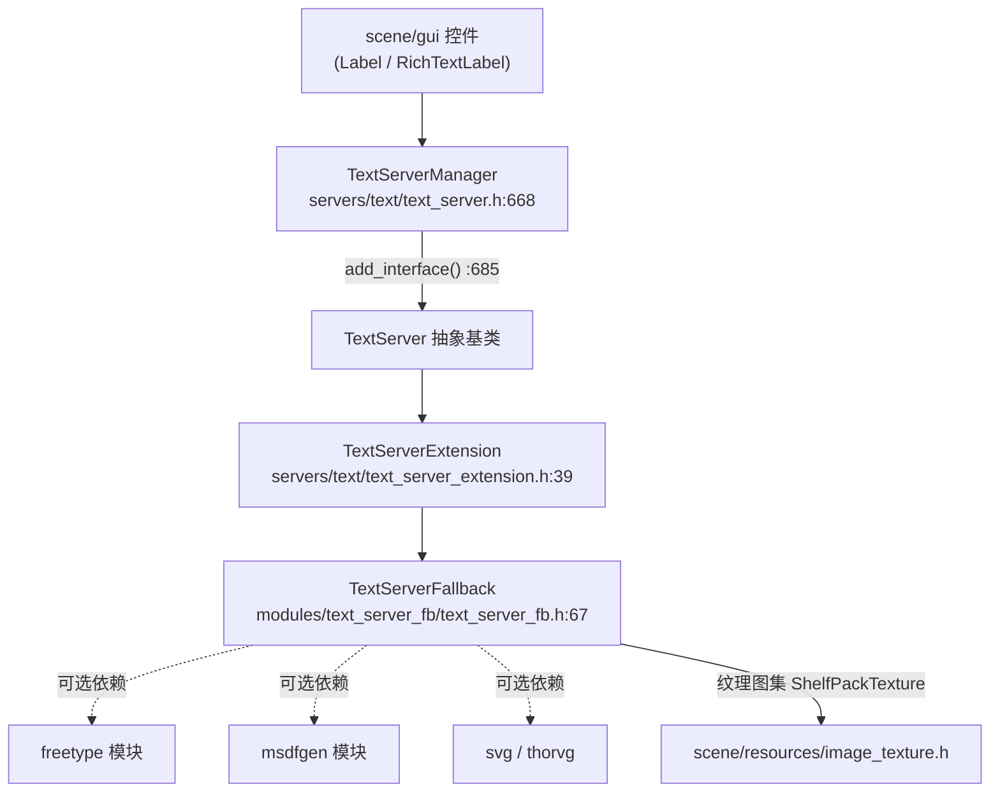
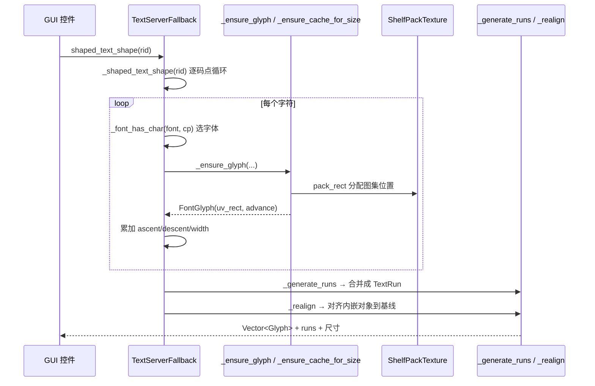

# text_server_fb（modules）

> 一句话：这是上帝文本引擎的「备用轮胎」——不装 FreeType 时，用一套从简的「逐字排队 + 位图贴图」逻辑，把 `TextServer` 契约兜住，保证文字照样能画出来。

**结论**：`TextServerFallback` 是一个实现完整 `TextServer` 契约、但主动砍掉 BiDi 与复杂塑形的兜底文本后端；它换来的代价是「处理海量文本更快、体积更小」，代价是「阿拉伯文/印地文这类双向或连字文字排版不正确」。

## 是什么 / 不是什么

`TextServerFallback` 干的是「把 Unicode 字符串变成一堆带位置、带字体、带纹理坐标的字形（Glyph）」，供上层 GUI / 场景节点绘制。它的特殊之处是**不做真正的塑形（shaping）**：

- 它支持 **简单布局**（`FEATURE_SIMPLE_LAYOUT`）与**位图字体**（`FEATURE_FONT_BITMAP`），见 `modules/text_server_fb/text_server_fb.cpp:71-86`。
- 它**不**支持双向文本（BiDi，`FEATURE_BIDI_LAYOUT`）、复杂塑形（`FEATURE_SHAPING`）、竖排（`FEATURE_VERTICAL_LAYOUT`）——这些交给 `modules/text_server_adv` 的 `TextServerAdvanced` 去管，本模块不碰。
- 它**不**自带字体解析器：动态字体（`FEATURE_FONT_DYNAMIC`）只在编译进 `freetype` 模块时才有；MSDF 字体（`FEATURE_FONT_MSDF`）只在编译进 `msdfgen` 时才有，见 `modules/text_server_fb/text_server_fb.cpp:92-102`。

一句话区分：`TextServerAdvanced` 追求「正确」，`TextServerFallback` 追求「够用 + 快」。头文件自己写的定位是 *"without BiDi, shaping and advanced font features support"*（`modules/text_server_fb/text_server_fb.h:34`）。

## 在引擎里的位置



说明：`TextServerFallback` 继承 `TextServerExtension`（而它继承 `TextServer`），在模块初始化时把自己注册进 `TextServerManager`，供上层按名字取用。`freetype` / `msdfgen` / `svg` 三个依赖都是**可选**的（`modules/text_server_fb/config.py:2`），没有也能编译。

## 关键概念

1. **逐字塑形（simple layout）**：比喻「不会连笔的排字工」——每个码点直接当成一个字形，不合并连字、不调换双向顺序。术语上对应 `_shaped_text_shape`（`modules/text_server_fb/text_server_fb.cpp:4880`），核心逻辑是一段 `for` 循环把 `sd->text[j]` 的码点原样赋给 `gl.index`（`:4955`）。

2. **纹理图集打包（ShelfPackTexture）**：比喻「把散件塞进固定尺寸的行李箱，一层层码放」。结构体 `ShelfPackTexture` 默认 1024×1024，用 `pack_rect` 做 shelf（货架）式分配（`modules/text_server_fb/text_server_fb.h:119-167`），把栅格化好的字形位图贴到一张大图上。

3. **字形缓存（FontGlyph / FontForSizeFallback）**：比喻「已经排版好的铅字盒，下次直接取」。`FontGlyph` 记录字形落在哪张纹理、UV 矩形与 advance（`modules/text_server_fb/text_server_fb.h:169-176`）；按字号缓存进 `FontForSizeFallback::glyph_map`。

4. **run 分段（TextRun）**：比喻「排版时把字体/字号相同的相邻字归成一段」。`_generate_runs` 扫描字形序列，把 `font_rid`、`font_size`、`span_index` 三者都相同的连续字形压成一条 `TextRun`（`modules/text_server_fb/text_server_fb.cpp:3659-3677`）。

5. **系统字体兜底（_find_sys_font_for_text）**：比喻「字库里没这个字，就去操作系统借一个」。当 span 里的字体都不含某字符且允许系统回退时，调用 `_find_sys_font_for_text` 从系统字体找（`modules/text_server_fb/text_server_fb.cpp:4975-4981`）。

## 核心文件（按阅读顺序）

1. `modules/text_server_fb/config.py` — 声明模块默认关闭（`is_enabled()` 返回 False），并登记可选依赖与文档类名。
2. `modules/text_server_fb/register_types.cpp` — 入口：注册 `TextServerFallback` 并塞进 `TextServerManager`。
3. `modules/text_server_fb/text_server_fb.h` — 类声明：全部内部缓存结构 + 契约方法列表。
4. `modules/text_server_fb/text_server_fb.cpp` — 实现（约 5400 行）：塑形、栅格化、图集打包、run 分段。
5. `modules/text_server_fb/thorvg_svg_in_ot.h/.cpp` — 可选：用 thorvg 渲染 OpenType 内嵌 SVG 字形。

## 数据流 / 调用链



真正的「塑形」只有三步：**逐码点定字形 → 栅格化进图集 → 合并 run 算尺寸**。没有复杂 text shaping 引擎、没有双向重排，这就是它快的根本原因。

## 中文口诀

```
逐字排队不连笔，码点原样当字形；
图集货架层层码，字形贴进大方箱；
字体字号分好段，run 一合并好绘制；
系统借字来兜底，够用就够不上双。
```

## 练习（15 分钟）

1. 打开 `modules/text_server_fb/text_server_fb.cpp:71`，读 `_has_feature`，列出这个后端**声明支持**和**声明不支持**的 Feature 各 3 个。
2. 找到 `_shaped_text_shape`（`:4880`）里的主 `for` 循环，指出「一个码点 = 一个 Glyph」对应的是哪一行赋值。
3. 在 `text_server_fb.h:119` 找到 `ShelfPackTexture`，说明 `pack_rect` 里 `best_waste` 的作用。
4. 在 `config.py` 找到把模块开启的编译开关名，试着推演「只开 `module_text_server_fb_enabled=yes`、关掉 freetype」会发生什么。

## 自测

- [ ] 为什么 `_is_locale_right_to_left` 恒返回 `false`？（线索：`text_server_fb.cpp:168-170`）
- [ ] `_bind_methods()` 为什么是空的？（线索：`text_server_fb.h:564-565`）
- [ ] `FEATURE_FONT_DYNAMIC` 在什么编译条件下才会被置入 `_get_features()` 的返回值？

## 一句话总结

> `TextServerFallback` 用「无 BiDi、无复杂塑形」换「更快更小」，靠逐码点排版 + 纹理图集 + run 分段，把 `TextServer` 契约在最简陋的条件下兜底成可用的文字渲染。
