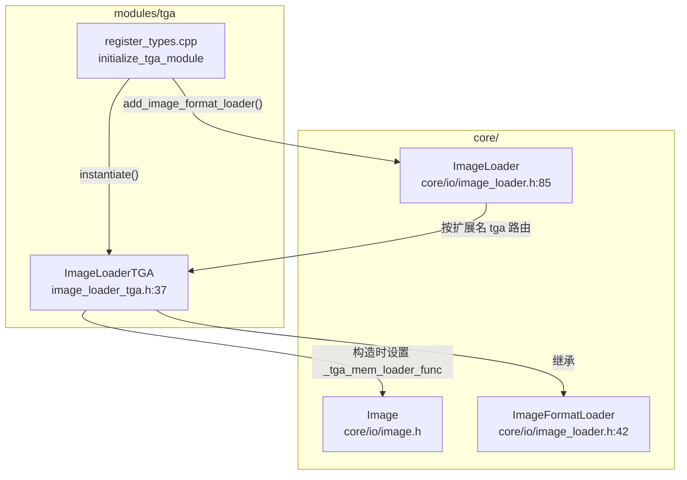
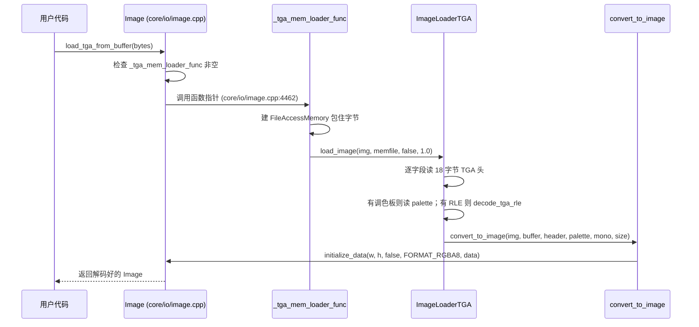

# tga（modules）

> 一句话：TGA 模块是 Godot 里那个「只会读、不会写」的图片翻译官——它把 TGA 图片文件翻译成引擎统一的 `Image`，但从来不负责把 `Image` 再存回 `.tga` 文件。

**结论**：tga 模块向 `ImageLoader` 注册了一个 `ImageFormatLoader` 子类 `ImageLoaderTGA`，让引擎能通过扩展名 `tga` 自动识别并解码 TGA 文件（含 RLE 压缩、调色板、16/24/32 位等变体）；它只做加载、不做保存，代价是 TGA 永远只能单向读入。

## 是什么 / 不是什么

**是什么**：一个图片格式 loader。它把 TGA 文件的二进制字节流，转成 Godot 统一像素格式 `Image::FORMAT_RGBA8` 的 `Image` 对象。

**不是什么**：
- 不是图片 **saver**：整个模块没有 `save_image` 之类的函数，`get_recognized_extensions` 只报 `tga` 用于识别，引擎存图时不会选中它。对比同层的 `png` 模块既读又写。
- 不是像素处理库：解码完就收手，后续缩放、格式转换交给 `Image` 自己（`convert_to_image` 里最后一步只是 `p_image->initialize_data`）。
- 不碰第三方库：目录里没有 `thirdparty/`，TGA 解码逻辑是引擎自带的纯 C++ 实现（约 380 行的 `image_loader_tga.cpp`）。

## 在引擎里的位置

模块只依赖 `core/io/image_loader.h` 和 `core/io/image.h`，向上没有任何模块依赖它——它是最底层的「格式插件」。

## 关键概念

- **格式 loader 插件**：像给餐厅增加一个「会做某道菜」的厨师，`ImageFormatLoader`（`core/io/image_loader.h:42`）是厨师执照，`ImageLoaderTGA` 是那位 TGA 厨师，注册进 `ImageLoader` 的名单（`core/io/image_loader.h:86` 的 `loader` 向量）后即可上岗。
- **RLE 解码**：TGA 的行程压缩——用「n 个相同像素」代替逐像素存储。`decode_tga_rle`（`image_loader_tga.cpp:37`）负责把压缩流展开成原始像素流，每次读一个控制字节，高位置 1 表示「重复填充」，否则是「直接拷贝」。
- **头解析 + 像素搬运**：`load_image`（`image_loader_tga.cpp:253`）先按 TGA 文件头字段逐个 `get_8/get_16` 读出宽高、位深、图像类型，再交给 `convert_to_image`（`image_loader_tga.cpp:91`）按 8/16/24/32 位四种位深把像素抄进 RGBA8 缓冲。
- **内存 loader 函数指针**：`Image::_tga_mem_loader_func`（`core/io/image.h:223`）是引擎给「从字节数组直接解码」预留的钩子，模块在构造函数里把本地函数 `_tga_mem_loader_func` 挂上去（`image_loader_tga.cpp:380`），于是 `Image::load_tga_from_buffer` 才能工作。

## 核心文件（按阅读顺序）

1. `modules/tga/config.py` — SCons 配置：`can_build` 恒返回 `True`，模块无条件可编译。
2. `modules/tga/SCsub` — 构建脚本，一行 `add_source_files(..., "*.cpp")` 收集全部 `.cpp`。
3. `modules/tga/register_types.h` — 声明 `initialize_tga_module` / `uninitialize_tga_module` 两个入口。
4. `modules/tga/register_types.cpp` — 入口实现：在 `MODULE_INITIALIZATION_LEVEL_SCENE` 级别实例化 loader 并注册到 `ImageLoader`。
5. `modules/tga/image_loader_tga.h` — 定义 `ImageLoaderTGA`、`tga_header_s` 头结构、图像类型/原点枚举，声明三个函数。
6. `modules/tga/image_loader_tga.cpp` — 全部解码逻辑：`decode_tga_rle`、`convert_to_image`、`load_image`、`get_recognized_extensions`、构造函数。

## 数据流 / 调用链

以「用户代码调用 `Image::load_tga_from_buffer`」为例：

`ImageLoader` 的路径（通过 `Image.load(path)` 触发）则省略了 memfile 包装：`ImageLoader::recognize("tga")` 命中 `ImageLoaderTGA` 后，直接把 `FileAccess` 交给 `load_image`。

## 中文口诀

TGA 模块真简单，一个 loader 单相传；
注册挂到 ImageLoader，扩展名只认 tga 三字。
RLE 解压先展开，高位置一是重复；
四种位深分路走，最后统一 RGBA8。
只读不写是底线，存盘别找它来干。

## 练习（15 分钟）

1. 打开 `modules/tga/image_loader_tga.cpp`，在 `decode_tga_rle` 里找出「重复填充」分支（`c & 0x80`）和「直接拷贝」分支（`else`），各数一行注释给自己听。
2. 在 `convert_to_image` 里定位 16 位像素的分支，验证它把 RGBA5551 展开成 `r/g/b/a` 四个字节的移位运算。
3. 读 `register_types.cpp` 的 `initialize_tga_module`，确认注册发生在哪个 `ModuleInitializationLevel`，并说明为什么这个 loader 只能出现在该级别之后。

## 自测

- [ ] `ImageLoaderTGA::get_recognized_extensions` 返回了几个扩展名？分别是什么？
- [ ] `decode_tga_rle` 里控制字节 `0x83` 表示什么？（提示：看 `count = (c & 0x7f) + 1` 和 `c & 0x80`）
- [ ] 为什么说这个模块「只读不写」？在源码里找一条证据。

## 一句话总结

> tga 模块是 Godot 内置的 TGA 只读格式插件：一个 `ImageLoaderTGA` 子类 + 一次 `ImageLoader` 注册 + 一个内存钩子函数，就把 TGA 文件翻译成了引擎统一的 `Image`。
