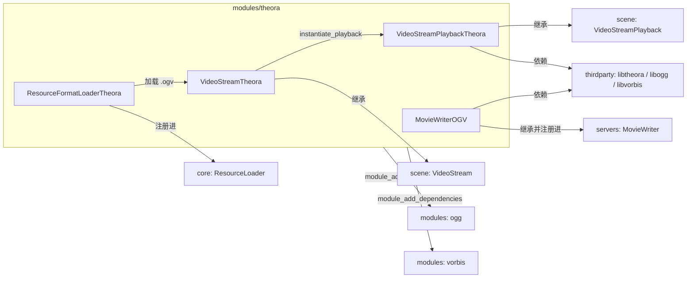
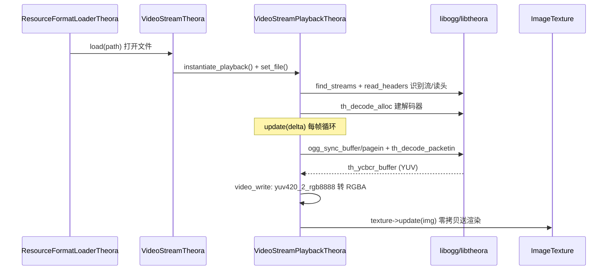
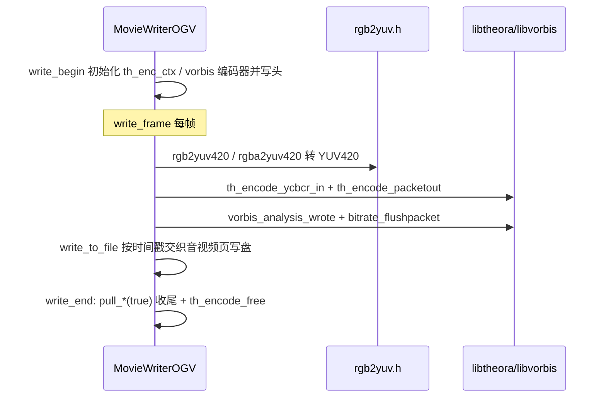

# theora（modules）

> 一句话：theora 是 Godot 的 OGV 视频「进出两扇门」——读进来是 `VideoStreamTheora` 解码播放，写出去是 `MovieWriterOGV` 编码录屏，中间都靠 libtheora 干活，Godot 只负责对接（胶水层）。

**结论**：theora 模块给引擎提供 `.ogv`（Ogg Theora 容器）视频的**解码播放**（`VideoStreamTheora`）和**录制写出**（`MovieWriterOGV`），为 `VideoStream`/`MovieWriter` 两个框架服务；代价是 Theora 纯 CPU 解码、画质与码率偏老，且编码器只在编辑器构建里编译。

## 是什么 / 不是什么

theora 只做「把 Theora 编解码库接到 Godot 的资源和写出器框架上」，一共 10 个源文件，注册了 4 个类。

- **负责**：`.ogv` 的识别加载（`ResourceFormatLoaderTheora`）、逐帧解码 + 音画同步（`VideoStreamPlaybackTheora`）、RGB→YUV 转换后编码写出（`MovieWriterOGV`）。
- **不负责**：Theora/Vorbis 真正的压缩算法——那是 `thirdparty/libtheora`、`thirdparty/libogg`、`thirdparty/libvorbis` 的事；`.ogg` 音频容器的加载交给相邻的 `ogg` 模块；音频混合与扬声器配置交给 `servers/audio`。

一句话分清：**编码/解码算法在 thirdparty，Godot 侧只有「喂数据、收帧、换格式」的胶水。**

## 在引擎里的位置



依赖关系钉在 `config.py:1-5`：`can_build` 里 `module_add_dependencies("theora", ["ogg", "vorbis"])`，且 RISC-V 架构（`arch` 以 `rv` 开头）直接返回 `False` 不可构建。

## 关键概念

1. **资源**（`VideoStreamTheora`）——用户拿在手里的「视频对象」，本身不解码，只存 `file` 路径和 `audio_track`，靠 `instantiate_playback()` 现场造一个播放器（`video_stream_theora.h:156`）。
2. **播放器**（`VideoStreamPlaybackTheora`）——真正的解码器，持有一堆 libogg/libtheora 状态（`ogg_sync_state oy`、`th_dec_ctx *td` 等），`update()` 里逐帧解出图像塞进 `ImageTexture`（`video_stream_theora.h:43`）。
3. **加载器**（`ResourceFormatLoaderTheora`）——用 `GDSOFTCLASS` 软注册，识别 `.ogv` 后缀、把文件包装成 `VideoStreamTheora`（`video_stream_theora.h:175`）。
4. **写出器**（`MovieWriterOGV`）——编辑器录屏（`--write-movie`）时把 RGB 帧转 YUV 后喂给 Theora 编码器，与 Vorbis 音频交织成 `.ogv`（`editor/movie_writer_ogv.h:40`）。
5. **两级初始化**（`initialize_theora_module`）——`SERVERS` 级注册写出器、`SCENE` 级注册加载器和 `VideoStreamTheora`，卸载时按相反顺序回收（`register_types.cpp:47-85`）。

## 核心文件（按阅读顺序）

1. `register_types.cpp` / `register_types.h` — 模块入口，两级初始化：SERVERS 级 `MovieWriter::add_writer(writer_ogv)`，SCENE 级 `ResourceLoader::add_resource_format_loader` + `GDREGISTER_CLASS(VideoStreamTheora)`。
2. `video_stream_theora.h` — 三个类的声明：`VideoStreamPlaybackTheora`、`VideoStreamTheora`、`ResourceFormatLoaderTheora`，头文件直接 `#include <theora/theoradec.h>` 和 `<vorbis/codec.h>`。
3. `video_stream_theora.cpp` — 解码主战场：`find_streams` 识别 Theora/Vorbis 流，`read_headers` 读三包头，`update` 音画同步解码，`seek` 用 granulepos 定位关键帧。
4. `editor/movie_writer_ogv.h` / `.cpp` — 编码写出：`write_begin` 初始化 Theora+Vorbis 编码器并写头，`write_frame` 逐帧 push/pull，`write_end` 收尾。
5. `editor/rgb2yuv.h` — 纯函数 `rgb2yuv420` / `rgba2yuv420`，用 BT.601 近似矩阵把 RGB(A) 转成 YUV420，供编码器喂帧。
6. `config.py` / `SCsub` — 声明依赖 `ogg`/`vorbis`；`SCsub` 中只有 `editor_build` 才追加 `encode.c`、`encfrag.c` 等编码源码，模板构建只编解码器。

## 数据流 / 调用链

解码（播放一条 `.ogv`）：



编码（编辑器录屏写 `.ogv`）：



写出的关键点：`write_frame` 里刻意「慢一帧」——先 pull 上一帧、再 push 当前帧，好把 EOS 标记放进最后一帧（`movie_writer_ogv.cpp:314-317` 注释）。

## 中文口诀

```
OGV 两扇门，读进又写出。
VideoStreamTheora 管播放，MovieWriterOGV 管录制。
找流读头三包头，granule 定位能快进。
RGB 转 YUV，BT.601 四二〇。
解码零拷贝送纹理，编码慢一帧塞 EOS。
算法全在 thirdparty，Godot 只当胶水糊。
```

## 练习（15 分钟）

1. 打开 `video_stream_theora.cpp` 的 `find_streams`（:288），找出它用哪个 libogg 函数拿到每个页的序列号，用哪个函数试探是否为 Theora 头。
2. 打开 `video_write`（:235），对照 `TH_PF_420/422/444` 三种像素格式，说清各自调用哪个 `yuv*_2_rgb8888` 转换函数。
3. 打开 `movie_writer_ogv.cpp` 的 `write_begin`（:114），找出 frame 尺寸向上取整到 16 倍数、并把 offset 强制为偶数的两行代码。
4. 在 `register_types.cpp` 里标注出哪一段属于 `MODULE_INITIALIZATION_LEVEL_SERVERS`、哪一段属于 `SCENE`，说出为什么写出器要放 SERVERS 级。

## 自测

- [ ] `VideoStreamTheora` 为什么能在 `set_file` 里报「has no video stream」？它怎么判定一个 Ogg 文件里到底有没有 Theora 视频流（`video_stream_theora.cpp:416-434`）？
- [ ] 解码器的 `seek_streams` 为什么要在目标 granulepos 上再回退 `min_seek = 512 * 1024` 字节（`video_stream_theora.cpp:117-118`）？
- [ ] 为什么模板（非编辑器）构建里没有 Theora 编码器？提示看 `SCsub` 的 `editor_build` 分支。

## 一句话总结

> theora 模块是 Godot 里 `.ogv` 视频的胶水层：解码交给 `VideoStreamPlaybackTheora`，编码写出交给 `MovieWriterOGV`，真正的压缩算法埋在 thirdparty 里，Godot 只做加载、换格式和喂帧。
