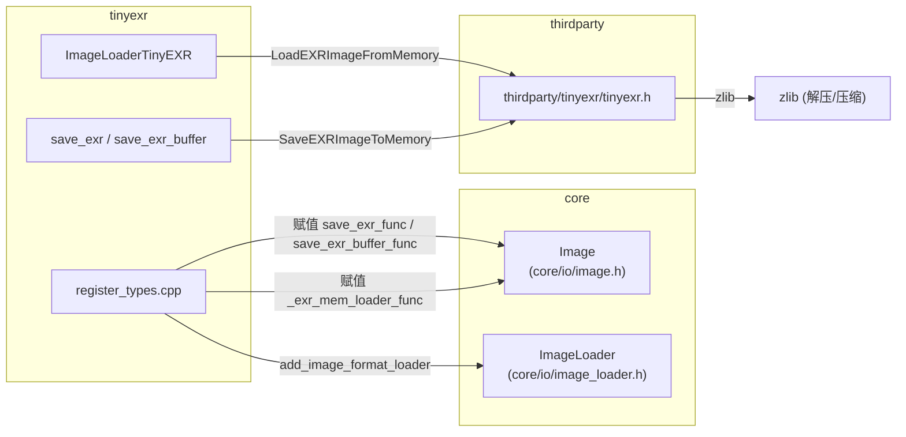
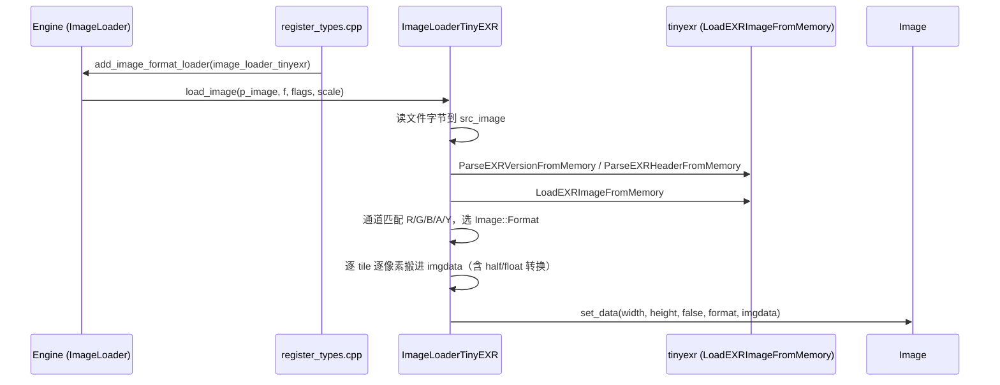

# tinyexr（modules）

> 一句话：tinyexr 是 EXR 图片的「翻译官」——把 OpenEXR 文件字节翻译成 Godot 能读写的 `Image` 像素，再把 `Image` 翻译回 EXR 字节。

**结论**：tinyexr 模块是一个纯胶水层，把第三方库 `thirdparty/tinyexr` 的 EXR 编解码能力接到 Godot 的图片系统上：注册一个 `ImageFormatLoader` 子类负责加载、挂两个函数指针给 `Image` 负责保存，为引擎补上 `.exr` 高动态范围图片的读写能力；代价是依赖一份 vendored 的 single-file 库 `tinyexr.cc`（约 1 万行），且不暴露任何 GDScript 可见类。

## 是什么 / 不是什么

**是什么**：一个图片格式插件。整个模块只有 8 个文件（`register_types.cpp/h`、`image_loader_tinyexr.cpp/h`、`image_saver_tinyexr.cpp/h`、`SCsub`、`config.py`），全部围绕一件事——让 `Image` 支持 `.exr` 格式。

**不是什么**：

- 不解析 EXR 文件本身的二进制格式（压缩、tile、多通道解码），这些全交给 `thirdparty/tinyexr/tinyexr.cc`；
- 不定义自己的资源类型、不注册任何 GDScript 类——全模块没有一处 `ClassDB::register_class`；
- 不负责把像素上传到 GPU、不参与渲染。

一句话边界：tinyexr 只做「Godot 数据 ↔ tinyexr 数据」的类型搬运和函数指针接线。

## 在引擎里的位置

方向：Godot 的 `Image`/`ImageLoader` 是被动接受方，tinyexr 在初始化时主动把三个回调「塞」进 core，之后 engine 用 `.exr` 时才会回头调用它们。

## 关键概念

- **格式加载器（ImageFormatLoader）**：Godot 图片系统里的一种插件接口，`core/io/image_loader.h:42` 定义基类，子类实现 `load_image` + `get_recognized_extensions` 就能让引擎认识一种新扩展名。tinyexr 的子类是 `ImageLoaderTinyEXR`（`image_loader_tinyexr.h:35`）。
- **保存函数指针（SaveEXRFunc）**：`Image` 不自带 EXR 保存实现，只留一个静态函数指针 `Image::save_exr_func`（`core/io/image.h:208`）。tinyexr 初始化时把自由函数 `save_exr` 填进去（`register_types.cpp:46`），保存时才间接调用。
- **内存加载回调（ImageMemLoadFunc）**：`Image::_exr_mem_loader_func`（`core/io/image.h:228`），让别的子系统能直接从内存字节生成 EXR `Image`，实现是 `image_loader_tinyexr.cpp:296` 的 `_tinyexr_mem_loader_func`。
- **通道重排（channel mapping）**：Godot 存像素是 RGBA 交错排列，tinyexr 期望每个通道单独一块平面，且 Gimp/Blender 期待 BGR 顺序，于是保存时用 `channel_mappings[4][4]` 做反交错 + 翻转（`image_saver_tinyexr.cpp:175`）。
- **半精度（half float）**：EXR 默认半浮点。加载时把 HALF 通道转成 FLOAT 读入（`image_loader_tinyexr.cpp:78`），再按需写回 `Image::FORMAT_RGBAH` 等半精度格式。

## 核心文件（按阅读顺序）

1. `register_types.cpp` — 入口。初始化时 `new` 一个 `ImageLoaderTinyEXR` 注册进 `ImageLoader`，并把两个保存函数指针挂到 `Image`（38-48 行）。
2. `image_loader_tinyexr.h` — `ImageLoaderTinyEXR` 类声明，继承 `ImageFormatLoader`，实现加载和扩展名识别。
3. `image_loader_tinyexr.cpp` — 加载实现：读字节 → tinyexr 解析 → 通道 → Godot `Image` 格式转换（39-290 行）。
4. `image_saver_tinyexr.h` — 保存的两个自由函数 `save_exr` / `save_exr_buffer` 声明。
5. `image_saver_tinyexr.cpp` — 保存实现：格式校验 → 反交错 → `SaveEXRImageToMemory`（148-323 行）。
6. `SCsub` — 编译脚本，把 `thirdparty/tinyexr/tinyexr.cc` 编进来，并开 `TINYEXR_USE_THREAD`、关 `TINYEXR_USE_MINIZ`（23-26 行）。

## 数据流 / 调用链

加载一条 `.exr` 的完整路径：

保存方向相反：`Image::save_exr` → 函数指针 `save_exr_func` → `save_exr` → `save_exr_buffer` → `SaveEXRImageToMemory` → 写文件。

## 中文口诀

- 一个模块八个文件，只做 EXR 进和出。
- 注册 loader 认扩展名，函数指针接保存。
- 加载三步：读字节、解通道、搬像素。
- 保存三步：验格式、反交错、写内存。
- 半精度统一转 float，线性标志别忘带（`FLAG_FORCE_LINEAR`）。

## 练习（15 分钟）

1. 打开 `register_types.cpp`，数一数初始化总共往 core 塞了几个回调，各指向谁。
2. 在 `image_loader_tinyexr.cpp` 里找到 `get_recognized_extensions`，确认它 push 的扩展名字符串是什么。
3. 在 `image_saver_tinyexr.cpp` 里找到 `channel_mappings`，写出 4 通道时 RGB 的排列顺序，并说明为什么要这么做。
4. 在 `SCsub` 里找到 `TINYEXR_USE_MINIZ` 的定义值，说明为什么设为 0。

## 自测

- [ ] `ImageLoaderTinyEXR` 继承自哪个基类？它必须实现哪两个虚函数？
- [ ] 模块往 `Image` 挂了哪三个静态函数指针（写出准确变量名）？
- [ ] 加载时 `use_float16` 为真的条件是什么？对应输出到哪些 `Image::Format`？
- [ ] 保存时压缩类型用的是什么（写出宏名）？

## 一句话总结

> tinyexr 是 EXR 与 Godot `Image` 之间的一道薄胶水：注册一个 loader 负责读、挂三个函数指针负责写，编解码的脏活全甩给 vendored 的 tinyexr 单文件库。
