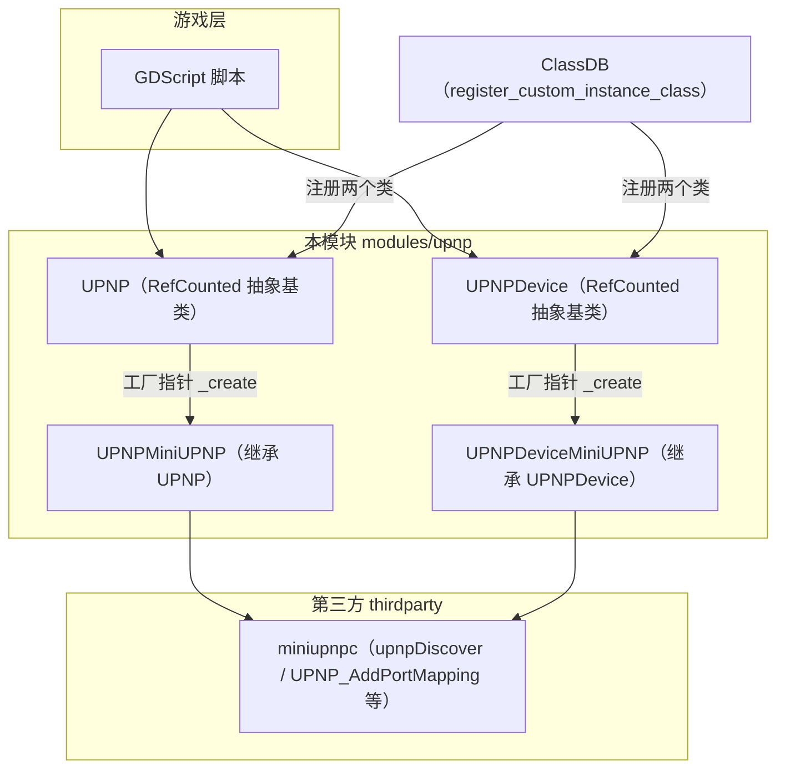
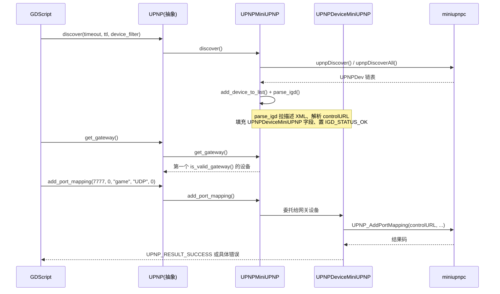

# upnp（modules）

> 一句话：UPnP 模块是「帮你的游戏在路由器上自动开洞」的翻译官——把 Godot 脚本对 `UPNP`/`UPNPDevice` 两个类的调用，翻译成 miniupnpc 库的网络协议请求。

**结论**：upnp 模块封装 UPnP（Universal Plug and Play）的 IGD（Internet Gateway Device，网关设备）协议，让 GDScript 能发现路由器、查询外网 IP、添加/删除端口映射（port mapping）——就是局域网联机游戏常用的「端口转发自动化」。它为引擎的 `multiplayer` 联机场景服务，代价是编译进一个第三方库 `thirdparty/miniupnpc/`（Web 平台不参与）。

## 是什么 / 不是什么

- **是**：一组 Godot 侧胶水层，把 miniupnpc 的 C API 包成 `RefCounted` 派生类并注册进 ClassDB。核心能力只有三件事——发现网关、查外网地址、增删端口映射。
- **不是**：它不是联机协议本身，不管玩家之间怎么传数据（那是 `multiplayer` / `enet` 的活）；它不是 UPnP 协议的完整实现，协议细节全在 `thirdparty/miniupnpc/` 里，本模块只做一层薄封装和错误码翻译。
- **不是**：它不负责 UPnP 之外的内网穿透方案（NAT 打洞、中继服务器都不在这里）。

## 在引擎里的位置

本模块共 13 个文件（含 `SCsub`、`config.py`、`doc_classes/`），其中胶水层 C++ 源码只有 6 个 `.cpp`/`.h` 对：`upnp.cpp`、`upnp_device.cpp` 是抽象基类绑定，`upnp_miniupnp.cpp`、`upnp_device_miniupnp.cpp` 是 miniupnpc 实现。它们全部被 `SCsub` 里的 `env_upnp.add_source_files(module_obj, "*.cpp")` 纳入编译（`modules/upnp/SCsub:48`）。

## 关键概念

- **网关发现（discover）**：像在局域网里喊一嗓子「谁是路由器」，等网关应答。术语是 SSDP 发现，入口是 `UPNP::discover()`，落到 `UPNPMiniUPNP::discover()` 里的 `upnpDiscover()`（`modules/upnp/upnp_miniupnp.cpp:72`）。
- **设备列表（devices）**：发现到的一串设备，存在 `Vector<Ref<UPNPDevice>> devices`（`modules/upnp/upnp_miniupnp.h:49`），用 `get_device_count()` / `get_device()` 遍历。
- **有效网关（valid gateway）**：不是每个 UPnP 设备都能转发端口，只有解析出 `controlURL` 且状态为 `IGD_STATUS_OK` 的才算数。判断函数是 `UPNPDevice::is_valid_gateway()`（`modules/upnp/upnp_device_miniupnp.cpp:155`），`get_gateway()` 会遍历列表找第一个有效网关（`modules/upnp/upnp_miniupnp.cpp:272`）。
- **端口映射（port mapping）**：把外网端口映射到内网主机的某端口，是模块的最终目的。添加用 `UPNP::add_port_mapping()`，删除用 `delete_port_mapping()`，最终都委托给 `UPNP_AddPortMapping` / `UPNP_DeletePortMapping`（`modules/upnp/upnp_device_miniupnp.cpp:74` / `:94`）。
- **工厂指针（`_create`）**：两个抽象基类各挂一个静态函数指针 `static UPNP *(*_create)(bool)`（`modules/upnp/upnp.h:43`），由 `UPNPMiniUPNP::make_default()` 注入具体构造器。这是 Godot 让「抽象基类 + 可替换实现」绕开虚工厂的惯用写法。

## 核心文件（按阅读顺序）

1. `register_types.cpp` — 模块入口，注册两个类、注入默认实现（Web 平台跳过 miniupnpc 部分）。
2. `upnp.h` — `UPNP` 抽象基类：定义 `UPNPResult` 枚举（29 个错误码）和全部虚接口。
3. `upnp_device.h` — `UPNPDevice` 抽象基类：定义 `IGDStatus` 枚举和单个网关设备的接口。
4. `upnp_miniupnp.h` / `upnp_miniupnp.cpp` — `UPNP` 的 miniupnpc 实现：发现、设备列表、错误码翻译。
5. `upnp_device_miniupnp.h` / `upnp_device_miniupnp.cpp` — `UPNPDevice` 的 miniupnpc 实现：真正发 HTTP/SOAP 请求的收尾处。
6. `upnp.cpp` / `upnp_device.cpp` — `_bind_methods()`，把接口暴露成 GDScript 方法和属性。
7. `SCsub` — 编译脚本，`builtin_miniupnpc` 开启且非 Web 平台时引入 `thirdparty/miniupnpc/` 源码。

## 数据流 / 调用链

一次典型的「添加端口映射」调用链：

`parse_igd()` 是整个模块信息量最大的一处：先 `miniwget` 拉设备描述 XML，再 `parserootdesc` 解析、`GetUPNPUrls` 拿控制 URL、`UPNP_GetValidIGD` 判定网关有效性，最后把 `controlURL`、`service_type`、本机地址写进 `UPNPDeviceMiniUPNP` 并置 `IGD_STATUS_OK`（`modules/upnp/upnp_miniupnp.cpp:123-185`）。之后的端口映射、查外网 IP 都只依赖这几个字段，不再重复发现。

## 中文口诀

- 端口映射是主线，发现网关是前站。
- discover 先喊一嗓子，devices 列表装网关。
- 有效网关靠 status，OK 才算能转端口。
- 映射之前先 get_gateway，找到网关才动手。
- 外网地址问 device，端口增删都委托。
- 错误码表翻译好，UNKNOWN 兜底不能少。
- Web 平台不参与，工厂指针注入实现。

## 练习（15 分钟）

1. 打开 `modules/upnp/upnp_miniupnp.cpp`，在 `parse_igd()` 里数一数：从「拉 XML」到「置 IGD_STATUS_OK」中间调了哪 4 个 miniupnpc 函数，各自拿什么结果。
2. 在 `upnp_device_miniupnp.cpp:63` 的 `add_port_mapping()` 里，把 `port_internal < 1` 时 `port_internal = port` 这句话用自己的话解释一遍——为什么允许传 0。
3. 对比 `upnp.cpp` 与 `upnp_device.cpp` 的 `_bind_methods()`，找出一对「同名方法」在两个类里各自绑定的差异（例如 `query_external_address` 在哪个类里有、哪个没有）。

## 自测

- [ ] `UPNP::discover()` 的 `device_filter` 参数默认值是什么？当 filter 不是「常见设备」时，会走 `upnpDiscover` 还是 `upnpDiscoverAll`？（答案在 `modules/upnp/upnp_miniupnp.cpp:71-75`）
- [ ] `UPNPMiniUPNP::add_port_mapping()` 里，如果 `get_gateway()` 返回 null，会返回哪个错误码？（答案在 `modules/upnp/upnp_miniupnp.cpp:320-328`）
- [ ] 为什么 `register_types.cpp` 里 miniupnpc 相关的 `make_default()` 被包在 `#ifndef WEB_ENABLED` 里？

## 一句话总结

> upnp 模块是一条「发现网关 → 找到有效网关 → 增删端口映射」的薄胶水链，把 GDScript 的两个类翻译成 miniupnpc 的协议调用，让联机游戏不用手动进路由器后台开端口。
