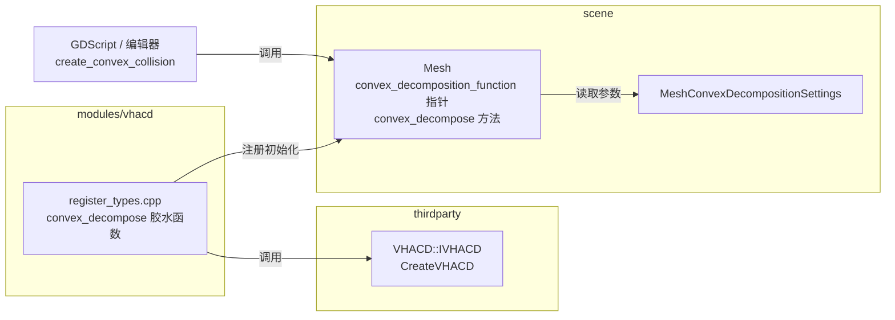
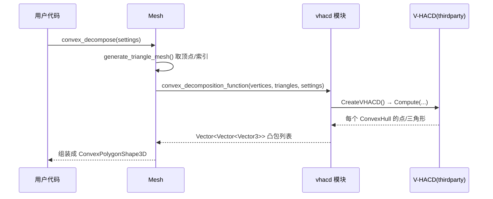

# vhacd（modules）

> 一句话：它是引擎里的「凹凸拆分机」，把一块复杂的网格自动拆成多块凸包，好让物理引擎做碰撞检测。

**结论**：`vhacd` 是一个极薄的胶水层——它把第三方库 V-HACD（Voxelized Hierarchical Approximate Convex Decomposition，体素化分层近似凸分解）接进引擎，通过给 `Mesh` 挂上一个函数指针，向场景层提供「网格 → 多个凸碰撞体」的能力。代价是它几乎不含自有逻辑，全部核心算法都在 `thirdparty/` 里。

## 是什么 / 不是什么

这个模块**是**一座桥：Godot 的 `Mesh` 定义了一个「凸分解函数指针」，但默认是空指针（`scene/resources/mesh.cpp:207`），`vhacd` 模块启动时把真实的分解函数填进去（`modules/vhacd/register_types.cpp:99`）。

它**不是**算法本身。V-HACD 的凸包生成、体素化、四面体化全部在第三方源码里（`thirdparty/vhacd/`，由 `SCsub:15-26` 编译），本模块不碰、也不展开。

它**也不是**碰撞体。分解结果被 `Mesh::convex_decompose()` 组装成 `ConvexPolygonShape3D` 返回，物理碰撞由 `servers/physics_3d` 负责，不归本模块管。

## 在引擎里的位置

## 关键概念

- **函数指针挂载点**：`Mesh` 留了一个静态函数指针 `convex_decomposition_function`（`scene/resources/mesh.h:202`），类型是 `ConvexDecompositionFunc`（`mesh.h:200`）。没有模块认领时它是空指针，谁接了谁负责凸分解。
- **胶水函数 `convex_decompose`**：本模块唯一有实际内容的函数（`register_types.cpp:37`），把 Godot 的顶点/索引数组翻译成 V-HACD 的参数，跑完再把凸包点读回来。
- **参数翻译表**：`VHACD::IVHACD::Parameters` 的每一个字段都由 `MeshConvexDecompositionSettings` 的 getter 逐个喂入（`register_types.cpp:39-52`），比如 `m_maxConvexHulls` ← `get_max_convex_hulls()`。
- **初始化级别**：模块只在 `MODULE_INITIALIZATION_LEVEL_SCENE` 阶段挂载/卸载（`register_types.cpp:95,103`），因为 `Mesh` 属于场景层。
- **构建开关**：`config.py:2` 里 `can_build` 返回 `not env["disable_physics_3d"]`——禁用 3D 物理时整个模块不编译。

## 核心文件（按阅读顺序）

1. `modules/vhacd/register_types.h` — 只声明两个入口函数 `initialize_vhacd_module` / `uninitialize_vhacd_module`（`register_types.h:35-36`）。
2. `modules/vhacd/register_types.cpp` — 全部胶水逻辑：`convex_decompose` 静态函数 + 挂载/卸载（`register_types.cpp:37-108`）。
3. `modules/vhacd/SCsub` — 编译脚本：先编第三方 V-HACD 源码，再编本目录 `*.cpp`（`SCsub:15-42`）。
4. `modules/vhacd/config.py` — 决定模块何时可构建（`config.py:2`）。
5. `thirdparty/vhacd/public/VHACD.h` — 被封装库的公开头：`IVHACD` 接口与 `CreateVHACD` 工厂（`VHACD.h:43,150`）。

## 数据流 / 调用链

调用入口在 `Mesh::convex_decompose()`（`scene/resources/mesh.cpp:920`），它先判空（`mesh.cpp:921`），再取出三角网格，最后把顶点数组原样丢给函数指针（`mesh.cpp:943`）。本模块的 `convex_decompose` 创建 `VHACD::IVHACD`，`Compute` 后遍历每个凸包，把 `hull.m_points` 拷回 `Vector3`（`register_types.cpp:54-91`）。

## 中文口诀

- 凸包难拆，函数指针留空位，vhacd 来填空。
- 参数逐个搬，settings 喂给 Parameters。
- 一进一出：顶点索引进，凸包列表出。
- 物理关了不编译，场景层才挂载。

## 练习（15 分钟）

1. 打开 `modules/vhacd/register_types.cpp`，数一数 `convex_decompose` 里一共翻译了多少个参数（`register_types.cpp:39-52`）。
2. 找到 `scene/resources/mesh.cpp:943`，确认 `Mesh` 是「先判空再调用」函数指针的，写下那一行 `ERR_FAIL_NULL_V` 在干什么。
3. 读 `config.py:2`，回答：如果把 `disable_physics_3d=yes`，这个模块会发生什么。

## 自测

- [ ] `Mesh::convex_decomposition_function` 的默认值是什么？是谁、在哪个文件里把它填成真实函数的？
- [ ] `convex_decompose` 返回的 `Vector<Vector<Vector3>>` 里，内层 `Vector3` 是从 V-HACD 的哪个字段拷出来的？
- [ ] 本模块自己写的 C++ 逻辑有几行，第三方算法有几行？（提示：看 `SCsub` 的 `thirdparty_sources` 列表长度。）

## 一句话总结

> `vhacd` 是 V-HACD 第三方库在 Godot 里的注册桩：用一行函数指针赋值，把「网格凸分解」这个能力借给了场景层的 `Mesh`。
