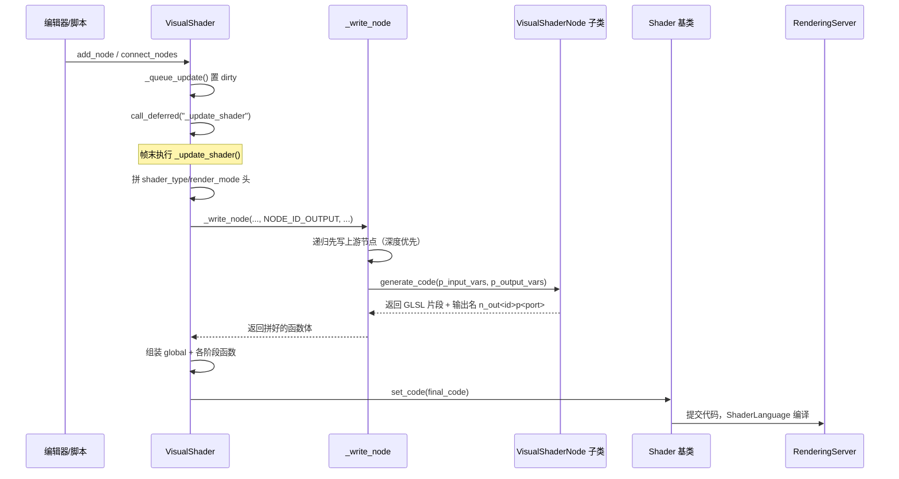

# visual_shader（modules）

> 一句话：把「用节点连线搭出来的着色器图」，翻译成一段完整的 GLSL 文本再交给引擎编译——节点是积木，连线是导线，代码生成是最后一步印刷。

**结论**：`visual_shader` 模块把可视化节点图（`VisualShader` + 约 110 个 `VisualShaderNode` 子类）编译成 Godot Shader 文本，交给 `servers/rendering` 的 `ShaderLanguage` 编译；它服务「不想手写 shader 的人」，代价是节点图本身就是文本 shader 的中间表示，每次改图都要重新生成整段代码。

## 是什么 / 不是什么

它负责：维护节点图（增删节点、连线、端口类型）、把图递归展开成 GLSL 代码、把生成结果塞回 `Shader` 基类去编译。

它不负责：真正解析和编译 GLSL——那是 `servers/rendering/shader_language.h:46` 的 `ShaderLanguage` 干的；也不负责把 shader 提交到 GPU 后端——那是 `RenderingServer` 的事。可视化节点图的**编辑界面**（连线画布、拖拽、面板）在 `editor/visual_shader_editor_plugin.cpp`，仅在 `TOOLS_ENABLED` 下编译（`SCsub:14-15`）。

一句话对比：`VisualShader` 是「生成 `Shader` 代码的工厂」，`Shader` 是「拿着代码去编译的产品」。

## 在引擎里的位置

```mermaid
flowchart TD
    subgraph modules/visual_shader
        VS[VisualShader : Shader]
        NODE[VisualShaderNode : Resource]
        NODES[vs_nodes/*.cpp<br/>节点子类族]
        EDITOR[editor/*.cpp<br/>仅 TOOLS_ENABLED]
    end
    subgraph scene/resources
        SHADER[Shader : Resource]
    end
    subgraph servers/rendering
        SL[ShaderLanguage]
        ST[ShaderTypes]
        RS[RenderingServer]
    end

    VS -->|继承| SHADER
    VS -->|持有 graph[TYPE_MAX] 的节点| NODE
    NODES -->|实现 generate_code| NODE
    VS -->|_update_shader 生成代码后 set_code| SHADER
    SHADER -->|查询模式信息| ST
    SHADER -->|set_code 触发解析| SL
    SHADER -->|shader RID 提交| RS
    EDITOR -->|读写并展示| VS
```

核心继承关系只有一条主干：`VisualShader` 继承 `scene/resources/shader.h:39` 的 `Shader`；`VisualShaderNode` 继承 `Resource`（`visual_shader.h:269`），它下面的所有具体节点（常量、运算、纹理、参数……）都是同一套接口。

## 关键概念

- **一张图按 shader 阶段分桶**：`VisualShader` 内部不是一张图，而是 `Graph graph[TYPE_MAX]`（`visual_shader.h:128`），一个 `Type`（`TYPE_VERTEX`、`TYPE_FRAGMENT`、`TYPE_LIGHT`……共 11 种，`visual_shader.h:46-59`）一张图。每个阶段各管各的，最后拼成 `vertex()`、`fragment()` 等多个函数。

- **节点 = 会吐代码的资源**：每个 `VisualShaderNode` 子类要实现 `generate_code(...)`（`visual_shader.h:383`），输入「上游变量的名字数组」，输出「一行/一段 GLSL」。这就是整条主线的原子操作。

- **端口类型决定变量怎么写**：`VisualShaderNode::PortType`（`visual_shader.h:273-284`）只有 9 种——标量（含 int/uint）、vec2/3/4、bool、transform、sampler。连线时类型不匹配，`_write_node` 会插入 `float(...)`、`.x` 这类隐式转换（`visual_shader.cpp:2218-2343`）。

- **输出节点是「写入内置变量的翻译器」**：`VisualShaderNodeOutput::ports[]`（`visual_shader.cpp:4192`）把「Albedo」「Normal」这类端口名映射到 `ALBEDO`、`NORMAL` 等引擎内置变量，`generate_code` 直接产出 `ALBEDO = n_out5p0;` 这样的赋值（`visual_shader.cpp:4384-4405`）。

- **脏标记 + 延迟重生成**：任何改动只调 `_queue_update()`，置位 `dirty` 后 `call_deferred("_update_shader")`（`visual_shader.cpp:3168-3175`），把整图重生成压到帧末，避免一改一编译。

## 核心文件（按阅读顺序）

1. `modules/visual_shader/visual_shader.h` — 两个核心类：`VisualShader`（图容器 + 编译调度）与 `VisualShaderNode`（节点基类接口）的声明。
2. `modules/visual_shader/visual_shader.cpp` — 全部主线实现：连线、`_update_shader`、`_write_node`、输入/输出节点。
3. `modules/visual_shader/vs_nodes/visual_shader_nodes.h` — 约 80 个具体节点类声明，按「常量 / 运算 / 函数 / 参数 / 纹理」分组。
4. `modules/visual_shader/vs_nodes/visual_shader_nodes.cpp` — 每个节点 `generate_code` 的真实 GLSL 模板。
5. `modules/visual_shader/vs_nodes/visual_shader_particle_nodes.cpp` — 粒子专用节点（发射器、`ParticleEmit`）。
6. `modules/visual_shader/vs_nodes/visual_shader_sdf_nodes.cpp` — SDF 采样/raymarch 专用节点。
7. `modules/visual_shader/register_types.cpp` — 在 `MODULE_INITIALIZATION_LEVEL_SCENE` 注册全部类，编辑器插件在 `EDITOR` 级别注册。
8. `modules/visual_shader/editor/visual_shader_editor_plugin.cpp` — 节点图画布与面板（只编译进 editor）。

## 数据流 / 调用链

一次典型的「改图 → 出 shader」调用链：



关键点：`_update_shader`（`visual_shader.cpp:2678`）从 `NODE_ID_OUTPUT`（值为 0，`visual_shader.h:185`）出发做**深度优先递归**——先写依赖的上游节点，再写自己（`visual_shader.cpp:2113-2131`）。每个节点的输出被命名成 `n_out<节点id>p<端口>`（`visual_shader.cpp:2198`），下游节点拿这个名字当输入变量引用，天然形成一条变量接力链。

## 中文口诀

```
节点是积木，连线当导线，
一张图分桶，阶段各管各。
改动不打紧，先标脏再延迟，
帧末重生成，输出节点当头。
上游先写码，名字接成链，
generate_code 吐一行，拼完塞回 Shader。
```

## 练习（15 分钟）

1. 打开 `visual_shader.cpp:2678`，找到 `shader_mode_str` 数组，对照 `visual_shader.h:46` 的 `Type` 枚举，说出 `shader_type spatial;` 这一行在哪个模式下会生成什么。
2. 在 `visual_shader.cpp:2198` 打一个断点（或加一行 `print_line`），连一个「FloatConstant → FloatOp → Output」的三节点图，观察 `_write_node` 被调用几次、每次 `src_var` 是什么。
3. 读 `vs_nodes/visual_shader_nodes.cpp` 里 `VisualShaderNodeFloatOp::generate_code`，把它产出的那行 GLSL 默写出来，再和断点里的输出对一遍。

## 自测

- [ ] `_write_node` 为什么要在写本节点前先递归写上游节点？如果去掉这段递归，生成的代码会错在哪？
- [ ] `VisualShaderNodeOutput::generate_code` 里的 `ports[]` 数组里 `s.contains_char(':')` 分支（`visual_shader.cpp:4393`）是处理什么情况的？
- [ ] `_queue_update` 里 `if (dirty.is_set()) return;` 这行是为了解决什么问题？

## 一句话总结

> `visual_shader` 是「节点图 → GLSL 文本」的编译器前端：`VisualShader` 存图并调度，`_write_node` 递归把每个 `VisualShaderNode::generate_code` 的产物接成变量链，最后 `set_code` 交给 `Shader` 基类和渲染层真正编译。
