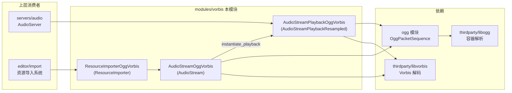
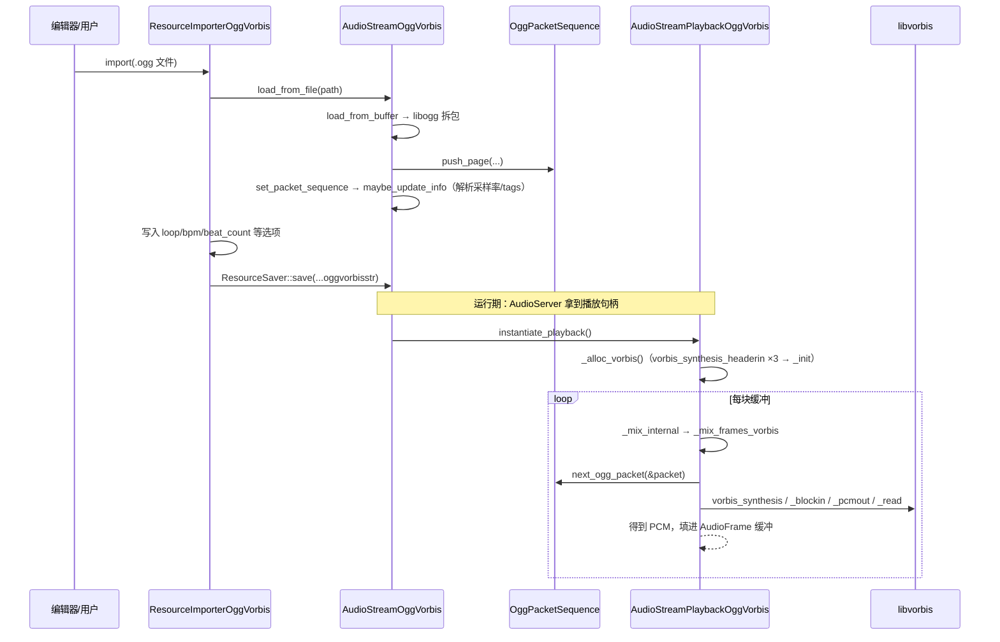

# vorbis（modules）

> 一句话：它是一根「转换插头」——把 OGG Vorbis 音频文件接进 Godot 的 `AudioStream` 插座，解码苦活全甩给第三方的 libvorbis / libogg。

**结论**：`vorbis` 模块让 Godot 能加载并播放 OGG Vorbis 格式的音频，只做「胶水」：导入时用 libogg 把 `.ogg` 拆成数据包序列存成 `.oggvorbisstr` 资源，运行时把包喂给 libvorbis 解出 PCM 交给音频服务器；它自己一行解码算法都不写。

## 是什么 / 不是什么

它负责三件事：注册 `AudioStreamOggVorbis` / `AudioStreamPlaybackOggVorbis` 两个类（`register_types.cpp:52-53`）；在编辑器里注册导入器 `ResourceImporterOggVorbis`（`register_types.cpp:58`）；把 libvorbis 的解码函数包成 Godot 播放接口。

它不是解码器本身——真正的数学（MDCT、floor、codebook）在 `thirdparty/libvorbis/`，容器解析在 `thirdparty/libogg/`。它也不管声音怎么从扬声器出来，那是 `servers/audio` 的 `AudioServer` 的活。它和同族的 `ogg` 模块分工：`ogg` 模块提供 `OggPacketSequence` 存包，本模块负责用 Vorbis 语义去消费这些包（`config.py:2` 声明依赖 `ogg`）。

## 在引擎里的位置

## 关键概念

- **包序列（OggPacketSequence）**：把 `.ogg` 文件里一页页的原始数据包存起来的「集装箱」，来自 `ogg` 模块（`ogg_packet_sequence.h:41`）。Vorbis 解码不需要关心文件里的页边界，只按包取。
- **流 / 播放分离**：`AudioStreamOggVorbis`（`audio_stream_ogg_vorbis.h:115`）是资源本体，存元数据；`AudioStreamPlaybackOggVorbis`（`audio_stream_ogg_vorbis.h:42`）是播放句柄，持有 libvorbis 的解码状态（`vorbis_dsp_state dsp_state` 等，见 `.h:57-60`）。
- **重采样基类**：播放类继承 `AudioStreamPlaybackResampled` 而非裸的 `AudioStreamPlayback`——它只负责产出原生采样率的 PCM，变速重采样交给基类，见 `audio_stream_ogg_vorbis.h:42`。
- **libvorbis 状态机**：`vorbis_info` / `vorbis_comment` / `vorbis_dsp_state` / `vorbis_block` 四个结构体是一套生命周期，分配用 `vorbis_*_init`，释放用 `vorbis_*_clear`（`audio_stream_ogg_vorbis.cpp:197-230`、`:398-411`）。

## 核心文件（按阅读顺序）

1. `register_types.cpp` — 入口，按初始化级别注册 3 个类；编辑器级别再挂导入器回调。
2. `register_types.h` — 声明 `initialize_vorbis_module` / `uninitialize_vorbis_module`。
3. `audio_stream_ogg_vorbis.h` — 两个核心类的公共接口与 libvorbis 成员。
4. `audio_stream_ogg_vorbis.cpp` — 解码主逻辑：`load_from_buffer`、`_alloc_vorbis`、`_mix_frames_vorbis`、`seek`。
5. `resource_importer_ogg_vorbis.cpp` — 导入器：识别 `.ogg`，导入时把选项写进流并 `ResourceSaver::save`。
6. `SCsub` — 编译胶水 `*.cpp`，并把 `thirdparty/libvorbis` 的源码一起编进去（`builtin_libvorbis`）。
7. `config.py` — 声明依赖 `ogg` 模块、列出要生成文档的类。

## 数据流 / 调用链

一次典型的「导入 + 播放」链路：

## 中文口诀

导入读包，播放解码；流管数据，播放管状态。
ogg 拆页，vorbis 出 PCM；四个结构体，init 配 clear。
采样率靠重采样基类，变速不碰原生 PCM。
只做胶水，算法全在 thirdparty。

## 练习（15 分钟）

1. 打开 `register_types.cpp`，指出 `AudioStreamOggVorbis` 和 `ResourceImporterOggVorbis` 分别在哪个初始化级别注册，为什么导入器要晚一级。
2. 打开 `audio_stream_ogg_vorbis.cpp` 的 `_alloc_vorbis`，数一数初始化顺序里调用了哪几个 `vorbis_*` 函数，再对照析构函数确认释放顺序是否相反。
3. 打开 `resource_importer_ogg_vorbis.cpp` 的 `import`，把 `get_recognized_extensions`、`get_save_extension`、`get_resource_type` 三个返回值连起来，说明 `.ogg` 文件最终变成什么。

## 自测

- [ ] `AudioStreamPlaybackOggVorbis` 继承的是哪个基类？为什么它自己不需要实现重采样？
- [ ] 解码一帧 PCM 的四个 libvorbis 调用（synthesis → blockin → pcmout → read）分别在哪个函数里、按什么顺序出现？
- [ ] `OggPacketSequence` 定义在哪个模块？本模块通过哪行代码声明了对它的依赖？

## 一句话总结

> `vorbis` 模块是 Godot 与 libvorbis 之间的胶水：负责把 `.ogg` 注册成可导入、可播放的 `AudioStream`，解码算法全部委托给 `thirdparty/libvorbis`。
