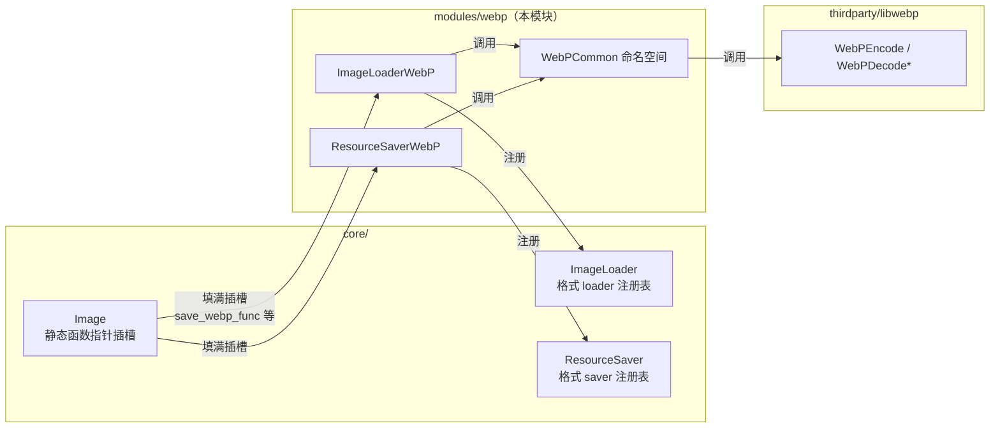
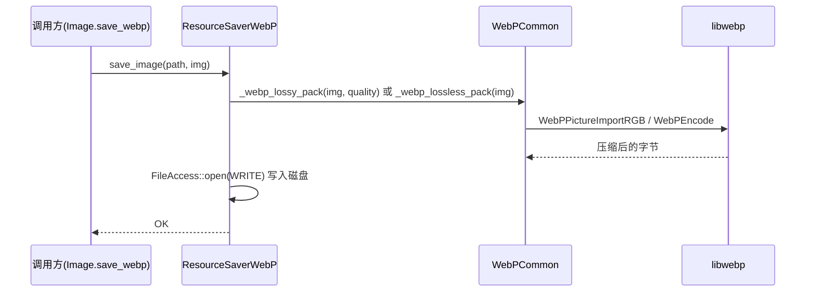

# webp（modules）

> 一句话：webp 模块是 Godot 与 libwebp 之间的「转接头」——把 `Image` 塞进 libwebp 的编解码函数，让引擎能读、能写 `.webp` 文件。

**结论**：这个模块给 Godot 的 `Image` 挂上 WebP 的「读」和「写」能力——注册一个 `ImageLoaderWebP` 读入 `.webp`、注册一个 `ResourceSaverWebP` 存出 `.webp`，并把真正的编解码工作全部转包给第三方库 libwebp。它自己只写胶水层（约 500 行），代价是引擎体积里要多带一整套 libwebp 源码。

## 是什么 / 不是什么

webp 模块干三件事，也只干这三件事：

- **注册 loader**：让 `Image` 认识 `.webp` 后缀，能把文件里的 WebP 字节流解码成 `Image`。
- **注册 saver**：让 `ImageTexture` 能存成 `.webp` 文件。
- **挂回调**：把 `Image` 上预留的几个静态函数指针（`save_webp_func`、`webp_lossy_packer` 等）指向本模块的实现。

它**不负责**：

- 不实现任何压缩算法——真正的 `WebPEncode` / `WebPDecodeRGBInto` 都来自 `thirdparty/libwebp`。
- 不处理其它图片格式——`png`、`jpg`、`bmp`、`ktx` 各有自己的模块。
- 不写动画 WebP 播放逻辑，只用 libwebp 的单帧编解码接口。

一句话：它是一层「翻译官」，把 Godot 的 `Image` 语言翻译成 libwebp 的 `WebPPicture` / `WebPBitstreamFeatures` 语言。

## 在引擎里的位置



`Image` 留了一排函数指针（`core/io/image.h:209-256`），本模块的构造函数负责把它们填上；而 loader / saver 则通过注册表接入引擎统一的图片读写流程。

## 关键概念

- **格式 loader**：`ImageFormatLoader`（`core/io/image_loader.h:42`）是「我能读某种后缀的文件」的接口。`ImageLoaderWebP` 继承它，只报告一个后缀 `webp`。
- **格式 saver**：`ResourceFormatSaver`（`core/io/resource_saver.h:36`）是「我能把某类资源存成文件」的接口。`ResourceSaverWebP` 继承它，只认 `ImageTexture`。
- **函数指针插槽**：`Image` 上的一组 `static` 函数指针（如 `Image::save_webp_func`、`Image::webp_lossy_packer`），默认是空。本模块一加载就「插上」实现，这样 `Image` 的 `save_webp()` 这类方法不用知道 libwebp 也能工作。
- **胶水命名空间 `WebPCommon`**：`modules/webp/webp_common.h:35`，是本模块真正碰 libwebp 头文件（`<webp/decode.h>`、`<webp/encode.h>`）的地方，其它文件只跟它打交道。

## 核心文件（按阅读顺序）

1. `modules/webp/register_types.cpp` — 入口：在 `MODULE_INITIALIZATION_LEVEL_SCENE` 阶段实例化并注册 loader 与 saver。
2. `modules/webp/image_loader_webp.h` / `.cpp` — 读入端：继承 `ImageFormatLoader`，把文件字节流交给 `WebPCommon` 解码。
3. `modules/webp/resource_saver_webp.h` / `.cpp` — 写出端：继承 `ResourceFormatSaver`，把 `ImageTexture` 里的 `Image` 编码成文件。
4. `modules/webp/webp_common.h` / `.cpp` — 胶水核心：`_webp_packer`（编码）、`_webp_unpack`（解码）、`webp_load_image_from_buffer`（直载），全部在此调用 libwebp。
5. `modules/webp/SCsub` — 构建：编进本模块的 `*.cpp`，并（在 `builtin_libwebp` 时）把 `thirdparty/libwebp` 的一百多个 `.c` 源文件一起编进来。
6. `modules/webp/config.py` — 声明模块无条件可构建（`can_build` 恒返回 `True`）。

## 数据流 / 调用链

读入一条链：从磁盘到 `Image`。

```mermaid
sequenceDiagram
    participant U as 调用方(Image.load)
    participant IL as ImageLoader
    participant IW as ImageLoaderWebP
    participant WC as WebPCommon
    participant LIB as libwebp

    U->>IL: load_image("x.webp")
    IL->>IW: load_image(image, FileAccess)
    IW->>IW: 读文件进 Vector&lt;uint8_t&gt;
    IW->>WC: webp_load_image_from_buffer(img, buf, len)
    WC->>LIB: WebPGetFeatures / WebPDecodeRGBInto
    LIB-->>WC: 解码后的像素
    WC->>WC: image->set_data(...) 填入 RGBA8/RGB8
    WC-->>IW: OK
    IW-->>U: 拿到可用的 Image
```

写出另一条链：从 `Image` 到磁盘。



编码前的预处理都在 `_webp_packer` 里：有 alpha 转 `RGBA8`，无 alpha 转 `RGB8`；压缩参数从 `rendering/textures/webp_compression/` 两个项目设置读取。

## 中文口诀

```
webp 模块三件事：注册读、注册写、挂回调。
Loader 认得后缀名，WebP 字节进 Image。
Saver 认准纹理类，Image 存成 webp 文件。
真活不干，全外包，libwebp 里把码编。
RGBA 有 alpha，RGB 无 alpha，packer 先看格式再压。
函数指针是插槽，模块一加载就插满。
```

## 练习（15 分钟）

1. 打开 `modules/webp/register_types.cpp`，数出 `initialize_webp_module` 一共做了几个 `instantiate()`、几个 `add_*` 调用。
2. 打开 `modules/webp/webp_common.cpp` 的 `_webp_packer`，找到 `WebPConfig`、`WebPPicture`、`WebPEncode` 三处，确认「有 alpha 走 RGBA、无 alpha 走 RGB」的分支在哪一行。
3. 打开 `core/io/image.h` 的 209–256 行，把 `Image` 上跟 webp 有关的函数指针都列出来，再看它们在哪个模块构造函数里被赋值。

## 自测

- [ ] `ImageLoaderWebP` 的 `get_recognized_extensions` 返回了什么后缀？它的构造函数给 `Image` 上哪三个 webp 相关指针赋了值？
- [ ] `ResourceSaverWebP::recognize` 判断的是哪种资源类型？写出 `.webp` 时用的是有损还是无损路径（默认 `save_image` 的 `p_lossy` 参数是什么）？
- [ ] 有损压缩的质量参数、无损压缩的压缩系数，分别从哪个项目设置键读取？

## 一句话总结

> webp 模块是一层薄胶水：注册两个格式类（读 `ImageLoaderWebP`、写 `ResourceSaverWebP`），再给 `Image` 挂上几个函数指针，把 WebP 编解码彻底交给 libwebp。
