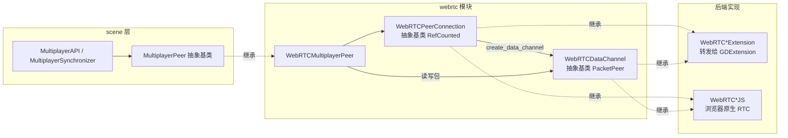
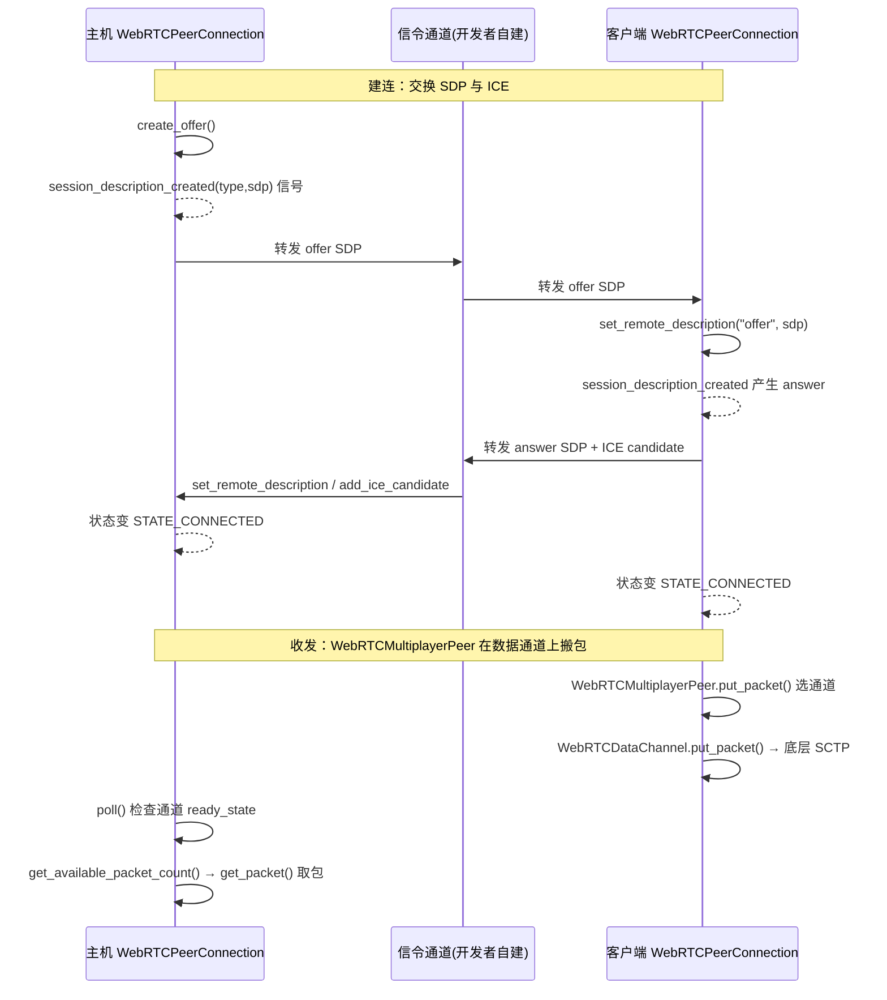

# webrtc（modules）

> 一句话：把浏览器的「打电话」能力（P2P 连接 + 数据通道）搬进 Godot，套上 `MultiplayerPeer` 的壳，让多人联机像本地一样写。

**结论**：webrtc 模块提供 3 个公开类——`WebRTCPeerConnection`（对等连接）、`WebRTCDataChannel`（数据通道，本质是 `PacketPeer`）、`WebRTCMultiplayerPeer`（把前两者接成引擎标准的 `MultiplayerPeer`），为「无需中心服务器转发、点对点直连」的多人游戏服务；代价是你得自己搭一条信令通道来交换 SDP/ICE 文本，且真正的底层传输依赖浏览器原生实现或 GDExtension 插件。

## 是什么 / 不是什么

WebRTC（Web Real-Time Communication）是一套让两个浏览器直接互发数据的协议栈。Godot 里的这个模块**不是** WebRTC 协议的 C++ 实现——它只是一层「接口壳」：

- 它**负责**：定义连接/通道的抽象接口、把标准的 SDP 协商与 ICE 候选收集流程暴露成信号和方法、把多条数据通道包装成一个 `MultiplayerPeer` 供 `MultiplayerAPI` 使用。
- 它**不负责**：真正的协议栈（DTLS/SRTP/SCTP 握手、音视频编解码）。在 Web 平台，这一层转交给浏览器原生 `RTCPeerConnection`（`webrtc_peer_connection_js.h:37` 的 `WebRTCPeerConnectionJS`）；在原生平台，交给 GDExtension 插件实现（`webrtc_peer_connection_extension.h:37` 的 `WebRTCPeerConnectionExtension`）。
- 它**也不负责**信令：offer/answer 和 ICE candidate 这些字符串怎么从一台机器送到另一台，需要开发者自己用 `WebSocketPeer`、HTTP 或其他手段转发。

一句话：这个模块是「方向盘和仪表盘」，发动机（协议栈）由外部后端提供，连接电线（信令）由你自己接。

## 在引擎里的位置

依赖关系自上而下：游戏层只认 `MultiplayerPeer`；`WebRTCMultiplayerPeer` 把「对等连接 + 数据通道」翻译成标准接口；`WebRTCPeerConnection` / `WebRTCDataChannel` 是抽象基类，真正的实现要么是浏览器 JS 桥，要么是 GDExtension 插件。

## 关键概念

- **对等连接（Peer Connection）＝ 一通电话**：`WebRTCPeerConnection`（`webrtc_peer_connection.h:35`）代表你和另一个端之间的一条连接。它负责协商（`create_offer`/`set_remote_description`/`set_local_description`/`add_ice_candidate`）和状态机（`ConnectionState` 从 `STATE_NEW` 一路到 `STATE_CONNECTED`，`webrtc_peer_connection.h:39-61`）。
- **数据通道（Data Channel）＝ 电话里的语音线**：`WebRTCDataChannel`（`webrtc_data_channel.h:35`）继承 `PacketPeer`，是真正收发字节的东西。它有 `write_mode`（文本/二进制）、`ChannelState`（`STATE_CONNECTING`→`STATE_OPEN`）、`get_available_packet_count()`/`get_packet()`/`put_packet()` 这套标准的收发包接口。
- **信令（Signaling）＝ 交换电话号码**：连接建立前，两端要互发 SDP 描述（「我的能力是什么」）和 ICE 候选（「从哪个地址能找到我」）。Godot 用 3 个信号把它交给你：`session_description_created`、`ice_candidate_created`、`data_channel_received`（`webrtc_peer_connection.cpp:82-84`）。
- **三种组网模式（Network Mode）＝ 桌游三种开局**：`WebRTCMultiplayerPeer` 支持 `create_server`（1 号做服务器中转）、`create_client`（只连服务器）、`create_mesh`（每两台都直连）（`webrtc_multiplayer_peer.cpp:192-203`）。
- **后端抽象（Backend）＝ 可插拔引擎**：`WebRTCPeerConnection::create()` 是工厂（`webrtc_peer_connection.cpp:48-64`）：`WEB_ENABLED` 时直接造 `WebRTCPeerConnectionJS`；否则用 `set_default_extension()` 指定的 GDExtension 类，没配就告警退回 `WebRTCPeerConnectionExtension`。

## 核心文件（按阅读顺序）

1. `register_types.cpp` — 模块入口：注册 5 个类，并定义全局配置 `network/limits/webrtc/max_channel_in_buffer_kb`（第 46 行）。
2. `webrtc_peer_connection.h` — `WebRTCPeerConnection` 抽象基类：纯虚接口 + 三个状态枚举。
3. `webrtc_data_channel.h` — `WebRTCDataChannel` 抽象基类：继承 `PacketPeer`，纯虚收发包接口。
4. `webrtc_peer_connection.cpp` — 工厂函数 `create()`、信号绑定（`session_description_created` 等）、`set_default_extension`。
5. `webrtc_multiplayer_peer.h` / `.cpp` — 主线：把连接和数据通道组装成 `MultiplayerPeer`，实现 `put_packet`/`get_packet`/`poll`。
6. `webrtc_peer_connection_extension.h` / `webrtc_data_channel_extension.h` — 用 `EXBIND`/`GDVIRTUAL_BIND` 宏把接口转发给 GDExtension。
7. `webrtc_peer_connection_js.h` / `webrtc_data_channel_js.h` — Web 平台专用：包一层 `godot_js_rtc_pc_*` 的 JS 桥（仅 `WEB_ENABLED` 时编译）。
8. `SCsub` — 编译 `*.cpp`，Web 平台额外挂 `library_godot_webrtc.js`。

## 数据流 / 调用链

一次典型的主机/客户端联机，分「建连」和「收发」两段：

关键在 `add_peer()`（`webrtc_multiplayer_peer.cpp:290-332`）：每加入一个 `WebRTCPeerConnection`，它立刻在其上创建 3 条预协商数据通道——`reliable`（id=1）、`ordered`（id=2，`maxPacketLifetime`）、`unreliable`（id=3，乱序），对应 `CH_RELIABLE`/`CH_ORDERED`/`CH_UNRELIABLE` 三个槽位（`webrtc_multiplayer_peer.h:44-49`）。`put_packet()` 按 `TransferMode` 选槽，`poll()` 轮询所有连接的通道状态并触发 `peer_connected`/`peer_disconnected` 信号。

## 中文口诀

信令搭桥传 SDP，ICE 候选找门路；
数据通道像电话，PacketPeer 管收发；
三槽可靠乱序齐，server/client/mesh 开局；
poll 轮询看状态，get/put 搬包不迷路；
后端插件可插拔，浏览器 GDExtension 两开花。

## 练习（15 分钟）

1. 用 `grep -rn "GLOBAL_DEF" modules/webrtc/` 找到唯一的全局配置项，说出它默认值和用途。
2. 读 `webrtc_multiplayer_peer.cpp` 的 `_initialize()`（第 205 行起），画出 `channels_config` 数组元素如何变成一个 `Dictionary` 配置。
3. 读 `add_peer()`（第 290 行起），写出三条预置通道各自的名字、id 和 `ordered` 取值。
4. 用 `grep -n "ADD_SIGNAL" modules/webrtc/*.cpp` 列出 `WebRTCPeerConnection` 暴露的全部信号。
5. 打开 `webrtc_peer_connection.cpp` 的 `create()`，用一句话解释 `WEB_ENABLED` 与非 Web 平台的返回差异。

## 自测

- [ ] `WebRTCDataChannel` 继承自哪个 core 类？它复用了该类的哪些收包/发包方法名？
- [ ] `WebRTCMultiplayerPeer::get_max_packet_size()` 返回多少？为什么不是 `PacketPeer` 的默认值？
- [ ] 一条 `WebRTCPeerConnection` 建好并 `add_peer` 后，`WebRTCMultiplayerPeer` 默认会创建几条数据通道？分别对应哪三个 `TransferMode`？
- [ ] 在非 Web 平台，`WebRTCPeerConnection::create()` 如果没配 `set_default_extension()`，会发生什么？（提示：看 `WARN_PRINT_ONCE`）

## 一句话总结

> webrtc 模块用「对等连接 + 数据通道」两层抽象把浏览器原生的 P2P 能力翻译成 Godot 标准的 `MultiplayerPeer`，让你用引擎熟悉的联机 API 写点对点直连游戏，前提是自己搞定信令和后端。
