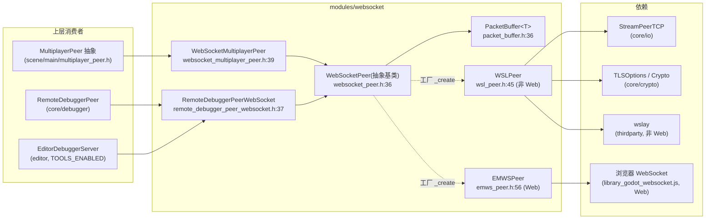
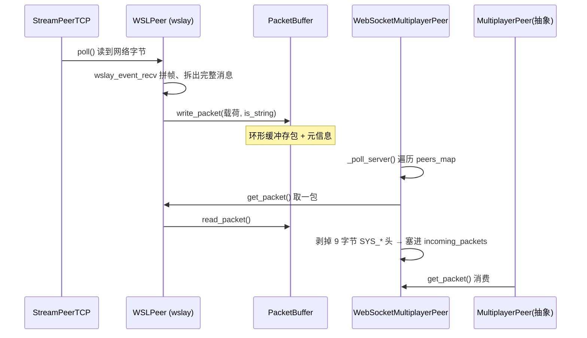

# websocket（modules）

> 一句话：WebSocket 是「跑在 TCP 上、却像浏览器那样说话」的协议——先做一次 HTTP 握手换成 TCP 长连接，之后所有数据都装进带长度的「帧」里收发。这个模块把这条协议拧成 Godot 熟悉的 `PacketPeer` 接口，再喂给联网层。

**结论**：`modules/websocket` 把 RFC 6455 的 WebSocket 握手与帧协议翻译成 Godot 的两层接口——底层 `WebSocketPeer`（一条连接的收发）、上层 `WebSocketMultiplayerPeer`（用这套连接做多人游戏）。代价是它自己不实现协议细节，非 Web 平台全交给 vendored 的 wslay 库，Web 平台全交给浏览器原生 `WebSocket`，Godot 只写「胶水」。

## 是什么 / 不是什么

它负责把「字节流 + 帧」的 WebSocket 协议，包成引擎里人人会用的 `PacketPeer` / `MultiplayerPeer` 接口。

- **是什么**：一个协议适配层。同一个基类 `WebSocketPeer` 下面有两个实现——非 Web 平台用 `WSLPeer`（包 wslay），Web 平台用 `EMWSPeer`（包浏览器 JS API）。`register_types.cpp:37-41` 用 `#ifdef WEB_ENABLED` 二选一。
- **不是什么**：不负责 TCP 连接的底层细节（交给 `core/io/stream_peer_tcp.h`），不负责多人游戏的节点同步语义（那是 `scene/main/multiplayer_peer.h` 的 `MultiplayerPeer` 抽象），不负责 TLS 加密实现（交给 `core/crypto`）。

一句话分界：`StreamPeerTCP` 给字节流，`WebSocketPeer` 给「一条完整的消息」，`WebSocketMultiplayerPeer` 给「一堆客户端各自一条消息」。

## 在引擎里的位置



箭头读法：上层只依赖 `WebSocketPeer` / `WebSocketMultiplayerPeer` 两个公共类；`WebSocketPeer` 通过静态工厂 `_create`（`websocket_peer.h:60`）指向真正的实现，换平台就是换工厂指针，上层无感。

## 关键概念

- **握手（handshake）**：像「进门先对暗号」。客户端发一串 HTTP 头（含随机 `Sec-WebSocket-Key`），服务端回 `101 Switching Protocols` 加 `Sec-WebSocket-Accept`。锚点：客户端拼 key 在 `wsl_peer.cpp:545-546`，服务端回 accept 在 `wsl_peer.cpp:262-265`。
- **帧（frame）**：像「信封」。每条消息被切成带 opcode（文本/二进制）和长度的帧。发送时 `WRITE_MODE_TEXT` / `WRITE_MODE_BINARY` 映射成 wslay 的 `WSLAY_TEXT_FRAME` / `WSLAY_BINARY_FRAME`（`wsl_peer.cpp:806`）。
- **`WebSocketPeer`**：一条连接的抽象。是 `PacketPeer` 的子类（`websocket_peer.h:36`），但不直接实例化——它是 `ClassDB::register_custom_instance_class` 注册的抽象基类，靠 `_create` 工厂造出 `WSLPeer` 或 `EMWSPeer`（`register_types.cpp:71`）。
- **`WebSocketMultiplayerPeer`**：把「一堆 `WebSocketPeer`」变成多人连接。它自己定了一套 9 字节小协议头 `SYS_ADD/SYS_DEL/SYS_ID`（`websocket_multiplayer_peer.h:46-53`）来分配 peer id。
- **`PacketBuffer<T>`**：收发消息的环形缓冲（`packet_buffer.h:36`），解决「帧进来是碎片、出去是整包」的边界问题。

## 核心文件（按阅读顺序）

1. `register_types.cpp` — 模块入口。按平台二选一初始化 `EMWSPeer`/`WSLPeer`，注册 2 个类，挂上调试器的 `ws://`/`wss://` 处理器。
2. `websocket_peer.h` / `websocket_peer.cpp` — 公共抽象基类。定义 `State`、`WriteMode`、缓冲区参数，以及 `connect_to_url`/`accept_stream`/`send`/`poll` 这套 `PacketPeer` 接口。
3. `websocket_multiplayer_peer.h` / `websocket_multiplayer_peer.cpp` — 多人封装。`create_server`/`create_client`，内部维护 `peers_map` 和 9 字节小协议。
4. `wsl_peer.h` / `wsl_peer.cpp` — 非 Web 平台的 wslay 胶水。手写 HTTP 握手 + 用 wslay 事件上下文收发帧（约 940 行，是本模块最重的文件）。
5. `emws_peer.h` / `emws_peer.cpp` — Web 平台胶水。把浏览器的 `WebSocket` 用 `godot_js_websocket_*`（`emws_peer.h:49-53`）转成同一套接口。
6. `packet_buffer.h` — 通用环形消息队列，两个实现共用的收包缓冲。
7. `remote_debugger_peer_websocket.h` / `.cpp` — 让引擎远程调试器走 WebSocket 传输。
8. `SCsub` — 非 Web 平台编 `thirdparty/wslay` 的 4 个 `.c`（`SCsub:18-23`）；Web 平台改挂 `library_godot_websocket.js`。

## 数据流 / 调用链

以「服务端收一帧二进制消息，经 `WebSocketMultiplayerPeer` 交给游戏」为例：



关键在最后一跳：`WebSocketMultiplayerPeer::put_packet` 在 `MultiplayerPeer` 的抽象接口之下自己塞了 9 字节头（`websocket_multiplayer_peer.h:46-53`），这样它能把「谁发的、发给谁」这类多人语义编码进同一条 WebSocket 消息里，而 `MultiplayerPeer` 的消费者完全不用管。

## 中文口诀

```
一条 TCP 打底，握手换成帧；
wslay 管帧，EMWS 管浏览器；
WebSocketPeer 定接口，工厂二选一；
MultiplayerPeer 上头，九字节分你我；
PacketBuffer 兜边界，碎片也能拼整包。
```

## 练习（15 分钟）

1. 打开 `wsl_peer.cpp:262-265`，找出服务端回 `101` 时写回的三个关键响应头，和 `Sec-WebSocket-Accept` 的值怎么算出来（看 `_compute_key_response` 在 `wsl_peer.cpp:697`）。
2. 对比 `websocket_peer.cpp:88-94` 的 `BIND_ENUM_CONSTANT`，数一数 `State` 和 `WriteMode` 各有几个枚举值暴露给 GDScript。
3. 在 `websocket_multiplayer_peer.h:46-53` 里找到 `SYS_ADD/SYS_DEL/SYS_ID` 三个值，回答：为什么 `PROTO_SIZE` 是 9。

## 自测

- [ ] `WebSocketPeer` 为什么不直接 `new`，而要用 `create()`（提示：看 `register_types.cpp:71` 和 `websocket_peer.h:60` 的 `_create` 是干什么的）？
- [ ] 非 Web 平台和 Web 平台各用哪个类实现 `WebSocketPeer`？切换点在哪一行？
- [ ] 一条「文本消息」和「二进制消息」在 wslay 层分别对应什么 opcode（`wsl_peer.cpp:806`）？

## 一句话总结

> `modules/websocket` 是 WebSocket 协议的「Godot 翻译官」：把 wslay（或浏览器）的握手与帧，翻译成引擎统一的 `PacketPeer`/`MultiplayerPeer`，让多人游戏和远程调试都能复用同一条数据通路。
