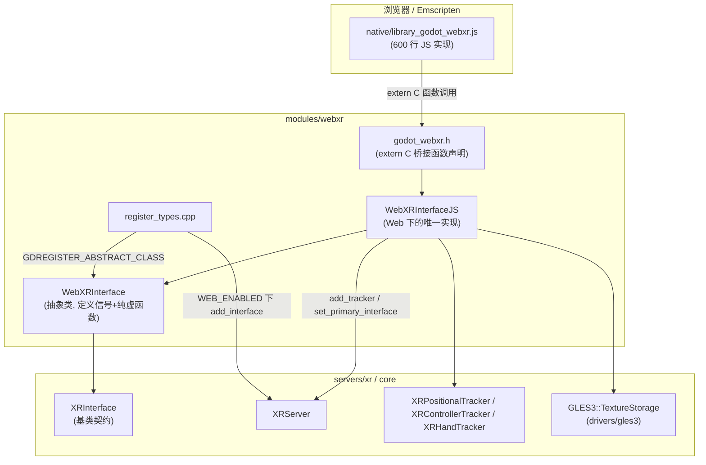
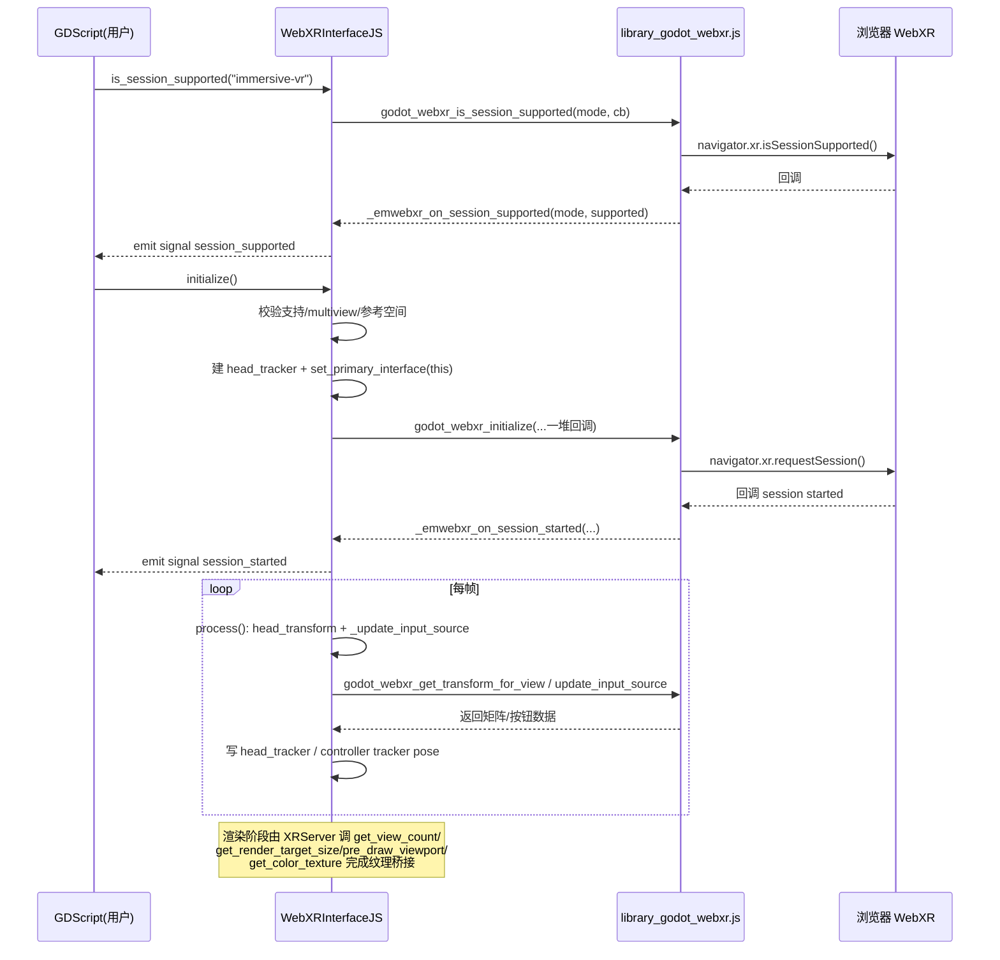

# webxr（modules）

> 一句话：WebXR 模块是一根「翻译官」——把浏览器里基于 JavaScript 回调的 WebXR 标准，翻译成 Godot 引擎里基于 C++ 同步返回值的 `XRInterface` 契约。

**结论**：`modules/webxr` 把 Web 浏览器的 WebXR API 包成一个 `XRInterface` 实现（`WebXRInterface`），让 Godot 导出的网页游戏能在 VR/AR 头显里跑；代价是 WebXR 天生异步（靠 JS 回调），所以这个模块被迫用「信号」代替「同步返回值」，初始化流程比 OpenXR 等原生接口绕。

## 是什么 / 不是什么

- **是什么**：一个只在 Web 导出（`WEB_ENABLED`）下生效的 XR 后端，负责会话申请、双目渲染、手柄与手势追踪的「浏览器版」实现。
- **不是什么**：它不是 XR 的调度中枢（那是 `servers/xr` 的 `XRServer`）；它也不是原生头显后端（OpenXR 在 `modules/openxr`，移动端在 `modules/mobile_vr`）。
- 它不碰渲染核心：纹理最终交给 `drivers/gles3` 的 `GLES3::TextureStorage` 托管，自己只做「拿 WebGLTexture 句柄 → 包成 `RID`」。

## 在引擎里的位置



- `register_types.cpp:50` 注册抽象类 `WebXRInterface`；`register_types.cpp:52-57` 仅在 `WEB_ENABLED` 下实例化 `WebXRInterfaceJS` 并 `XRServer::add_interface` 挂进服务器。
- 上层（`scene/` 的 `XROrigin3D`、`Viewport.use_xr`）通过 `XRServer` 间接使用它，不直接 new。

## 关键概念

1. **「翻译官」= 契约适配**：基类 `XRInterface` 的纯虚函数（`initialize`、`get_view_count`、`get_render_target_size`、`get_camera_transform`，见 `servers/xr/xr_interface.h:110-140`）都是「一问一答」的同步接口；WebXR 却是「你申请、浏览器稍后回调你」。`WebXRInterface` 用信号把这种异步翻译回同步世界。
2. **「两级类」= 抽象壳 + Web 实现**：`WebXRInterface`（`webxr_interface.h:40`）只定义纯虚函数和信号，本身不注册可实例化对象（`GDREGISTER_ABSTRACT_CLASS`）；真正干活的是 `WebXRInterfaceJS`（`webxr_interface_js.h:49`）。这样将来换后端（比如 Node.js 端）只要再写一个子类。
3. **「C++ ↔ JS 桥」**：`godot_webxr.h:51-95` 声明一批 `extern C` 函数（`godot_webxr_initialize`、`godot_webxr_update_input_source` 等），JS 侧在 `native/library_godot_webxr.js` 里实现；JS 反过来通过 `EMSCRIPTEN_KEEPALIVE` 回调 C++（`webxr_interface_js.cpp:99` 的 `_emwebxr_on_input_event`）。
4. **「目标射线」= 输入来源分类**：`TargetRayMode` 枚举（`webxr_interface.h:52-57`）把 WebXR 的 input source 分成 `GAZE`（眼睛看）、`TRACKED_POINTER`（手柄）、`SCREEN`（触屏/鼠标）、`UNKNOWN`，决定这个 source 该被当成手柄还是触屏事件。
5. **「参考空间」= 你在哪」**：`requested_reference_space_types` 字符串（如 `bounded-floor, local-floor, local`）按优先级申请坐标系，最终拿到哪个存在 `reference_space_type` 里（`webxr_interface.cpp:46`、`webxr_interface_js.cpp:148-158`）。

## 核心文件（按阅读顺序）

1. `config.py` — 决定模块能不能编：仅当 `opengl3` 开、`disable_xr` 关才构建，且 Web + `proxy_to_pthread` 时直接禁用（`config.py:1-6`）；声明要生成文档的类 `["WebXRInterface"]`。
2. `SCsub` — 编译 `*.cpp`；仅在 `platform == "web"` 时把 `native/library_godot_webxr.js` 作为 JS 库、`native/webxr.externs.js` 作为 externs 注入（`SCsub:7-9`）。
3. `register_types.cpp` — 模块入口：注册抽象类、Web 下实例化并挂进 `XRServer`（`initialize_webxr_module` / `uninitialize_webxr_module`）。
4. `webxr_interface.h` — 抽象壳：`GDCLASS(WebXRInterface, XRInterface)`，声明纯虚函数、`TargetRayMode` 枚举。
5. `webxr_interface.cpp` — 绑定：`_bind_methods` 里 bind 方法、`ADD_PROPERTY`、`ADD_SIGNAL`（`session_started`/`session_failed`/`select`/`squeeze`…）、`BIND_ENUM_CONSTANT`。
6. `godot_webxr.h` — C++ 与 JS 之间的 `extern C` 桥函数与回调 typedef（`GodotWebXRStartedCallback` 等）。
7. `webxr_interface_js.h` — Web 实现类：16 个 input source（`input_source_count = 16`）、2 只手（`HAND_MAX = 2`）、25 个手关节（`WEBXR_HAND_JOINT_MAX = 25`）等成员。
8. `webxr_interface_js.cpp` — 真正的实现（890 行）：会话生命周期、`_emwebxr_*` 回调、`process()` 每帧刷新头显与输入、纹理桥接、手势追踪。
9. `native/library_godot_webxr.js` — JS 侧实现（约 600 行），直接调用浏览器 `navigator.xr`。
10. `webxr_interface.compat.inc` — 兼容层：旧签名 `get_input_source_tracker` 的兼容绑定（`DISABLE_DEPRECATED` 时关闭）。

## 数据流 / 调用链

一次「申请会话 → 拿到帧 → 渲染」的典型流程：



关键点：`initialize()`（`webxr_interface_js.cpp:288-343`）返回 `true` 只代表「请求已发出」，真正的成败靠 `session_started` / `session_failed` 信号异步落地——这正是 `WebXRInterface` 与其他 XR 接口最大的不同。

## 中文口诀

```
浏览器里跑 VR，WebXR 来做翻译。
同步契约异步补，信号回填不猜谜。
抽象壳子定信号，JS 实现真干活。
extern C 架大桥，JS 回调 C++ 里。
十六手柄两只手，二十五节算手势。
先问支持再申请，start 信号才算起。
纹理句柄包 RID，重新附加别忘记。
```

## 练习（15 分钟）

1. 打开 `webxr_interface_js.cpp` 的 `initialize()`（288 行起），逐条数它发射 `session_failed` 信号的三个前置检查是什么。
2. 在 `_update_input_source`（620 行起）里找出：屏幕类输入源（`TARGET_RAY_MODE_SCREEN`）的摇杆向量是怎么换算成屏幕像素坐标的（`_get_screen_position_from_joy_vector`）。
3. 打开 `native/library_godot_webxr.js`，找到与 `godot_webxr_update_input_source` 对应的 JS 实现，确认它返回的数组顺序与 `godot_webxr.h:74-88` 的参数一一对应。

## 自测

- [ ] `WebXRInterfaceJS::get_capabilities()`（`webxr_interface_js.cpp:276-278`）返回了哪四个能力位？为什么 WebXR 同时宣称 `XR_VR` 和 `XR_AR`？
- [ ] 为什么 `initialize()` 里对 `immersive-vr` 单独检查 `GLES3::Config::get_singleton()->multiview_supported`（`webxr_interface_js.cpp:298`）？
- [ ] `pre_draw_viewport`（`webxr_interface_js.cpp:501`）为什么每帧都要 `render_target_set_reattach_textures(...true)`，即使纹理的 GLuint 和上一帧相同？
- [ ] 头显位姿 `head_transform` 是在哪个函数、用哪个桥函数的什么参数（view = ?）拉出来的（`webxr_interface_js.cpp:602-608`）？

## 一句话总结

> `modules/webxr` 是 WebXR 标准与 Godot `XRInterface` 契约之间的「异步翻译层」：它用 `WebXRInterface` 抽象壳定义信号、用 `WebXRInterfaceJS` + `godot_webxr.h` 的 `extern C` 桥把浏览器的回调结果翻译成引擎能同步消费的位姿、输入和纹理。
