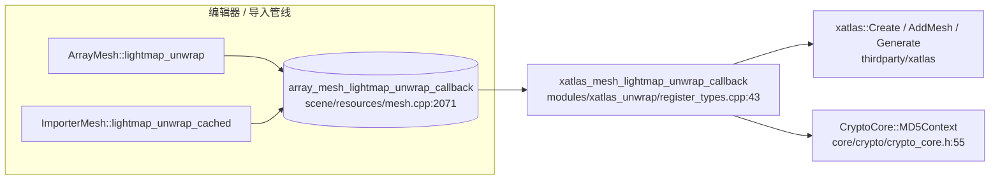
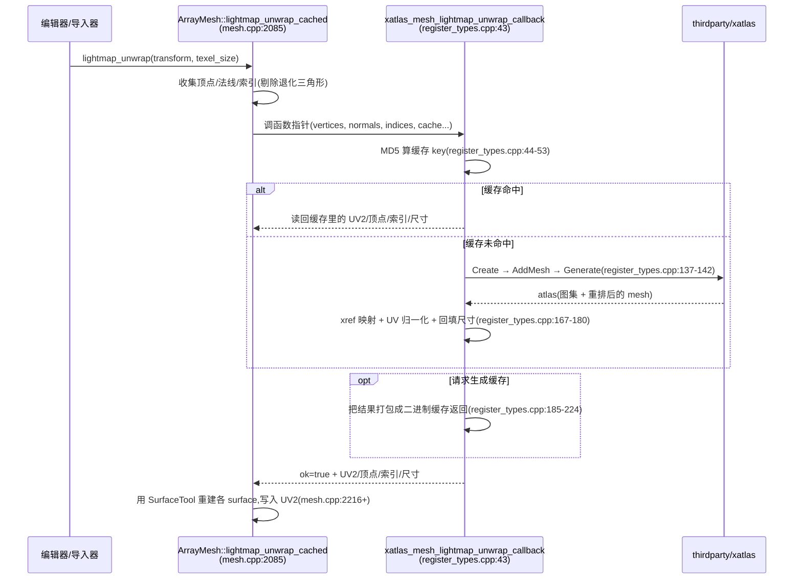

# xatlas_unwrap（modules）

> 一句话：它像是「贴 UV 的自动裁缝」——把一张三维网格剪开、摊平、塞进一张方布（光照贴图图集）里，术语叫 **UV 自动展开（atlas generation）**。

**结论**：`modules/xatlas_unwrap` 是第三方 `xatlas` 库的**薄胶水层**——它不注册任何新类、不暴露任何脚本 API，只在 `MODULE_INITIALIZATION_LEVEL_SCENE` 阶段把自己的实现函数挂到 scene 层共享的全局函数指针 `array_mesh_lightmap_unwrap_callback` 上（`register_types.cpp:236`），从而让 `ArrayMesh` / `ImporterMesh` 获得「给网格生成光照贴图 UV2」的能力；代价是背进 1 个 thirdparty 源文件的编译量，且只在编辑器构建里启用（`config.py:2`）。

## 是什么 / 不是什么

它负责：把「一堆三角形 + 法线」喂给 xatlas，产出「一套摊平后的 UV2 + 重排后的顶点/索引 + 图集尺寸」，并在结果前面包一层 MD5 缓存（`register_types.cpp:43-228`）。

它不负责：真正去烤光照贴图（那是 `lightmapper_rd` 的活）；不负责管网格数据本身（`ArrayMesh` 负责收集顶点、法线、索引，再消费返回的 UV2）；不负责定义「什么时候要 unwrap」（由 `ArrayMesh::lightmap_unwrap` 和 `ImporterMesh::lightmap_unwrap_cached` 决定）。

换句话说：这个模块是一根「管子」，两端都是别人——入口是 scene 层留空的函数指针，出口是 `thirdparty/xatlas`。

## 在引擎里的位置

依赖方向一句话：`scene` 只认识自己身上的一个函数指针，不知道模块存在；模块在初始化时把指针填上（`register_types.cpp:236`），并把真正的计算转发给 `thirdparty/xatlas`。谁都没直接 `#include` 对方——靠 `extern` 声明对上了号（`register_types.cpp:41` 与 `mesh.cpp:2071` 是同一个符号的两处声明）。

## 关键概念

- **函数指针插座（callback slot）**：scene 层留了一个全局变量 `array_mesh_lightmap_unwrap_callback`，默认 `nullptr`（`mesh.cpp:2071`）。调用方先查它：`ERR_FAIL_NULL_V(array_mesh_lightmap_unwrap_callback, ERR_UNCONFIGURED)`（`mesh.cpp:2086`）——没被模块填上就直接报「未配置」。这就是 Godot 模块解耦的惯用手法：**scene 定义插座，模块来插插头**。

- **光照贴图 UV2（lightmap UV）**：普通网格已经有 UV0 管贴图，光照贴图需要另一套「不重叠、按图集尺寸归一化」的坐标。模块产出的 `*r_uv` 就是把 xatlas 摊平后的坐标除以图集宽高（`register_types.cpp:168-169`），得到 0~1 的 UV2。

- **chart 与 atlas（岛与图集）**：xatlas 把网格按连续面切成一块块「岛」（chart），再把岛装箱进一张方形图集（atlas）。模块给的打包参数是 `maxChartSize = 4094`、`padding = 1`（`register_types.cpp:132-133`）——4094 是因为图集 4096 要留 2 个像素给网格间 padding。

- **MD5 缓存（cache key）**：每次展开前先对「texel 尺寸 + 索引 + 顶点 + 法线」算一个 MD5（`register_types.cpp:44-53`），用它去二进制缓存里找命中。命中就直接读回上次结果，跳过 xatlas 重算（`register_types.cpp:87-110`），这是烘焙重开工程时提速的关键。

## 核心文件（按阅读顺序）

1. `modules/xatlas_unwrap/config.py` — `can_build` 返回 `env.editor_build`（`config.py:2`）：只有编辑器构建才编译本模块，运行时导出包不带它。
2. `modules/xatlas_unwrap/SCsub` — 编译脚本：`builtin_xatlas` 为真时把 `thirdparty/xatlas/xatlas.cpp` 加进编译（`SCsub:13-25`），再编译本模块自己的 `*.cpp`（`SCsub:32`）。
3. `modules/xatlas_unwrap/register_types.h` — 只声明 `initialize_xatlas_unwrap_module` / `uninitialize_xatlas_unwrap_module` 两个入口（`register_types.h:35-36`）。
4. `modules/xatlas_unwrap/register_types.cpp` — 全部实现在这一个文件里：`extern` 声明插座（`:41`）、`xatlas_mesh_lightmap_unwrap_callback` 主体（`:43-228`）、初始化时插插头（`:231-237`）。

## 数据流 / 调用链

注意一个细节：xatlas 会为了摊平而**重新切分顶点**（同一个源顶点可能因为落在不同的 chart 被拆开）。所以回调返回的不只是 UV，还有 `*r_vertex`（记录输出顶点指向输入顶点的 `xref` 下标，`register_types.cpp:167`）和重排后的 `*r_index`，`ArrayMesh` 靠这个映射把 UV2 安回正确的源顶点（`mesh.cpp:2216-2227`）。

## 中文口诀

- 不注册类，只插插头，SCENE 一级把指针凑。
- 网格剪成岛，岛装进图集，UV 一除宽高变归一。
- 先算 MD5，命中就复用，省下 xatlas 重头跑。
- 顶点会被拆，xref 记得住，UV2 才安得回原处。
- 只给编辑器，导出不带它，烤完贴图删它也不怕。

## 练习（15 分钟）

1. 打开 `register_types.cpp:231-237`，确认初始化只在 `MODULE_INITIALIZATION_LEVEL_SCENE` 生效，再解释：如果改成 `MODULE_INITIALIZATION_LEVEL_CORE` 会有什么问题（提示：`ArrayMesh` 那时还没进 ClassDB）。
2. 找到 `register_types.cpp:44-53` 的 MD5 输入四件套，对比 `scene/resources/mesh.cpp:2194` 的实参，确认它们一一对应。
3. 在 `register_types.cpp:168-169` 给 UV 归一化那两行打注释，重编译，观察光照贴图 UV2 是否「溢出图集」——验证归一化的作用。

## 自测

- [ ] `array_mesh_lightmap_unwrap_callback` 的默认值是什么？谁在什么初始化级把它改成非空？
- [ ] 缓存命中路径里，`*r_uv` 指向的是哪块内存（`register_types.cpp:104`）？为什么不用 `memalloc` 而直接指进 `p_cache_data`？
- [ ] `maxChartSize` 为什么是 4094 而不是 4096（`register_types.cpp:133`）？
- [ ] 为什么回调要额外返回 `*r_vertex`（xref），只返回 UV 和索引不够吗？

## 一句话总结

> xatlas_unwrap 是「一根接在 `ArrayMesh` 函数指针插座上的管子」：这头喂进网格顶点/法线/索引，那头叫 xatlas 摊平打包，中间夹一层 MD5 缓存，把 UV 自动展开能力借给了引擎的编辑器构建。
