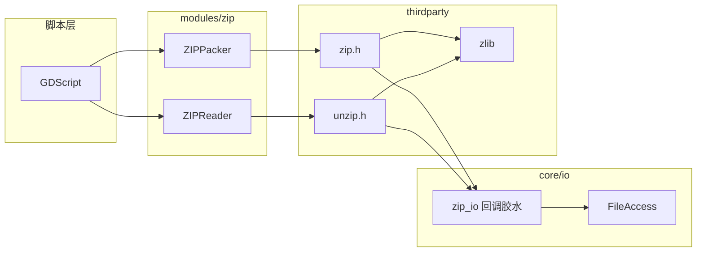
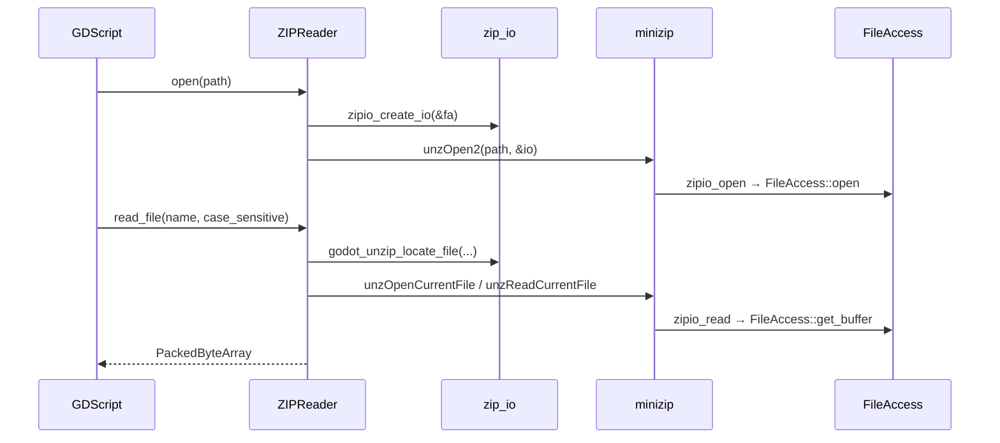

# zip（modules）

> 一句话：就像把 minizip 这台「压缩包机」装上一层 Godot 面板——脚本按下两个按钮（读 / 写），机器自己在里面干活。

**结论**：这个模块给 GDScript 暴露两个 `RefCounted` 类 `ZIPReader` 和 `ZIPPacker`，用来读写 `.zip` 归档；它本身不写任何压缩算法，只做「把 minizip 的 C 接口翻译成 Godot 的 `FileAccess`」这一层胶水，代价是只能整文件读进内存（`read_file` 返回整块 `PackedByteArray`），且整个模块能否编译取决于 `minizip` 是否启用。

## 是什么 / 不是什么

这个模块是 **minizip 的脚本前端**：`ZIPPacker` 负责往归档里写文件（`zip_packer.h:38`），`ZIPReader` 负责从归档里读文件（`zip_reader.h:38`）。

它**不**自己实现压缩算法——`deflate` 那套交给 `thirdparty/zlib`，归档格式交给 `thirdparty/minizip`，这两者都不归它管（也不在本文范围）。

它**不**负责把 `.zip` 挂成引擎的虚拟文件系统——那是 `core/io/file_access_zip.cpp` 干的，走的是 `core/io/zip_io` 同一套胶水，但不是本模块的活。

## 在引擎里的位置

模块自己只有 6 个源文件（`zip_reader.{h,cpp}`、`zip_packer.{h,cpp}`、`register_types.{h,cpp}`、`zip_packer.compat.inc`）。真正的胶水住在 `core/io/zip_io.{h,cpp}`，模块只是它的两个消费方之一。

## 关键概念

- **归档句柄**：`unzFile`（读）和 `zipFile`（写）是 minizip 给的一对「门把手」。`ZIPReader` 持 `unzFile uzf`（`zip_reader.h:42`），`ZIPPacker` 持 `zipFile zf`（`zip_packer.h:42`）。门把手后面才是真归档。
- **IO 回调表 `zlib_filefunc_def`**：minizip 默认用 C 的 `FILE*` 读写磁盘，Godot 偏要用自己的 `FileAccess`（能走虚拟文件系统）。桥接办法是塞一张函数指针表进去——`zipio_create_io`（`core/io/zip_io.h:60`）把 `zipio_open/read/write/tell/seek/close/testerror` 全指向对 `FileAccess` 的包装。
- **压缩级别 `compression_level`**：`ZIPPacker` 的整数字段，取值被限定在 `Z_DEFAULT_COMPRESSION` 到 `Z_BEST_COMPRESSION`（`zip_packer.h:62-66`、`zip_packer.cpp:61-64`），最终传给 `zipOpenNewFileInZip4` 的 `Z_DEFLATED` 参数（`zip_packer.cpp:113-114`）。
- **追加模式 `ZipAppend`**：`open()` 决定新开归档还是往旧归档里续写，枚举 `APPEND_CREATE / APPEND_CREATEAFTER / APPEND_ADDINZIP`（`zip_packer.h:55-59`）。

## 核心文件（按阅读顺序）

1. `modules/zip/config.py` — 编译开关：`can_build` 直接返回 `env["minizip"]`（`config.py:2`），并声明要生成的文档类清单 `ZIPReader`、`ZIPPacker`。
2. `modules/zip/SCsub` — 编译 `*.cpp`；开了 `tests` 时再编译 `tests/*.cpp`（`SCsub:12-13`）。
3. `modules/zip/register_types.cpp` — 在 `MODULE_INITIALIZATION_LEVEL_SCENE` 用 `GDREGISTER_CLASS` 注册两个类（`register_types.cpp:43-44`）。
4. `modules/zip/zip_reader.h` — 读归档的公共接口：`open / close / get_files / read_file / file_exists / get_compression_level`。
5. `modules/zip/zip_packer.h` — 写归档的公共接口：`open / close / start_file / write_file / close_file / add_directory` 加两个枚举。
6. `core/io/zip_io.h` + `core/io/zip_io.cpp` — 胶水本体：`zipio_create_io` 造回调表（`zip_io.cpp:172-185`），另有 `godot_unzip_locate_file` / `godot_unzip_get_current_file_info` 处理 Unicode 与超长路径（`zip_io.cpp:35-71`）。
7. `modules/zip/zip_packer.compat.inc` — 兼容层：为旧签名 `start_file(path)` 绑一个 `bind_compatibility_method`（`zip_packer.compat.inc:42`）。

## 数据流 / 调用链

一次「读文件」的完整链条，重点看胶水怎么在 minizip 和 `FileAccess` 之间穿针引线：

写侧对称：`ZIPPacker::open` 用 `zipio_create_io` 造表后调 `zipOpen2`（`zip_packer.cpp:43-44`），`start_file` 调 `zipOpenNewFileInZip4` 开条目、`write_file` 调 `zipWriteFileInFileZip`、`close_file` 调 `zipCloseFileInZip`。两者打开时都是「先造回调表，再带着表去 open」，这是理解整个模块的唯一关键点。

## 中文口诀

压缩包，读写难，minizip 里藏门把手；
Reader 读，Packer 写，两个句柄挂中间；
zipio 一张回调表，FileAccess 把活干；
先 open 后 close 别颠倒，压缩级别记心间。

## 练习（15 分钟）

1. 打开 `register_types.cpp`，圈出两处 `GDREGISTER_CLASS`，说出它们的初始化级别。
2. 读 `zip_reader.cpp` 的 `read_file`（`zip_reader.cpp:92-127`），用笔写下 minizip 调用的先后顺序（locate → open → read → close）。
3. 读 `core/io/zip_io.cpp` 的 `zipio_read` 和 `zipio_write`（`zip_io.cpp:100-115`），指出各自调用了 `FileAccess` 的哪个方法。
4. 读 `tests/test_zip.h`，找出一处「写入后断言文件大小」的用例，理解 128 字节这个数字是怎么来的。

## 自测

- [ ] `ZIPReader` 和 `ZIPPacker` 各自持有的 minizip 句柄类型是什么？
- [ ] 为什么 `open()` 要先调 `zipio_create_io` 再调 `unzOpen2` / `zipOpen2`，而不是直接传路径？
- [ ] `config.py` 里 `can_build` 返回什么？这决定了模块在什么条件下才被编译？
- [ ] `start_file` 自动创建父目录靠的是哪个成员变量（`zip_packer.h` 里找）？

## 一句话总结

> `zip` 模块是 minizip 的脚本胶水层：注册 `ZIPReader` / `ZIPPacker` 两个类，靠 `core/io/zip_io` 的回调表把 minizip 的 C 接口接到 Godot 的 `FileAccess` 上，让脚本能整包读写 `.zip`。
