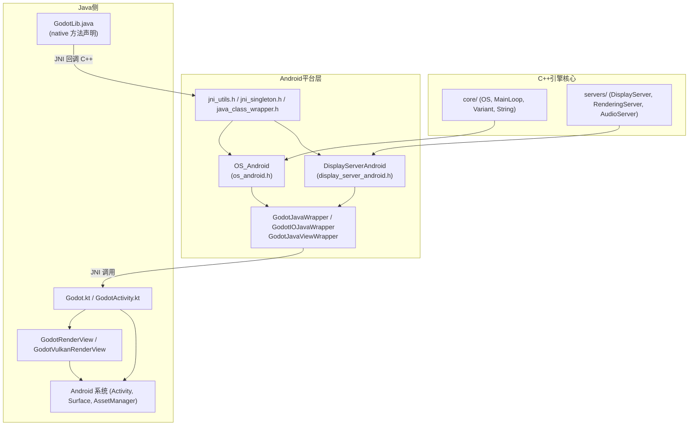
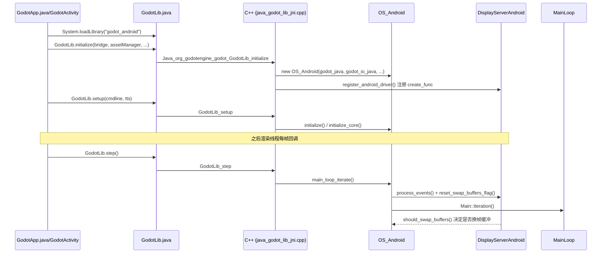

# Android（platform）

> 一句话：Android 平台层是「把 Godot 这台跨平台发动机，塞进安卓 App 这个 Java 外壳里的转接板」——用 JNI 在 C++ 引擎和 Java/Android 框架之间来回传话。

**结论**：这个模块负责在 Android 上落实 Godot 的两个平台契约——`OS` 与 `DisplayServer`——并用一套 JNI 桥接代码让 C++ 核心能调用 Android 系统能力（屏幕、输入、文件、音频、权限）；代价是必须维护一份 C++↔Java 双向的胶水层，任何新增的系统能力都要两端各写一遍。

## 是什么 / 不是什么

这个模块是 Godot 在 Android 上的「操作系统适配层」。它负责三件事：实现 `OS_Android` 和 `DisplayServerAndroid` 两个平台子类，把 Android 的生命周期、窗口、输入翻译成 Godot 内部调用；搭建 Java 桥（`GodotJavaWrapper` 等）让 C++ 调 Java；以及把引擎编译成一个 `.so` 交给 Gradle 打包。

它不是渲染器（渲染交给 `servers/rendering/`，Android 只提供 `ANativeWindow` 和 `RenderingContextDriverVulkanAndroid` 这个入口）；不是音频引擎（OpenSLES 只是 `AudioDriver` 的一个实现）；也不负责 Gradle/APK 的构建逻辑本身（导出流程在 `platform/android/export/`，Gradle 脚本在 `platform/android/java/`）。它只当「转接板」，不生产功能。

## 在引擎里的位置



## 关键概念

1. **「转接板」= `OS_Android` 与 `DisplayServerAndroid`**：这两个类继承自 `OS_Unix` 和 `DisplayServer`（`os_android.h:43`、`display_server_android.h:43`），是 Android 平台对引擎两个基类契约的落地点。引擎上层只认基类，不关心下面是 Windows 还是 Android。

2. **「翻译官」= Java 桥接三兄弟**：`GodotJavaWrapper` 封装 `Godot.kt`（`java_godot_wrapper.h:43`）、`GodotIOJavaWrapper` 封装 `GodotIO.java`（`java_godot_io_wrapper.h:40`）、`GodotJavaViewWrapper` 封装 `GodotRenderView`（`java_godot_view_wrapper.h:39`）。C++ 侧不直接写 `env->CallVoidMethod(...)`，而是通过缓存的 `jmethodID` 调用有名字的方法。

3. **「反向传话筒」= `Java_org_godotengine_godot_GodotLib_*`**：`java_godot_lib_jni.h` 里那一长串 `JNIEXPORT` 函数，是 Java 侧回调 C++ 的入口。命名规则是 JNI 规定的 `Java_<包名>_<类名>_<方法名>`，对应 `GodotLib.java` 里的 `native` 声明（`java_godot_lib_jni.h:39`）。

4. **「类型摆渡」= `jni_utils`**：`jstring_to_string`、`_jobject_to_variant`、`_variant_to_jobject`（`jni_utils.h:40-44`）负责把 Java 对象和 Godot 的 `String`/`Variant` 互转。跨语言传值全靠这几个函数做翻译。

5. **「脚本级桥」= `JNISingleton` 与 `JavaClassWrapper`**：允许 GDScript 直接拿到一个 Java 单例对象（`api/jni_singleton.h:38`）或反射调用任意 Java 类（`api/java_class_wrapper.h:247`），这是插件系统的基础。

## 核心文件（按阅读顺序）

1. `platform/android/detect.py` — SCons 检测入口：定义平台名 "Android"、NDK 版本、最低 API 24（`get_min_target_api`）。
2. `platform/android/SCsub` — 编译清单：23 个 `.cpp` 编成一个 `libgodot_android.so`。
3. `platform/android/os_android.h` — `OS_Android` 声明，平台契约的「操作系统」半边。
4. `platform/android/display_server_android.h` — `DisplayServerAndroid` 声明，平台契约的「显示/窗口/输入」半边。
5. `platform/android/java_godot_lib_jni.h` — Java 回调 C++ 的全部 JNI 入口（`GodotLib_*`）。
6. `platform/android/java_godot_wrapper.h` — C++ 调 Java 的 `Godot.kt` 封装。
7. `platform/android/java_godot_io_wrapper.h` — C++ 调 Java 的 `GodotIO.java` 封装。
8. `platform/android/jni_utils.h` — JNI 类型转换与线程安全的 `jni_find_class`。
9. `platform/android/java/lib/src/main/java/org/godotengine/godot/GodotLib.java` — Java 侧 native 声明与 `System.loadLibrary("godot_android")`。
10. `platform/android/export/export.cpp` — 导出器注册（`register_android_exporter`）。

## 数据流 / 调用链

一次「App 启动 → 跑主循环」的典型链路：



链路里最值得注意的两点：初始化时 Java 把 `AssetManager`、`GodotIO`、`FileAccessHandler` 这些 Android 专属对象「交」给 C++，C++ 存成 wrapper 以后随时回调；主循环不是 C++ 自己 `while` 死转，而是由 Android 的渲染线程每帧调一次 `GodotLib.step()` 来驱动（`os_android.cpp:380` 的 `main_loop_iterate`）。

## 中文口诀

```
安卓壳里套引擎，JNI 两头传话音；
OS 管命与权限，DisplayServer 管窗口和输入；
Java 调 C 用 GodotLib，C 调 Java 靠 Wrapper；
类型摆渡 jni_utils，脚本桥接 JNISingleton；
主循环不靠自己转，step 一脚踢一帧。
```

## 练习（15 分钟）

1. 打开 `platform/android/java_godot_lib_jni.h`，数一数 `JNIEXPORT` 函数里有多少个名字带 `dispatch` 或 `joy` 或 `key` 的，判断输入事件分几类从 Java 回传。
2. 在 `os_android.cpp` 里找 `main_loop_iterate`，读它的前 10 行，写下一句话：为什么主循环要先 `reset_swap_buffers_flag()` 再 `process_events()`。
3. 打开 `display_server_android.cpp` 的 `create_func`，找到 Vulkan 初始化失败时 `alert` 弹出的提示文案，把它和 `register_android_driver` 的注册名 `"android"` 记下来。

## 自测

- [ ] `OS_Android` 继承的是哪个基类？它和 `OS_Unix` 是什么关系？（见 `os_android.h:43`）
- [ ] Java 侧通过哪个类、哪个方法名触发 C++ 的 `GodotLib_initialize`？这条链路的命名规则是什么？
- [ ] `GodotJavaWrapper` 和 `GodotLib` 分别是「谁调谁」的方向？各对应哪个真实文件？

## 一句话总结

> Android 平台层是一块 JNI 转接板：C++ 核心实现 `OS`/`DisplayServer` 契约，Java 外壳负责对接 Android 系统，两端靠 `GodotLib_*` 回调和 `*Wrapper` 调用保持对话。
