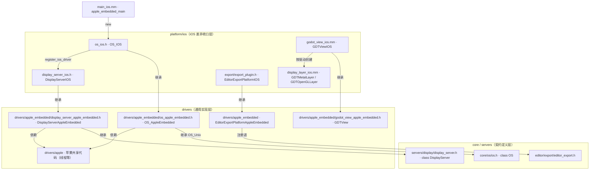
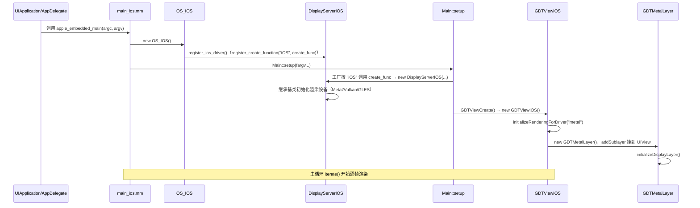

# ios（platform）

> 一句话：iOS 平台层是一层「薄皮」——它不自己造操作系统和窗口契约，而是继承 `drivers/apple_embedded` 那套苹果嵌入式底座，只补上 iOS 特有的屏幕参数、渲染层选择和 Xcode 工程导出。

**结论**：iOS 平台层把 Godot 的 `OS` / `DisplayServer` 两条抽象契约落到 iPhone/iPad 上，但它自己不重写这两套契约，而是继承 `OS_AppleEmbedded` / `DisplayServerAppleEmbedded` 两个苹果嵌入式基类，代价是它受限于苹果单窗口、单 App 生命周期、必须在 macOS 上用 Xcode 工具链构建。

## 是什么 / 不是什么

**是什么**：它是 Godot 七大 `platform` 之一（`platform/ios/`，28 个文件），把引擎「抽象 OS 接口」接到 UIKit/Foundation 上。整个目录里只有 6 个会被编译进静态库的 `.mm` 源文件（`SCsub:10-17`）。

**不是什么**：

- 它**不**重新实现 `OS` 契约——`OS_IOS` 只重写了一个 `get_name()`，其余全靠 `OS_AppleEmbedded` → `OS_Unix` 两层继承（`os_ios.h:37`、`os_ios.mm:48`）。
- 它**不**实现渲染后端——Metal/Vulkan/GLES 的渲染设备在 `drivers/` 里，这里只负责「把正确的 `CALayer` 塞进 `UIView`」。
- 它**不**自己写 Xcode 工程模板——模板在 `misc/dist/apple_embedded_xcode`，这里只做导出配置和 `Info.plist`/`.pbxproj` 的占位符替换。

对比就这 3 处，一句话收束：**iOS 平台层是「iOS 专属差异」的收口点，通用逻辑全在苹果嵌入式底座里。**

## 在引擎里的位置



箭头方向 = 「依赖 / 继承谁」。iOS 层只做三件事：继承两个嵌入式基类、创建渲染 `CALayer`、注册导出器。

## 关键概念

- **OS 契约 = 三层继承**：抽象接口在 `core/os/os.h` 的 `class OS`，Unix 通用实现在 `OS_Unix`（`drivers/unix/os_unix.h:52`），苹果移动端再叠一层 `OS_AppleEmbedded`（`os_apple_embedded.h:51`），`OS_IOS` 是最后一层薄壳。就像「祖传菜谱（OS）→ 妈妈改良（OS_Unix）→ 姐姐加盐（OS_AppleEmbedded）→ 你端上桌（OS_IOS）」。

- **DisplayServer 契约 = 工厂注册**：`DisplayServerIOS` 继承 `DisplayServerAppleEmbedded`，用 `register_create_function("iOS", create_func, ...)` 把自己登记进 `DisplayServer` 的全局工厂（`display_server_ios.mm:55`）。引擎要显示器时，喊一声名字「iOS」就能 `new` 出正确实现。

- **渲染层 = 按驱动名选 `CALayer`**：`GDTViewIOS` 的 `initializeRenderingForDriver:` 一看驱动名是 `metal`/`vulkan` 就 `new` 一个 `GDTMetalLayer`（`CAMetalLayer`），是 `opengl3` 就 `new` 一个 `GDTOpenGLLayer`（`CAEAGLLayer`）（`godot_view_ios.mm:48-84`）。`CALayer` 是 UIKit 的「画布」，Godot 渲染设备往这块画布上画。

- **屏幕参数 = 查表 + 兜底**：`DisplayServerIOS` 只重写了 `screen_get_dpi` / `screen_get_scale` / `screen_get_refresh_rate` 三个接口，用 `GDTDeviceMetrics` 的机型→DPI 查表，查不到再按 `UIScreen.scale` 兜底（`display_server_ios.mm:63-122`）。

- **导出器 = 占位符替换**：`EditorExportPlatformIOS` 把 Xcode 工程模板里的 `$targeted_device_family`、`$moltenvk_buildfile`、`$launch_screen_image_mode` 等占位符替换成真实值（`export_plugin.cpp:390-490`）。

## 核心文件（按阅读顺序）

1. `detect.py` — SCons 平台探测：声明 iOS 只能在 macOS 上构建，定义了 `simulator`、`ios_simulator` 等构建选项（`detect.py:16-35`）。
2. `SCsub` — 声明 6 个 `.mm` 源文件，编成 `libios` 静态库，再和苹果嵌入式底座合并成 `libgodot`（`SCsub:10-30`）。
3. `os_ios.h` / `os_ios.mm` — `OS_IOS`：唯一职责是构造时调用 `DisplayServerIOS::register_ios_driver()`，以及返回平台名 `"iOS"`（`os_ios.mm:41-50`）。
4. `main_ios.mm` — 真正的入口 `apple_embedded_main`：`new OS_IOS()` → `Main::setup(...)` → `initialize_modules()`（`main_ios.mm:44-74`）。
5. `display_server_ios.h` / `display_server_ios.mm` — `DisplayServerIOS`：重写屏幕 DPI/缩放/刷新率，以及 HDR(EDR) 支持判定（`display_server_ios.mm:63-143`）。
6. `godot_view_ios.h` / `godot_view_ios.mm` — `GDTViewIOS`：`UIView` 子类，实现 `GDTViewCreate()`，按驱动名创建渲染 `CALayer`（`godot_view_ios.mm:48-96`）。
7. `display_layer_ios.h` / `display_layer_ios.mm` — `GDTMetalLayer`（空实现，Metal 由 CAMetalLayer 自己画）和 `GDTOpenGLLayer`（手动搭 EAGL framebuffer）（`display_layer_ios.mm:51-195`）。
8. `device_metrics.h` — `GDTDeviceMetrics`：维护「机型数组 → DPI」的查表字典（`device_metrics.h:35`）。
9. `export/export_plugin.h` / `export_plugin.cpp` — `EditorExportPlatformIOS`：iOS 导出选项、图标集生成、`Info.plist` 占位符替换（`export_plugin.cpp:56-232`）。
10. `export/export.cpp` — `register_ios_exporter()`：实例化导出器并挂到 `EditorExport`（`export.cpp:46-57`）。

## 数据流 / 调用链

一次「App 启动 → 出第一帧」的典型调用：



启动链的核心只有一步：`OS_IOS` 构造时把 `DisplayServerIOS` 的工厂函数登记进 `DisplayServer`，之后 `Main::setup` 靠名字把它实例化出来。

## 中文口诀

```
OS 契约靠继承，Apple 底座三层叠
DisplayServer 进工厂，喊声 iOS 就 new
GDTView 看驱动，Metal 还是 OpenGL
DPI 查表兜 UIScreen，HDR 就问 EDR
导出器换占位符，Xcode 工程才落地
iPhone iPad 一个样，窗口只有一扇门
```

## 练习（15 分钟）

1. 打开 `os_ios.h`，数一数 `OS_IOS` 一共声明了几个成员函数（答案是 3 个：`get_singleton`、构造、析构、`get_name`——数完你就明白「薄壳」是什么意思）。
2. 在 `display_server_ios.h` 里找出 `DisplayServerIOS` 相对 `DisplayServerAppleEmbedded` 多出来的、带 `override` 的成员函数，列成清单。
3. 读 `godot_view_ios.mm` 的 `initializeRenderingForDriver:`，用一句话说清：驱动名是 `vulkan` 和 `metal` 时都走哪个 `CALayer` 类。

## 自测

- [ ] `DisplayServerIOS` 是怎么被 `Main::setup` 找到的？在 `display_server_ios.mm` 里定位注册调用，写出那个字符串常量。
- [ ] `OS_IOS` 相对 `OS_AppleEmbedded` 新增的逻辑只有几行？这说明了 iOS 平台层和苹果嵌入式底座的什么分工？
- [ ] `screen_get_dpi` 在查表失败后的兜底分支里，Pad 和 Phone 各返回多少？（`display_server_ios.mm:84-101`）

## 一句话总结

> iOS 平台层不重写 `OS`/`DisplayServer` 契约，而是继承苹果嵌入式底座后，只补上 iOS 专属的屏幕参数、渲染层创建和 Xcode 导出这三块拼图。
