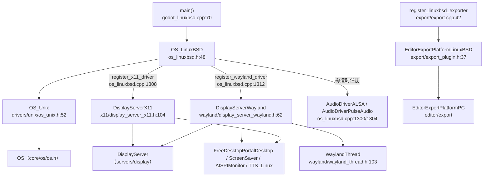

# linuxbsd（platform）

> 一句话：Linux/*BSD 是「同一套 POSIX 底层 + 两套窗口协议（X11 / Wayland）」拼出来的桌面平台端口——像一台汽车共用底盘、但能换两套方向盘。

**结论**：`platform/linuxbsd/` 是 Godot 跑在 Linux 与各 BSD 上的平台层：它用一个 `OS_LinuxBSD` 兑现 `OS`/`OS_Unix` 契约、用 `DisplayServerX11` 与 `DisplayServerWayland` 两个后端兑现 `DisplayServer` 契约，再补上导出器和 Freedesktop 集成；代价是「一个平台两套窗口栈」，窗口/输入/剪贴板逻辑都要写两份。

## 是什么 / 不是什么

- **是什么**：桌面 POSIX 平台的「落地层」——把引擎抽象接口（`OS`、`DisplayServer`）接到真实的 Linux/BSD 系统调用和显示协议上。
- **不是什么**：不是渲染器（Vulkan/GL 的具体画法在 `servers/rendering`、`drivers/vulkan` 里，这里只管「把画面 swap 到哪个窗口」）；不是窗口管理的通用实现（X11 和 Wayland 各写各的，互不共享代码）；不是音频/输入驱动的实现（`AudioDriverALSA`、`AudioDriverPulseAudio`、`JoypadSDL` 都在 `drivers/` 下，这里只负责「按编译选项把驱动注册进去」）。

它不负责的交给谁：系统字体、崩溃回栈、D-Bus 屏保这三类能力虽然源文件在本目录，但都只是「桥」，真正的库在 `thirdparty/`（本次不展开）。

## 在引擎里的位置



## 关键概念

1. **OS 契约兑现者 `OS_LinuxBSD`** —— 引擎问「我在哪个平台、字体在哪、数据目录在哪」，它给出答案。它继承 `OS_Unix`（`os_linuxbsd.h:48`），重写 `get_identifier()`/`get_name()`、`get_system_fonts()`、`get_config_path()` 等一批 `virtual`（`os_linuxbsd.h:96-135`）。
2. **两个窗口后端** —— X11 与 Wayland 是互斥的两条主线，都继承 `DisplayServer`，各自实现 `process_events()`、`swap_buffers()`、`window_set_title()` 等同一套虚函数。选哪个由 `--display-driver` 和编译选项决定，`register_x11_driver()` / `register_wayland_driver()` 把两者都注册进 `DisplayServer` 的工厂表（`os_linuxbsd.cpp:1308-1312`）。
3. **Wayland 的独立事件线程 `WaylandThread`** —— Wayland 是纯事件驱动协议，Godot 把整个 `wl_display` 事件循环放到独立线程，`DisplayServerWayland` 用 `List<Message>` 与主线程交换窗口/输入消息（`wayland_thread.h:103`、`:669-671`）。
4. **动态装载（sowrap）** —— 各 `dynwrappers/*-so_wrap.c` 用 `dlsym` 在运行时装载 Xlib/Xcursor/Wayland 等系统库，避免编译期硬链接（`SCsub:21-22`、`detect.py:58` 的 `use_sowrap`）。
5. **导出器 `EditorExportPlatformLinuxBSD`** —— 继承 `EditorExportPlatformPC`，负责把 PCK 塞进 ELF 可执行文件（`fixup_embedded_pck`，`export_plugin.h:79`）并跑 SSH 远程部署（`export_plugin.h:42-64`）。

## 核心文件（按阅读顺序）

1. `SCsub` — 入口清单：编译 `os_linuxbsd.cpp` 等公共文件，再按 `x11`/`wayland` 选项递归编译子目录（`SCsub:8-28`）。
2. `detect.py` — SCons 构建探针：`get_name()` 返回 `"LinuxBSD"`，`get_opts()` 定义 `x11`/`wayland`/`use_sowrap`/`alsa`/`pulseaudio` 等开关（`detect.py:13-76`）。
3. `godot_linuxbsd.cpp` — 可执行文件的 `main()`：查 SSE4.2、建 `OS_LinuxBSD`、`Main::setup` → `Main::start` → `os.run()`（`godot_linuxbsd.cpp:70-136`）。
4. `os_linuxbsd.h` / `os_linuxbsd.cpp` — OS 层的全部兑现 + 驱动注册；构造器是「接线中心」（`os_linuxbsd.cpp:1296`）。
5. `x11/display_server_x11.h` — X11 后端完整虚函数签名，含 Xlib 窗口、XIM 输入法、XDND 拖放、XInput2 触摸（`display_server_x11.h:104`）。
6. `wayland/display_server_wayland.h` — Wayland 后端签名，持有 `WaylandThread wayland_thread`（`display_server_wayland.h:140`）。
7. `wayland/wayland_thread.h` — Wayland 协议核心：`wl_registry`/`wl_seat`/`xdg_shell` 等全局对象与全部 `listener` 回调（`wayland_thread.h:197-286`）。
8. `export/export_plugin.h` + `export/export.cpp` — Linux/BSD 导出平台与注册（`export.cpp:38-50`）。

## 数据流 / 调用链

以「启动一个 Wayland 会话、处理一次鼠标点击」为例：

```mermaid
sequenceDiagram
    participant M as main(godot_linuxbsd.cpp)
    participant O as OS_LinuxBSD
    participant F as DisplayServer 工厂
    participant W as DisplayServerWayland
    participant T as WaylandThread
    participant S as SceneTree/MainLoop

    M->>O: OS_LinuxBSD os; Main::setup/start
    O->>F: register_wayland_driver()
    F->>W: create_func() → new DisplayServerWayland
    W->>T: 启动 events_thread，wl_display 事件循环
    S->>W: process_events()
    W->>T: 取出 List<Message>
    T-->>W: InputEventMessage(event)
    W->>S: _dispatch_input_event(InputEvent)
```

X11 主线结构相同，只是把 `WaylandThread` 换成 `DisplayServerX11` 自带的 `events_thread` 与 `_poll_events()`（`display_server_x11.h:368-371`），消息来自 Xlib 的 `XEvent` 队列。

## 中文口诀

- 一套 POSIX 底盘，两套窗口方向盘；
- X11 管旧，Wayland 管新，注册进工厂任引擎挑；
- OS 层接线，DisplayServer 干窗，Wayland 再开一条线程收事件；
- sowrap 运行时找库，不硬链，换发行版不重编；
- 导出就是「PCK 塞进 ELF」，再加 SSH 跑远程。

## 练习（15 分钟）

1. `grep -n "register_.*_driver" platform/linuxbsd/os_linuxbsd.cpp`，说出两个窗口后端各自注册的入口函数名和行号。
2. 打开 `platform/linuxbsd/wayland/display_server_wayland.cpp`，找到 `create_func` 里 `WaylandThread` 首次被启动的位置，确认它是不是独立线程。
3. 在 `platform/linuxbsd/export/export.cpp` 里读出 `set_name`/`set_os_name`/`set_chmod_flags` 的三个值，解释 `0755` 的意义。
4. 对比 `x11/display_server_x11.h:368` 与 `wayland/wayland_thread.h:666` 两处 `events_thread`，各写一句话：它们分别把什么事件源拉到后台线程。

## 自测

- [ ] `OS_LinuxBSD` 的直接基类是谁？它在哪个目录里定义？
- [ ] X11 与 Wayland 两个 `DisplayServer` 是「继承同一基类的两个类」，还是「一个类两套 if」？在头文件里各找一行证明。
- [ ] 不重编译源码、仅换发行版，为什么 `use_sowrap` 能让二进制继续跑？线索在 `SCsub:21` 和任一 `dynwrappers/*.c`。
- [ ] Wayland 的键盘按键映射到 Godot `Key` 用的是哪个类？（线索：`wayland/key_mapping_xkb.h`）

## 一句话总结

> `platform/linuxbsd/` 是桌面 POSIX 平台的「适配层」：一个 `OS_LinuxBSD` 加两个 `DisplayServer`（X11/Wayland）兑现引擎契约，再加一个导出器把游戏变成可分发 ELF。
