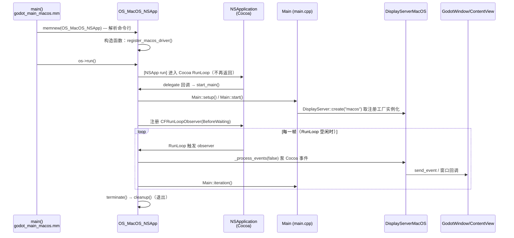

# macOS（platform）

> 一句话：macOS 平台层是 Godot 在苹果桌面系统上的「插座转接头」——把 Cocoa/AppKit 的窗口、事件、RunLoop 翻译成引擎内部的 `OS` 和 `DisplayServer` 契约。

**结论**：这个模块负责让 Godot 进程在 macOS 上「活」起来并「显示」出来——用 `OS_MacOS` 填满 `OS_Unix`/`OS` 的系统级契约（路径、权限、字体、进程、崩溃处理、音频/MIDI 驱动），用 `DisplayServerMacOS` 填满 `DisplayServer` 的窗口/输入/渲染契约，代价是整套代码用 Objective-C++（`.mm`）与 Cocoa 深度绑定、无法跨平台复用。

## 是什么 / 不是什么

- **是什么**：Cocoa/AppKit 与引擎核心之间的翻译层。约 30 个 `.mm` 源文件（`platform/macos/SCsub:8-31` 列了 22 个常驻文件，另有编辑器和导出子目录）。
- **不是什么**：它**不**实现渲染算法本身——Metal/Vulkan 的渲染上下文只在这里「接个头」（`RenderingContextDriverVulkanMacOS`），真正干活在 `servers/rendering/` 和 `drivers/`；它**不**决定窗口/事件语义，`DisplayServer` 的抽象接口定义在 `servers/display/display_server.h`；它**不**管导出包的通用流程，只实现 macOS 专属的 `.app`/`.dmg`/`.pkg` 打包。

## 在引擎里的位置

```mermaid
flowchart TD
    subgraph app["macOS 进程入口"]
        MAIN["godot_main_macos.mm<br/>main()"]
    end
    subgraph core["引擎核心（跨平台）"]
        OS["core/os/os.h — OS 抽象"]
        DS["servers/display/display_server.h<br/>DisplayServer 抽象"]
        MAINLOOP["main/main.cpp — Main::setup/start/iteration"]
    end
    subgraph macos["platform/macos（本模块）"]
        OSM["OS_MacOS / NSApp / Headless / Embedded<br/>os_macos.h"]
        DSM["DisplayServerMacOS<br/>display_server_macos.h"]
        DSB["DisplayServerMacOSBase<br/>display_server_macos_base.h"]
        DSE["DisplayServerMacOSEmbedded<br/>display_server_macos_embedded.h"]
        OBJC["GodotWindow / GodotContentView /<br/>GodotApplication ...（ObjC 类）"]
        EXPORT["EditorExportPlatformMacOS<br/>export/export_plugin.h"]
    end
    subgraph unix["drivers/unix"]
        OSUNIX["OS_Unix"]
    end

    MAIN -->|"memnew 三选一<br/>godot_main_macos.mm:98-110"| OSM
    OSM -->|继承| OSUNIX
    OSUNIX --> OS
    OSM -->|"register_macos_driver()<br/>os_macos.mm:1094"| DS
    DS -->|"register_create_function(\"macos\",...)"| DSM
    DSM --> DSB
    DSB --> DS
    DSE --> DSB
    DSM -->|"持有"| OBJC
    MAINLOOP -->|"实例化并驱动"| DS
    EXPORT -->|"注册进 EditorExport"| MAINLOOP
```

## 关键概念

- **OS 契约 = 系统杂活的代班**：`OS_MacOS` 继承 `OS_Unix`（`platform/macos/os_macos.h:44`），把「可执行文件路径、系统目录、字体、权限、子进程、崩溃处理」这些平台相关杂活接过来。真正的抽象父类 `OS` 在 `core/os/os.h`。
- **三种形态 + 一种隐藏形态**：同一个 `OS_MacOS` 基类拆成 `OS_MacOS_NSApp`（带 UI，跑 Cocoa 事件循环）、`OS_MacOS_Headless`（`--headless`，纯命令行）、`OS_MacOS_Embedded`（嵌进编辑器的内嵌游戏视图）——见 `os_macos.h:184/204/213`。入口 `main()` 靠命令行参数三选一（`godot_main_macos.mm:98-110`）。
- **DisplayServer 契约 = 窗口与输入的代班**：`DisplayServerMacOS` 继承 `DisplayServerMacOSBase` → `DisplayServer`（`display_server_macos.h:71`、`display_server_macos_base.h:47`），把窗口、鼠标、键盘、剪贴板、TTS、HDR 翻译成 Cocoa 调用。每个窗口对应一个 `GodotWindow`（`NSWindow` 子类，`godot_window.h:38`）+ `GodotWindowDelegate`（`godot_window_delegate.h:40`）+ `GodotContentView`（`godot_content_view.h:61`）。
- **驱动注册 = 挂名**：`DisplayServerMacOS::register_macos_driver()` 只做一件事——把 `create_func`/`get_rendering_drivers_func` 登记进 `DisplayServer` 的工厂注册表（`display_server_macos.mm:3523-3524`），后续 `Main::setup` 按名字 `"macos"` 取工厂来实例化。
- **RunLoop 借壳**：macOS 版不自己写 `while` 循环，而是把 `Main::iteration()` 挂到 Cocoa 的 `CFRunLoopObserver`（`os_macos.mm:1132-1160`）上，让苹果的 RunLoop 每次空闲就推一帧。

## 核心文件（按阅读顺序）

1. `platform/macos/SCsub` — 编译清单，声明哪些 `.mm` 进编译、编辑器态/库态额外加哪些文件。
2. `platform/macos/detect.py` — SCons 探测：`can_build()`（`darwin` 或 `OSXCROSS_ROOT`）、架构校验、链接的 20 个系统 framework（`detect.py:244-278`）、导出文档类 `EditorExportPlatformMacOS`（`detect.py:76-79`）。
3. `platform/macos/godot_main_macos.mm` — 进程入口 `main()`：解析参数 → 三选一 `OS_MacOS` 子类 → `os->run()`（`godot_main_macos.mm:41/98-110/132`）。
4. `platform/macos/os_macos.h` — `OS_MacOS` 及三个子类的声明，是 `OS` 契约在本平台的实现面。
5. `platform/macos/os_macos.mm` — 实现：`initialize()`/`initialize_core()`（注册 `DirAccessMacOS`）、构造函数末尾注册 DisplayServer 驱动、`OS_MacOS_NSApp::run()`/`start_main()`。
6. `platform/macos/display_server_macos_base.h` — `DisplayServerMacOSBase`：剪贴板、TTS、键盘布局、鼠标模式、HDR 参考亮度等通用实现。
7. `platform/macos/display_server_macos.h` / `.mm` — `DisplayServerMacOS`：窗口、事件分发、光标、状态栏、原生菜单，以及 `register_macos_driver()`。
8. `platform/macos/export/export_plugin.h` / `export.cpp` — `EditorExportPlatformMacOS`：`.app` 打包、代码签名、公证、DMG/PKG。
9. `platform/macos/dir_access_macos.h` — `DirAccessMacOS`（继承 `DirAccessUnix`），补 macOS 特有的 bundle/大小写/隐藏文件语义。

## 数据流 / 调用链



## 中文口诀

- 入口 `main` 三分身，头带、无头、嵌入身。
- 系统杂活找 `OS`，窗口输入找 `DisplayServer`。
- 构造函数挂个名，`register_macos_driver` 把工厂登。
- `NSApp run` 进壳不回头，`CFRunLoopObserver` 替它推帧。
- 一窗三件套：`GodotWindow`、`Delegate`、`ContentView`。
- 导出打包交给 `EditorExportPlatformMacOS`，签名公证 DMG。

## 练习（15 分钟）

1. 打开 `platform/macos/os_macos.h:184-209`，对照 `godot_main_macos.mm:98-110`，说出 `--headless`、`--embedded`、默认三种情况各走哪个 `OS_MacOS` 子类。
2. 在 `display_server_macos.mm` 里找 `register_macos_driver()`（约 3523 行），确认它登记的名字字符串是 `"macos"`。
3. 在 `os_macos.mm:1111-1160` 找到 `CFRunLoopObserverCreateWithHandler`，圈出 `Main::iteration()` 被调用的那几行。
4. 打开 `detect.py:244-278`，数一数链接了多少个 `-framework`，挑 3 个说出各自用途（如 Cocoa、Metal、CoreAudio）。

## 自测

- [ ] `OS_MacOS` 的父类是谁？它在哪一行声明继承关系？
- [ ] `DisplayServerMacOS` 与 `DisplayServerMacOSBase` 各自继承谁？谁持有窗口？
- [ ] macOS 版的主循环是怎么被驱动的（自旋 `while` 还是 Cocoa RunLoop）？证据在哪一行？
- [ ] 导出平台类叫什么名字？它由哪个文件里的哪个函数注册（`detect.py` 的哪个方法声明了它）？

## 一句话总结

> macOS 平台层 = 用 Objective-C++ 把 Cocoa 的窗口/事件/RunLoop 翻译成 `OS` 与 `DisplayServer` 两套抽象契约，让引擎其余部分在苹果桌面上照常运转。
