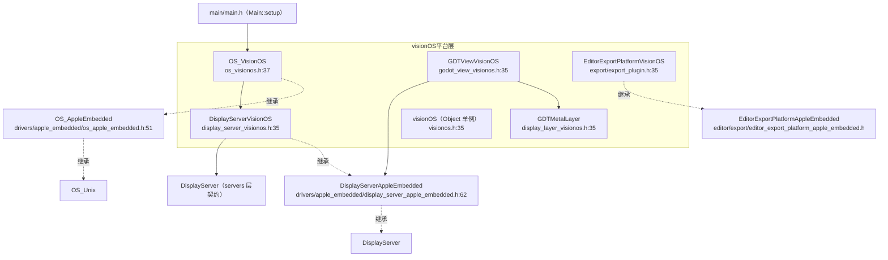
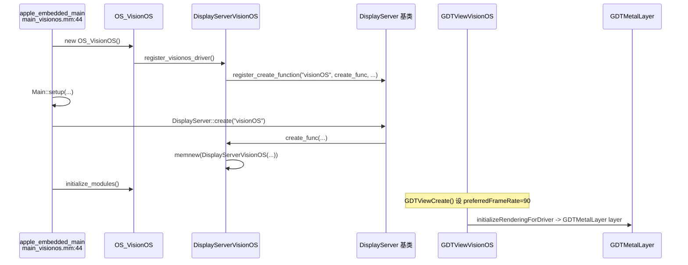

# visionos（platform）

> 一句话：visionOS 平台是给 Apple Vision Pro 这种「眼镜盒子」装的一副转接壳——它自己不重新造 OS 和窗口，只在 `drivers/apple_embedded` 这套「Apple 嵌入式设备」底座上，覆写几个 visionOS 特有的参数。

**结论**：`platform/visionos/` 是一个「薄封装平台层」，为 Apple Vision Pro 提供 Godot 的运行时入口、OS 与 DisplayServer 子类、以及导出插件；它只覆写名字、屏幕参数、HDR 头room 和 Metal 渲染层，主体逻辑全部继承自 `drivers/apple_embedded`。

## 是什么 / 不是什么

- **它是**：`drivers/apple_embedded`（Apple 嵌入式设备的抽象平台）在 visionOS 上的一个具体实例化——把抽象类换成 `OS_VisionOS`、`DisplayServerVisionOS`、`EditorExportPlatformVisionOS` 三个子类，并编译进 `libgodot`（`platform/visionos/SCsub:10-19`）。
- **它不是**：iOS 的复制粘贴。iOS 在 `platform/ios/` 里也有自己的一套 `OS_IOS`/`DisplayServerIOS`；visionOS 与它共享同一个父类，但 SDK 名是 `xros`、部署目标是 `26.0`、设备族写死为 `realityDevice`（`platform/visionos/export/export_plugin.h:38-44`）。
- **它也不负责**：真正的渲染（交给 Metal 驱动，`detect.py:143-160` 里禁用 Vulkan/OpenGL）和 XR 追踪（交给 `modules/xr`），只提供一个能显示内容的 `CAMetalLayer` 壳。

## 在引擎里的位置

## 关键概念

- **OS 子类只报名字**：`OS_VisionOS` 继承 `OS_AppleEmbedded`，唯一实质覆写是 `get_name()` 返回 `"visionOS"`，构造时顺手注册 DisplayServer 驱动（`os_visionos.mm:41-50`）。比喻：一个只换「门牌号」的租客。
- **DisplayServer 子类补屏幕参数**：`DisplayServerVisionOS` 覆写 DPI=72（带 TODO）、刷新率=90、缩放=1，以及 HDR/EDR 头room=2.0（`display_server_visionos.mm:56-95`）。比喻：它负责告诉引擎「这块屏多大、多快、多亮」。
- **软类注册（GDSOFTCLASS）**：`DisplayServerVisionOS` 用 `GDSOFTCLASS` 而不是 `GDCLASS` 声明，说明它走工厂函数 `create_func` 由 `register_create_function` 挂进 DisplayServer 的驱动表，而不是直接被脚本 `new`（`display_server_visionos.h:36`、`display_server_visionos.mm:48-50`）。
- **Metal 渲染层壳**：`GDTMetalLayer` 是 `CAMetalLayer` 实现 `GDTDisplayLayer` 协议，四个生命周期方法全是空实现，占位等未来填充（`display_layer_visionos.h:35`、`display_layer_visionos.mm:33-45`）。
- **平台单例对象**：`visionOS`（小写）继承 `AppleEmbedded`，是挂到 ClassDB 的平台门面对象，暴露给 GDScript 的 `OS` 类使用（`visionos.h:35`）。

## 核心文件（按阅读顺序）

1. `platform/visionos/detect.py` — SCons 平台探测：`can_build`、编译/链接 flag、只留 Metal、写死 `VISIONOS_ENABLED` 等宏。
2. `platform/visionos/SCsub` — 编译 5 个 `.mm` 成 `visionos` 库，再 `combine_libs_apple_embedded` 合进 `libgodot`。
3. `platform/visionos/os_visionos.h` / `.mm` — `OS_VisionOS`：报名字、注册 DisplayServer 驱动。
4. `platform/visionos/display_server_visionos.h` / `.mm` — `DisplayServerVisionOS`：屏幕 DPI/刷新率/缩放/HDR。
5. `platform/visionos/main_visionos.mm` — 入口 `apple_embedded_main`：建 OS、跑 `Main::setup`。
6. `platform/visionos/godot_view_visionos.h` / `.mm` — `GDTViewVisionOS`：挂游戏手柄交互、创建 Metal 层。
7. `platform/visionos/display_layer_visionos.h` / `.mm` — `GDTMetalLayer`：Metal 渲染层空壳。
8. `platform/visionos/export/export.cpp` — 导出注册：`register_visionos_exporter_types` / `register_visionos_exporter`。
9. `platform/visionos/export/export_plugin.h` / `.cpp` — `EditorExportPlatformVisionOS`：SDK 名、设备族、Xcode 工程替换变量。

## 数据流 / 调用链

## 中文口诀

Apple 底座先站稳，visionOS 子类把名报。
OS 只换门牌号，驱动注册构造调。
DisplayServer 补三样：DPI、刷新、缩放要。
HDR 头room 二点零，Metal 层壳空位等。
入口 apple_embedded_main，Main::setup 来开跑。
导出插件报 SDK，xros 目标 26.0。

## 练习（15 分钟）

1. 打开 `platform/visionos/os_visionos.mm`，找到 `register_visionos_driver()` 被谁在什么时候调用。
2. 打开 `platform/visionos/display_server_visionos.mm`，指出三个 `screen_get_*` 各返回什么常量。
3. 打开 `platform/visionos/export/export_plugin.cpp`，找到 `$targeted_device_family` 被替换成什么值。
4. 用 `grep -rn "register_visionos_exporter" platform/visionos` 确认导出插件是怎么挂进 `EditorExport` 的。

## 自测

- [ ] `OS_VisionOS` 除了 `get_name()` 还覆写了哪个虚函数？它做了什么？
- [ ] `DisplayServerVisionOS` 是用 `GDCLASS` 还是 `GDSOFTCLASS` 声明的？为什么这样选？
- [ ] `detect.py` 里 visionOS 支持哪几种渲染驱动？Vulkan/OpenGL 被怎么处理？

## 一句话总结

> `platform/visionos/` 是 Apple Vision Pro 的「转接壳」：它站在 `drivers/apple_embedded` 的底座上，用三个子类（OS、DisplayServer、导出平台）和一个 Metal 层壳，把 Godot 的 OS/DisplayServer 契约接到 visionOS 的 SDK 上，自己只覆写最少量的平台差异。
