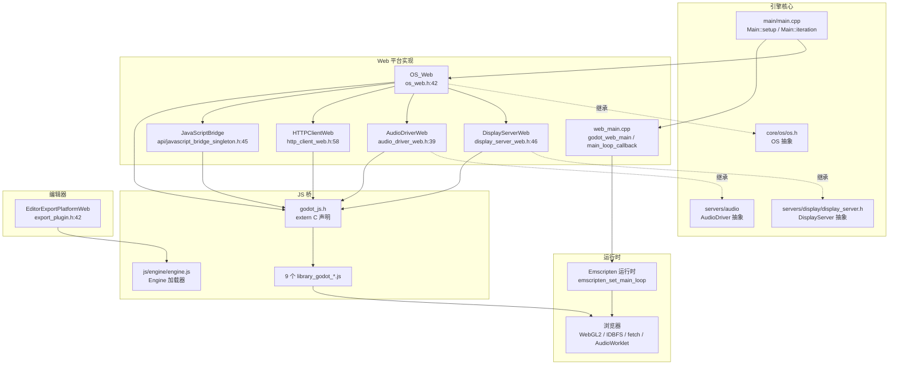
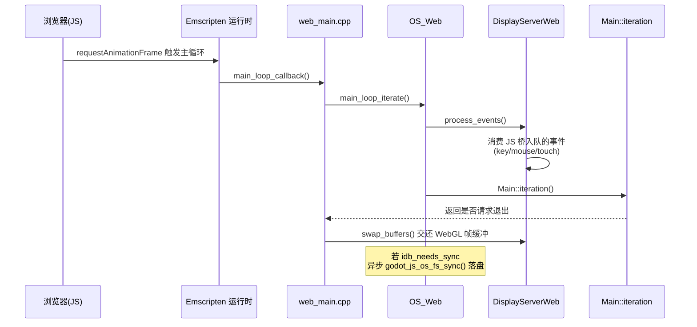

# web（platform）

> 一句话：把 Godot 的「进程 + 窗口 + 文件系统 + 音频」契约，用 Emscripten 编译成 WebAssembly，再靠一段 extern "C" 桥（`godot_js.h`）和 9 个 JS 库翻译给浏览器。

**结论**：Web 平台是 Godot 跑在浏览器里的后端——它把 `OS_Unix` 和 `DisplayServer` 两条抽象契约，实现成「Emscripten 运行时 + 浏览器 API」的翻译层；代价是进程、文件、网络等能力全部受限，只能走浏览器允许的沙盒路径。

## 是什么 / 不是什么

Web 平台只做一件事：让引擎核心在浏览器标签页里正常启动、渲染、响应用户输入。它的本质是「接口翻译」——把引擎层的 `OS`/`DisplayServer`/`AudioDriver` 虚函数，翻译成对 `emscripten_*` C API 和手写 JS 桥函数的调用。

它**不是**一个新的渲染后端：渲染仍走 OpenGL/GLES3，只是 GL 调用被 Emscripten 翻译成 WebGL2（`detect.py:258-266` 里 `-sMAX_WEBGL_VERSION=2`）。它**不是**通用进程平台：`OS_Web::kill()`、`execute_with_pipe()` 直接返回 `ERR_UNAVAILABLE`（`os_web.cpp:128-131`）。它**不负责**导出的 HTML 模板排版——那部分在 `misc/dist/html`（`README.md:8-9`）。

## 在引擎里的位置

## 关键概念

- **extern "C" 桥**：`godot_js.h` 全文件是 140 行的 C 函数声明（`extern void godot_js_os_fs_sync(...)` 等），用 `WASM_EXPORT`（`godot_js.h:33`，即 `__attribute__((visibility("default")))`）让 C++ 侧符号能被 JS 侧回调到。这是整个平台的「脐带」。
- **主循环反转**：桌面端是引擎自己 `while` 跑帧，Web 端把控制权交给浏览器——`emscripten_set_main_loop(main_loop_callback, -1, false)`（`web_main.cpp:175`）注册一个每帧由 `requestAnimationFrame` 驱动的回调。
- **契约适配**：`OS_Web` 继承 `OS_Unix`（`os_web.h:42`），`DisplayServerWeb` 继承 `DisplayServer`（`display_server_web.h:46`），各自用 `override` 补齐/裁剪父类方法，做不到的返回 `ERR_UNAVAILABLE`。
- **JS 单例**：`JavaScriptBridge` 通过 `register_web_api()` 注册为引擎单例（`api/api.cpp:44`），让 GDScript 能用 `JavaScriptBridge.eval()` 直接跑 JS；其底层是 `godot_js_eval`（`javascript_bridge_singleton.cpp:341`）。
- **文件系统持久化**：`/userfs` 路径映射到浏览器 IndexedDB（IDBFS），写文件后置位 `idb_needs_sync`，主循环里异步 `godot_js_os_fs_sync()` 落盘（`os_web.cpp:81-85`）。

## 核心文件（按阅读顺序）

1. `detect.py` — SCons 平台入口：`can_build()` 靠探测 `emcc`（`detect.py:29-30`），`configure()` 里定架构 `wasm32`/`wasm64`、Emscripten 最低 4.0.0、开 WebGL2/线程/SIMD 等链接旗标。
2. `SCsub` — 编译清单：7 个 C++ 源文件（`SCsub:23-31`）+ 9 个 JS 库（`SCsub:37-47`）注入 `--js-library`，再拼出 `.wasm`/`.js`/`.zip` 三件套。
3. `godot_js.h` — 桥的头文件，全部 extern C 声明，按 OS/Input/TTS/Display 分组，是理解「C++ 能调哪些浏览器能力」的目录。
4. `os_web.h` / `os_web.cpp` — `OS_Web`：初始化时注册 `IPWeb`、`NetSocketWeb`、DisplayServer 驱动（`os_web.cpp:55-60`），并裁剪进程、路径、持久化等 OS 方法。
5. `display_server_web.h` / `display_server_web.cpp` — `DisplayServerWeb`：窗口/鼠标/键盘/触摸/IME/剪贴板/游戏手柄的翻译；`register_web_driver()` 用 `register_create_function("web", ...)` 挂到 DisplayServer 工厂（`display_server_web.cpp:1238-1239`）。
6. `web_main.cpp` — 平台入口：`godot_web_main()` 建 `OS_Web`、`Main::setup/start`，注册主循环并处理退出（`web_main.cpp:133-181`）。
7. `api/javascript_bridge_singleton.h` / `javascript_bridge_singleton.cpp` — `JavaScriptBridge`/`JavaScriptObject` 单例及其 `JavaScriptObjectImpl` 实现。
8. `js/libs/library_godot_*.js` — 桥的 JS 侧，实现 `godot_js_*` 函数；`js/engine/engine.js` 是导出后网页里的 `Engine` 加载器。

## 数据流 / 调用链

事件反向路径：浏览器事件 → `library_godot_input.js` → 调用 C++ 侧 `WASM_EXPORT` 静态回调（如 `mouse_button_callback`，`display_server_web.h:127`）→ 转成 `InputEvent` 入队 → 下一帧 `process_events()` 派发。

## 中文口诀

- 编译靠 emcc，探测 `can_build`；
- 进程与窗口，抽象来对接；
- `OS_Web` 管系统，`DisplayServerWeb` 管屏幕；
- 一条 `godot_js` 桥，extern C 通两边；
- 主循环交给浏览器，`requestAnimationFrame` 当心跳；
- 文件落在 `/userfs`，IDBFS 异步落盘；
- 能力缺失别硬扛，`ERR_UNAVAILABLE` 打回来；
- 网页要加载引擎，`js/engine/engine.js` 当门房。

## 练习（15 分钟）

1. 打开 `godot_js.h`，数一数 `// Input` 分组下有几个 `godot_js_input_*` 函数，各对应哪种浏览器事件。
2. 在 `display_server_web.cpp` 里找到 `register_web_driver()`，确认它把驱动名字注册成了什么字符串。
3. 读 `web_main.cpp` 的 `main_loop_callback()`，标出「跳帧」「退出」两条分支各调用哪个 Emscripten 函数。
4. 在 `os_web.cpp` 里 grep `ERR_UNAVAILABLE`，列出 Web 平台明确不支持的 OS 能力清单。

## 自测

- [ ] `OS_Web` 和 `DisplayServerWeb` 各继承自哪个基类？它们分别在哪一行声明？
- [ ] 主循环由谁驱动？`emscripten_set_main_loop` 的回调函数叫什么，定义在哪个文件？
- [ ] C++ 侧如何把一个函数暴露给 JS 回调？`WASM_EXPORT` 宏的完整定义是什么？
- [ ] 用户写的文件为什么能「持久化」？`/userfs` 和 IDBFS 之间是什么关系，同步发生在主循环哪一步？

## 一句话总结

> Web 平台是把 Godot 的进程/窗口/音频契约翻译给浏览器的适配层：C++ 侧继承实现 `OS`/`DisplayServer`/`AudioDriver`，JS 侧用 9 个 `library_godot_*.js` 兑现 `godot_js.h` 的承诺，主循环则反过来交给浏览器的 `requestAnimationFrame`。
