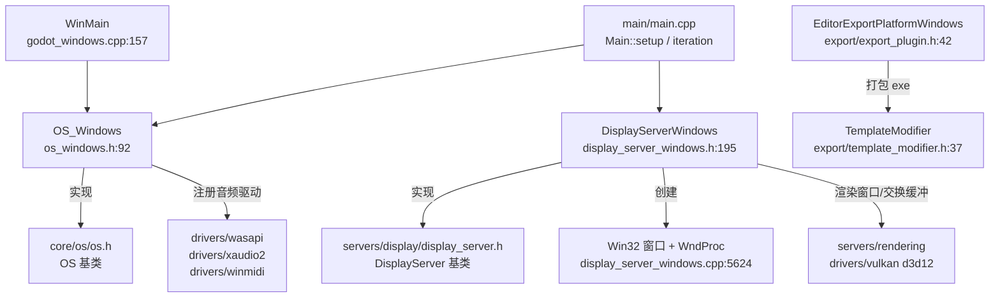
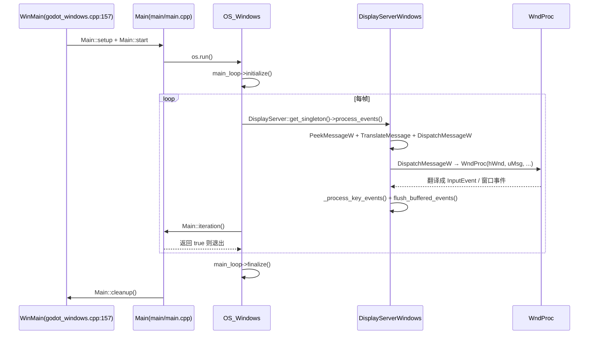

# windows（platform）

> 一句话：把 Win32 的「窗口 + 消息循环 + WinMain 入口」翻译成 Godot 的 `OS` / `DisplayServer` 两套契约，让引擎的其余部分可以当自己是平台无关的。

**结论**：Windows 平台层负责三件事——提供程序入口 `WinMain`、用 `OS_Windows` 实现 OS 契约（时钟/进程/路径/动态库等系统能力）、用 `DisplayServerWindows` 实现 DisplayServer 契约（窗口/输入/消息泵）；代价是约 10 个核心 C++ 文件、近 60 万字节源码，全部绑死 Win32 API，换平台就得整套重写。

## 是什么 / 不是什么

这个目录是 Godot 在 Windows 上的「落地层」。它只做两件苦活：把 Win32 的窗口和消息循环翻译成引擎统一接口，再把引擎的统一命令（建窗口、设鼠标、读剪贴板）翻译回 Win32 调用。

它**不负责**渲染本身——渲染交给 `drivers/` 里的 Vulkan/D3D12/GL 驱动，这里只提供承载渲染的窗口和交换缓冲（`DisplayServerWindows::swap_buffers`）。它**不负责**音频/手柄，只把 `AudioDriverWASAPI`、`AudioDriverXAudio2`、`MIDIDriverWinMidi` 这些驱动注册进管理器（`os_windows.h:102-109`）。它**不负责**具体游戏逻辑，那是 `Main` 和场景树的事。

一句话记住边界：**平台层是「翻译官」，不是「干活的人」**。

## 在引擎里的位置



- 上方 `Main` 是唯一的指挥者：它先 `Main::setup` 初始化，再进 `OS_Windows::run` 的循环，每帧调 `Main::iteration`。
- 右侧是它翻译的对象：Win32 窗口和渲染/音频驱动。
- 底部 `export/` 是编辑器导出 exe 时的「装订线」，与运行时主循环无关。

## 关键概念

1. **消息泵（message pump）**：Win32 的「收件箱」，所有键盘、鼠标、系统事件都以 `MSG` 形式排队，等你 `PeekMessageW`/`DispatchMessageW` 取走。比喻：游戏引擎不能像普通 Win32 程序那样用阻塞的 `GetMessage` 死等，要每帧主动「查信」。锚点：`DisplayServerWindows::process_events`（`display_server_windows.cpp:4424`）。

2. **窗口过程（WndProc）**：每个 Win32 窗口注册一个回调函数，系统把消息投递给它。Godot 把所有窗口消息汇总到一个 `WndProc`，在里面 `switch (uMsg)` 分发。锚点：`DisplayServerWindows::WndProc`（`display_server_windows.cpp:5624`）。

3. **OS / DisplayServer 双契约**：Godot 把「系统能力」和「窗口/显示能力」拆成两个抽象基类，平台各自实现。`OS_Windows` 继承 `OS`（`os_windows.h:92`），`DisplayServerWindows` 继承 `DisplayServer`（`display_server_windows.h:195`）。写引擎上层的人只对着基类，不碰 Win32。

4. **驱动注册**：平台启动时把本平台的工厂函数登记进基类的注册表，之后 `DisplayServer::create` 按名字就能造出实例。锚点：`DisplayServerWindows::register_windows_driver`（`display_server_windows.cpp:8459`），它调 `register_create_function("windows", create_func, get_rendering_drivers_func)`。

5. **PCK 内嵌**：导出 exe 时把游戏数据 `pck` 段塞进可执行文件末尾，运行时读 PE 头定位偏移。锚点：`OS_Windows::get_embedded_pck_offset`（`os_windows.cpp:2365`）与 `godot_windows.cpp:42` 的 `#pragma section("pck")`。

## 核心文件（按阅读顺序）

1. `godot_windows.cpp` — 程序入口。`WinMain` → `main` → `_main` → `widechar_main`，把宽字符参数转成 UTF-8，再交给 `Main::setup` / `Main::start` / `os.run()`。模板版还声明了内嵌 PCK 的 `pck` 段。
2. `os_windows.h` / `os_windows.cpp` — `OS_Windows`，实现 OS 契约：时钟、进程、路径、环境变量、动态库、系统字体（DirectWrite）、崩溃处理器注册等。`run()` 在这里。
3. `display_server_windows.h` / `display_server_windows.cpp` — `DisplayServerWindows`，实现 DisplayServer 契约：窗口管理、消息泵 `process_events`、`WndProc`、鼠标/键盘/剪贴板/屏幕/IME/原生对话框。全目录最大的文件（约 28 万字节）。
4. `key_mapping_windows.h` / `key_mapping_windows.cpp` — `KeyMappingWindows`，把 Win32 虚拟键码 `VK_*` 映射成 Godot 的 `Key` 枚举。
5. `detect.py` — SCons 构建脚本，检测 MSVC/MinGW 编译器、架构（x86_64/x86_32/arm64/arm32），生成编译选项。
6. `SCsub` — 组装源文件列表、链接 `.rc` 资源、按 GUI/console 子系统决定是否另编一个控制台包装器。
7. `export/export_plugin.h` / `export_plugin.cpp` — `EditorExportPlatformWindows`（继承 `EditorExportPlatformPC`），导出 exe、代码签名、图标处理。
8. `export/template_modifier.h` / `template_modifier.cpp` — `TemplateModifier`，直接改 PE 资源（图标/清单/版本信息/内嵌 PCK），不靠 Win32 API 写字节流。

## 数据流 / 调用链

一次「启动 → 主循环 → 处理一条键盘消息 → 退出」的典型路径：



关键点：`OS_Windows::run`（`os_windows.cpp:2342`）是主循环的「壳」，真正的 Win32 消息泵在 `DisplayServerWindows::process_events` 里。消息泵不是简单 `while (PeekMessage) ...`：它把 `WM_INPUT`（原始输入）、`WM_MOUSEMOVE`（鼠标移动）与其余「离散消息」分开节流，防止高轮询率把泵打瘫（`display_server_windows.cpp:4439-4483`）。

## 中文口诀

```
WinMain 进来，宽字符先转，
OS 管系统，Display 管窗口。
run() 是空壳，迭代在主循环，
process_events 查信件，WndProc 来分发。
键码靠 KeyMapping 翻译，
驱动靠 register 注册。
导出走 export，PCK 塞进 exe 尾巴。
平台层只做翻译官，干活交给 drivers 和 servers。
```

## 练习（15 分钟）

1. 打开 `os_windows.cpp:2342` 的 `OS_Windows::run()`，数一数它一共几行，找出主循环退出靠哪个函数返回 `true`。
2. 打开 `display_server_windows.cpp:4424` 的 `process_events`，找到 `PeekMessageW` 第一次出现的位置，读出它为什么把 `WM_INPUT` 单独拎出来。
3. 在 `WndProc`（`display_server_windows.cpp:5624`）里 `switch (uMsg)` 找一个你认识的 case（比如 `WM_CHAR` 或 `WM_MOUSEMOVE`），看它最终调用了哪个 `Input` 方法。
4. 打开 `export/export.cpp:39`，确认 `register_windows_exporter_types` 里注册的那个类名，再回到 `export_plugin.h:42` 看它继承谁。

## 自测

- [ ] `DisplayServerWindows` 是通过哪个函数把自己注册进 `DisplayServer` 的？注册的字符串名字是什么？
- [ ] `OS_Windows::run()` 的主循环里，先 `process_events()` 再 `Main::iteration()`，这个顺序为什么不能反？
- [ ] `WM_INPUT` 为什么不能在 `process_events` 里像普通消息一样被 `DispatchMessageW` 派发？（提示：看 `process_raw_input` 与注释）
- [ ] 导出 exe 时，游戏数据 `pck` 是怎么塞进可执行文件的？运行时又是谁、怎么找到它的偏移？

## 一句话总结

> Windows 平台层是 Godot 与 Win32 之间的「翻译官」：`WinMain` 负责进门，`OS_Windows` 负责系统能力，`DisplayServerWindows` 负责窗口与消息泵，把上层对引擎的期望落成一条每帧转一圈的 Win32 消息循环。
