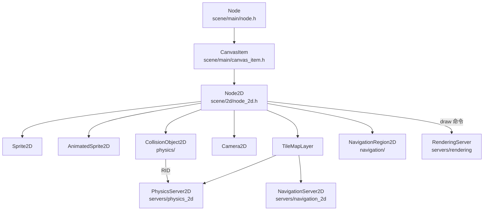
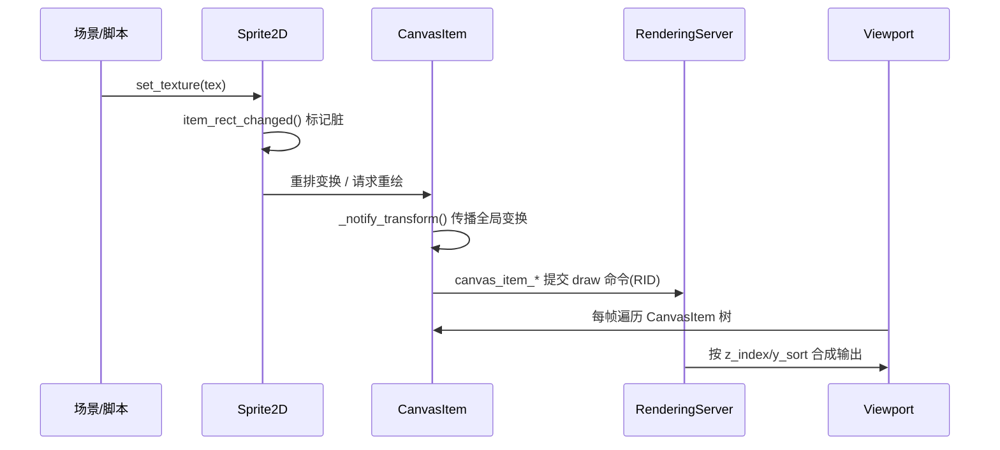

# 2d（scene）

> 一句话：2D 场景是一张「透明胶片叠起来的画」——每个节点就是一张胶片，贴在 CanvasItem 这块画布上，最终按 z 顺序交给渲染服务器上屏。

**结论**：`scene/2d` 模块定义 Godot 所有 2D 场景节点（精灵、瓦片地图、2D 物理体、相机等），为「2D 游戏逻辑」服务；代价是它自己几乎不干渲染、物理的实活，只做「把属性翻译成服务器 RID 调用」的中间层。

## 是什么 / 不是什么

`scene/2d` 是 2D 节点的「门面层」：它把你在编辑器里看到的 Node2D 树，翻译成渲染、物理、导航三个服务器听得懂的指令。

- **它是**：Node2D 及其全部子类的定义地，2D 场景树的骨架。
- **它不是**：真正画像素的地方（那是 `servers/rendering` 的 RenderingServer）；也不是算碰撞的地方（那是 `servers/physics_2d` 的 PhysicsServer2D）。

对比一句：2D 节点是「遥控器」，服务器是「电视机」。遥控器只负责把按钮按下去（`scene/2d`），画面和信号在电视机里（`servers/`）。

一个容易踩的坑：`CanvasItem` 不在本目录，它在 `scene/main/canvas_item.h`（层 main）。`scene/2d` 的根节点 `Node2D` 直接继承它（`node_2d.h:35`）。所以本模块真正的「根」是跨层借来的。

## 在引擎里的位置

依赖方向是「一层往下传」：`scene/2d` 位于 `scene`（Node/CanvasItem 的上层）与 `servers`（真正干活）之间。它往上依赖 `scene/main` 和 `scene/resources`（纹理、TileSet、Shape2D 等资源），往下只发 RID 调用，从不自己持有像素或物理状态。

## 关键概念

1. **Node2D 是「位置贴纸」**——只给节点一个 2D 变换。术语上它缓存 `position / rotation / scale / skew` 四个标量，惰性合成一个 `Transform2D`（`node_2d.h:38-44`），只有脏了才在 `_update_transform()` 里重算（`node_2d.h:49`）。锚点：`Node2D`。

2. **CanvasItem 是「上屏资格证」**——有了它才能被画。它持有一个 `RID canvas_item`（`canvas_item.h:91`），这是渲染服务器里对应资源的句柄；还管 `modulate` 着色、`z_index` 层序、`y_sort_enabled` Y 排序（`canvas_item.h:96-112`）。锚点：`CanvasItem`（在 `scene/main`）。

3. **Sprite2D 是「贴图」**——把一张 `Ref<Texture2D>` 按帧切好贴出来（`sprite_2d.h:39`）。`AnimatedSprite2D` 更进一步，拿 `Ref<SpriteFrames>` 帧表按时间推进，`play()/pause()/stop()` 控制播放（`animated_sprite_2d.h:39,93`）。锚点：`Sprite2D` / `AnimatedSprite2D`。

4. **TileMapLayer 是「一格多系统的调度员」**——一个格子里同时挂渲染、物理、导航、场景四套数据。它按「象限」（`RenderingQuadrant` 管渲染、`PhysicsQuadrant` 管物理，`tile_map_layer.h:207,239`）把 `HashMap<Vector2i, CellData>` 切块（`tile_map_layer.h:389`），哪块变了只更新哪块。锚点：`TileMapLayer`。

5. **CollisionObject2D 是「碰撞层开关」**——只记 `collision_layer / collision_mask` 和一堆形状 owner，真正的刚体/查询在 PhysicsServer2D。锚点：`CollisionObject2D`（`collision_object_2d.h:52-57`）。

## 核心文件（按阅读顺序）

1. `scene/2d/SCsub` — 编译清单：`*.cpp` 全收，再按条件链入 `physics/`、`navigation/` 两个子目录（`SCsub:6-12`）。
2. `scene/2d/node_2d.h` — 本模块的根 `Node2D`，2D 变换四件套 + 全局/局部坐标换算。
3. `scene/main/canvas_item.h` — 跨层基类，`RID canvas_item` 与绘制命令的出口（真正的渲染主线在这）。
4. `scene/2d/sprite_2d.h` — 静态贴图，区域/翻转/帧切分的样板。
5. `scene/2d/animated_sprite_2d.h` — 帧动画，`SpriteFrames` 驱动。
6. `scene/2d/tile_map_layer.h` — 瓦片地图单层，象限分块 + 四套系统并存（本模块最重的文件）。
7. `scene/2d/tile_map.h` — `TileMap` 是兼容容器，内部 `LocalVector<TileMapLayer*> layers`（`tile_map.h:76`）。
8. `scene/2d/physics/collision_object_2d.h` — 2D 物理体基类。
9. `scene/2d/camera_2d.h` — 2D 相机，决定「世界坐标如何映射到屏幕」。

## 数据流 / 调用链

一次「贴一张精灵并显示」的典型链路：

要点：节点不存像素，`Sprite2D` 只把纹理引用和变换「推」给渲染服务器；`Viewport` 是 `CanvasItem` 的 `friend`（`canvas_item.h:175`），负责每帧把整棵 2D 树扫一遍按序绘制。物理同理——`CollisionObject2D` 持 RID 把形状丢给 `PhysicsServer2D`，自己只同步变换。

## 中文口诀

> 节点只是一层皮，画布才是真画笔；
> 位置旋转缩放斜，Transform2D 来合成；
> 精灵贴图动画帧，贴到节点就上屏；
> 瓦片按格切成块，渲染物理一起管；
> 碰撞只记层与掩，形状丢给物理服；
> 相机一个镜头转，世界坐标屏上见。

## 练习（15 分钟）

1. 打开 `node_2d.h`，找到 `_update_transform()` 和四个 `mutable` 标量，用一句话说明「为什么它们标成 `mutable`」。
2. 在 `register_scene_types.cpp` 搜 `REGISTER 2D`，数一下这个块里 `GDREGISTER_CLASS` 有多少条（不精确数，感受量级即可）。
3. 打开 `tile_map_layer.h`，找到 `RenderingQuadrant` 和 `PhysicsQuadrant`，对比它们各自管哪些 `CellData` 成员。
4. 在 `canvas_item.h` 里 grep `z_index`，确认「绘制顺序」到底在哪个类手里。

## 自测

- [ ] `Node2D` 为什么不自己继承 `Node`，而要经过 `CanvasItem`？缺了 `CanvasItem` 会失去什么能力？
- [ ] `TileMap` 和 `TileMapLayer` 是什么关系？哪个才是真正存 `CellData` 的？
- [ ] `CollisionObject2D` 的 `collision_layer` 和 `collision_mask` 是发给谁的？碰撞检测本身在哪个服务器？

## 一句话总结

> `scene/2d` 是 2D 场景节点的「遥控器层」：定义 Node2D 这棵树和它的变换，把每类节点的属性翻译成渲染/物理/导航服务器的 RID 调用，自己从不持有像素或物理状态。
