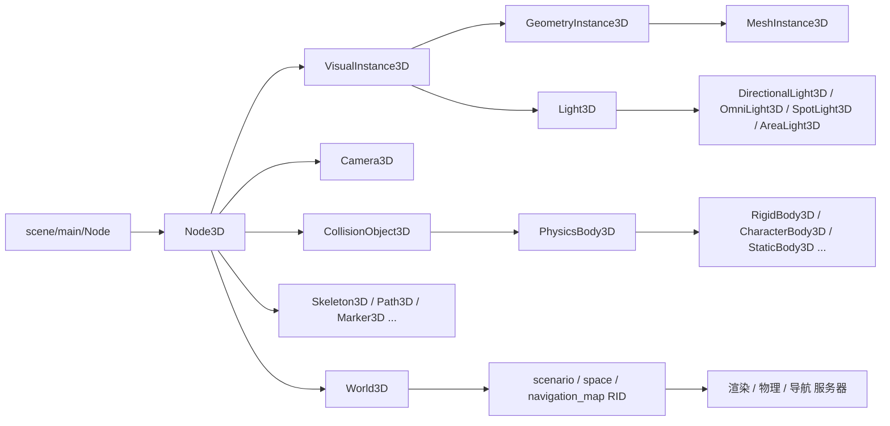
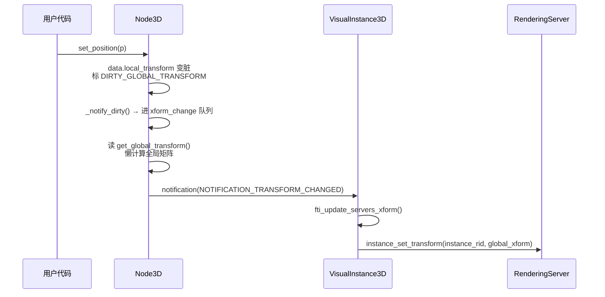

# 3d（scene）

> 一句话：3D 场景是一棵「每节都能摆姿势的骨架」——`Node3D` 是每个骨节的姿态（位置/旋转/缩放），`VisualInstance3D`、`Camera3D`、`CollisionObject3D` 三大家族分别往这棵骨架上挂「看得见的东西、看世界的眼睛、摸得着的身体」。

**结论**：`scene/3d` 是引擎的 3D 场景前端层——它定义「3D 世界里的每一个节点怎么摆、怎么互相挂接、怎么把姿态同步给渲染/物理/导航三台服务器」，服务对象是「在场景树里组织 3D 内容的用户代码」，代价是一套围绕 `Transform3D` 的脏标记（dirty flag）机制和层层继承的节点体系。

## 是什么 / 不是什么

`scene/3d` 负责「3D 节点的组织与姿态管理」，不负责「真正去画、去算物理、去找路」——那三件事由服务器层干，这里只做薄前端。

- **是**：`Node3D` 及派生节点的姿态存取（局部/全局 Transform3D）、父子挂接、进/出世界通知、可见性传播，以及把节点变化翻译成发给服务器的 RID 调用。
- **不是**：不是渲染器（实际绘制在 `servers/rendering/`），不是物理引擎（碰撞计算在 `servers/physics_3d/`），不是导航网格生成（寻路在 `servers/navigation_3d/`）。这里的节点只持有 `RID`，把姿态「同步」过去，不亲自算结果。

对比句（3 处）：`Node3D` 之于 3D 场景，就像 `Node2D` 之于 2D 场景——都是「带变换的挂载点」，只不过 2D 存的是 `Transform2D`（平移+旋转+缩放共 6 个自由度），3D 存的是 `Transform3D`（Basis 3×3 矩阵 + 原点，位移之外还有完整的旋转/缩放）。

## 在引擎里的位置

- `Node3D` 继承 `scene/main/node.h` 的 `Node`（`scene/3d/node_3d.h:50-51`），是所有 3D 节点的根。
- 三大分支挂在它下面：`VisualInstance3D`（可见物）、`Camera3D`（相机）、`CollisionObject3D`（碰撞体）。
- `Node3D::get_world_3d()` 返回 `World3D`（`scene/resources/3d/world_3d.h:46`），后者持有 `scenario`、`space`、`navigation_map` 三个 RID（`world_3d.h:50-53`），是「节点 → 服务器」的桥。

## 关键概念

1. **姿态 = 一个 3×3 基矩阵 + 一个原点**。术语叫 `Transform3D`（`core/math/transform_3d.h:38`），由 `Basis`（旋转+缩放）和 `Vector3`（位移）组成。一个节点的「摆在哪、朝哪、多大」全由它决定。

2. **局部 vs 全局是一对脏标记**。`Node3D` 同时缓存 `local_transform` 和 `global_transform`，改局部就标脏全局，读全局时再懒计算（`node_3d.h:85-91` 的 `TransformDirty` 枚举）。Euler 角单独存，避免「转一圈再转回来」在欧拉↔矩阵往返里丢数值（`node_3d.h:69-91` 注释）。

3. **进/出世界是两次广播**。节点进树时收到 `NOTIFICATION_ENTER_WORLD`（值 41），出树收到 `NOTIFICATION_EXIT_WORLD`（42）；姿态变会收到 `NOTIFICATION_TRANSFORM_CHANGED`（2000）（`node_3d.h:234-240`）。派生节点靠这些通知决定何时把姿态同步给服务器。

4. **可见物靠两个 RID 落地**。`VisualInstance3D` 持有 `base`（几何体）和 `instance`（摆放实例）两个 RID（`visual_instance_3d.h:42-43`），`MeshInstance3D` 再往 `GeometryInstance3D` 上挂 `Ref<Mesh>` 和 `Skin`（`mesh_instance_3d.h:44-52`）。

5. **碰撞体是「形状持有者」不是「形状」**。`CollisionObject3D` 持有一个物理 `RID` 和一组 shape owner（`collision_object_3d.h:57,64-79`），真正的形状是 `Shape3D` 资源；`PhysicsBody3D` 在此基础上加 `move_and_collide`/`test_move`（`physics_body_3d.h:55-56`）。

## 核心文件（按阅读顺序）

1. `scene/3d/node_3d.h` — 3D 节点的根：Transform3D 存取、脏标记机制、进/出世界通知、`Node3DGizmo`（编辑器 gizmo 抽象，`node_3d.h:36`）。
2. `scene/3d/visual_instance_3d.h` — 可见物基类：`base`/`instance` 两个 RID + 层掩码 + 剔除；同文件还定义 `GeometryInstance3D`（阴影/GI/LOD/材质覆盖）。
3. `scene/3d/mesh_instance_3d.h` — 网格实例：挂 `Mesh`、`Skin`、骨骼路径、blend shape。
4. `scene/3d/light_3d.h` — 光源基类 `Light3D` 及四个子类：平行光/点光/聚光/面光。
5. `scene/3d/camera_3d.h` — 相机：投影类型（透视/正交/自定义视锥）、`make_current()`、朝向射线投影。
6. `scene/3d/physics/collision_object_3d.h` — 碰撞对象：`collision_layer`/`collision_mask`、shape owner 管理、拾取。
7. `scene/3d/physics/physics_body_3d.h` — 物理体基类：`move_and_collide`/`test_move`、轴锁定。
8. `scene/register_scene_types.cpp` — 所有 3D 类的注册入口（`Node3D` 在 `register_scene_types.cpp:625`，`GDREGISTER_CLASS` 系列）。

## 数据流 / 调用链

一次「改位置 → 同步到渲染服务器」的典型路径：

关键点：`Node3D` 改位置只是标脏（`node_3d.cpp` 里 `_set_dirty_bits`），真正把新矩阵推给渲染服务器，是在派生类 `VisualInstance3D` 覆写的 `fti_update_servers_xform()` 里完成的（`visual_instance_3d.h:52` 声明，覆写自 `node_3d.h:214` 的虚函数）。「薄前端、重服务器」的分工在这里最直观。

## 中文口诀

> 节点挂树摆姿势，变换矩阵是根基；
> 改了局部脏全局，读时才算不着急。
> 可见物体双 RID，相机碰撞各一支；
> 进进出出有通知，姿态同步靠虚函数。

## 练习（15 分钟）

1. 打开 `scene/3d/node_3d.h`，找出 `TransformDirty` 枚举的四个取值，各用一句话说清「什么情况会置位」。
2. 打开 `scene/register_scene_types.cpp`，搜 `GDREGISTER_CLASS(Light3D)` 附近，把 `Light3D` 的四个子类名抄下来，再回到 `light_3d.h` 确认每个子类的 `GDCLASS` 父类一致。
3. 打开 `visual_instance_3d.h`，画出 `VisualInstance3D → GeometryInstance3D → MeshInstance3D` 的继承链，并在每一层标出一个「这一层新加的东西」。

## 自测

- [ ] `Node3D` 的 `get_global_transform()` 为什么是「懒计算」的？在 `node_3d.h` 里找到支撑这个结论的枚举/注释。
- [ ] `VisualInstance3D` 的 `base` 和 `instance` 两个 RID 分别代表什么？`instance` 的变换是在哪个虚函数里被同步给渲染服务器的？
- [ ] `CollisionObject3D` 和 `PhysicsBody3D` 的分工边界在哪？「移动并撞停」的入口函数叫什么、定义在哪个文件哪一行？

## 一句话总结

> `scene/3d` 是 3D 世界的「骨架层」：`Node3D` 定义每个节点怎么摆，三大派生家族分别挂可见物、相机和碰撞体，再通过 `World3D` 的 RID 把姿态同步给渲染/物理/导航服务器，自己只做姿态管理、不做实际计算。
