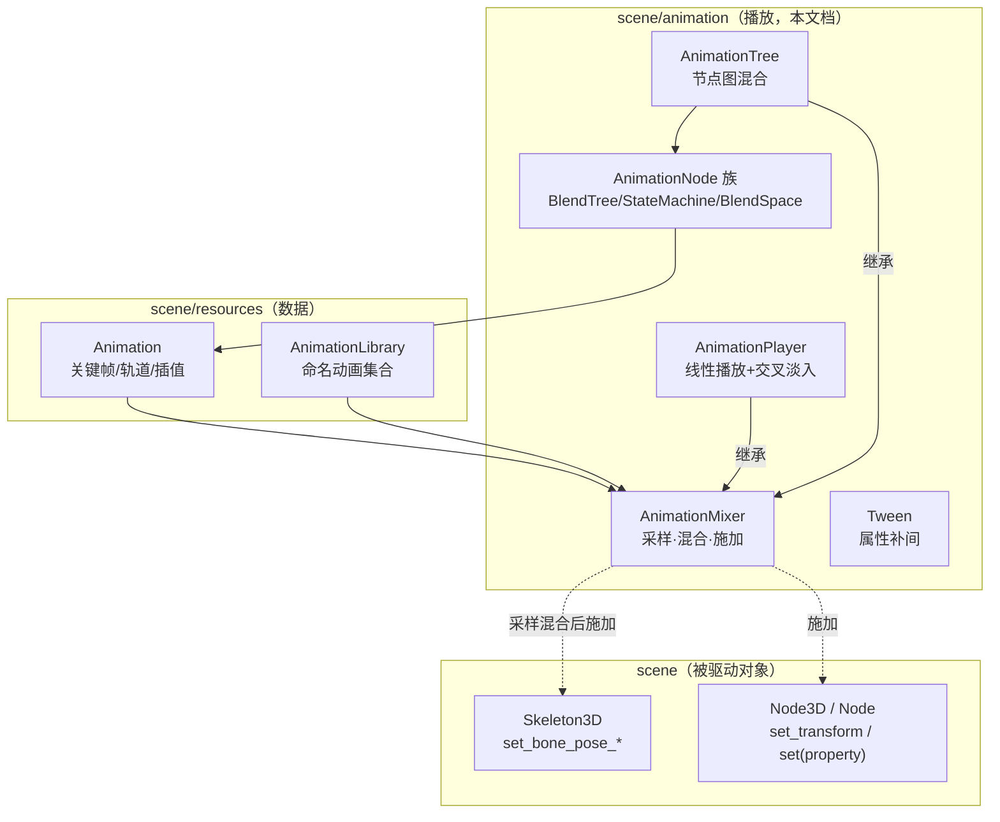
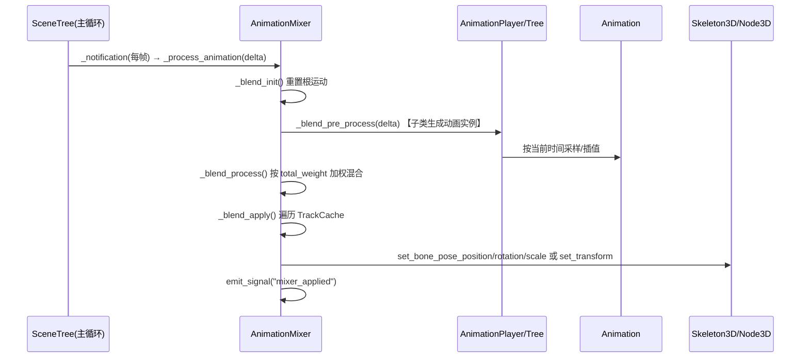

# animation（scene）

> 一句话：动画模块是引擎的「放映机」——它把预先录好的关键帧胶片（`Animation`）在运行时按时间轴抽出来、按权重搅匀，再打到场景里的骨骼和属性上。

**结论**：这个模块负责「动画资源 → 运行时播放 → 驱动骨骼/属性」这条主线，为 `AnimationPlayer`（线性播放）和 `AnimationTree`（图混合）两个入口服务；代价是一套厚重的轨道缓存与混合逻辑（仅 `animation_mixer.cpp` 就有约 2600 行），全部用来把「采样→混合→施加」这一步做快做对。

## 是什么 / 不是什么

它负责：把 `Animation` 里的关键帧在某个时间点插值出值（采样）、把多条动画按权重混成一条（混合）、把结果写回场景对象（施加）——这是它的全部工作。

它不负责：关键帧数据本身怎么存，那是 `Animation` 资源（`scene/resources/animation.h:38`，已归 `resources` 模块文档）；骨骼怎么递归算全局位姿、怎么蒙皮，那是 `Skeleton3D`（`scene/3d/skeleton_3d.h:65`）的事；编辑器里怎么拖关键帧做动画，那是 `editor/animation` 模块。

一句话划界：动画模块是「播放器」，不是「胶卷」也不是「骨架」。

## 在引擎里的位置

依赖方向一句话：`Animation`/`AnimationLibrary` 是输入，`AnimationMixer` 是中枢，`Skeleton3D`/`Node3D` 是输出；`AnimationPlayer`、`AnimationTree` 都只是 `AnimationMixer` 的两种「播放策略」子类。

## 关键概念

- **轨道 Track**：一条「谁在变」的记录。每条轨道挂一个 `NodePath`（`Animation::Track.path`）指向要改的对象属性或骨骼，并带类型（`Animation::TrackType`：`TYPE_VALUE`/`TYPE_POSITION_3D`/`TYPE_ROTATION_3D`/`TYPE_SCALE_3D`/`TYPE_BLEND_SHAPE`/`TYPE_METHOD`/`TYPE_BEZIER`/`TYPE_AUDIO`/`TYPE_ANIMATION`，`scene/resources/animation.h:48`）。
- **关键帧 Key**：一条「什么时候变成什么」的记录。`Key` 存时间 `time` 与过渡 `transition`（`scene/resources/animation.h:126`），具体值按轨道类型存在 `TKey<T>`（`Vector3`/`Quaternion`/`Variant`/`float`…）。
- **采样 + 混合**：`AnimationMixer` 把每条轨道缓存成 `TrackCache`（`animation_mixer.h:144`），`_blend_process` 先按时间插值采样，再按 `total_weight` 加权混合，最后 `_blend_apply` 统一写回对象（`animation_mixer.cpp:1902`）。
- **播放策略**：`AnimationPlayer` 维护「当前动画 + 交叉淡入列表」（`animation_player.h:93` 的 `Playback`），`AnimationTree` 维护一棵 `AnimationNode` 图（`animation_tree.h:451` 的 `root_animation_node`）。
- **根运动 Root Motion**：把「骨骼根部的位置旋转」累积成 `root_motion_position/rotation/scale`（`animation_mixer.h:334`），供 `CharacterBody3D` 之类当位移用，而不是直接改节点。

## 核心文件（按阅读顺序）

1. `scene/resources/animation.h` — `Animation` 资源本体：9 种轨道类型、插值、循环、marker、压缩格式。**入口必读**。
2. `scene/resources/animation_library.h` — `AnimationLibrary`，把若干 `Animation` 打包成一个命名集合。
3. `scene/animation/animation_mixer.h` — `AnimationMixer`：轨道缓存 `TrackCache`、混合五步流水、根运动累加器。**主线中枢**。
4. `scene/animation/animation_player.h` — `AnimationPlayer`：`play()`/`seek()`/`stop()` 与交叉淡入。
5. `scene/animation/animation_tree.h` — `AnimationTree` 与 `AnimationNode`/`AnimationNodeInstance`：节点图、`blend_node`/`blend_input`、参数槽。
6. `scene/animation/animation_blend_tree.h` — 节点族：`AnimationNodeAnimation`（叶子）、`AnimationNodeBlend2/3`、`AnimationNodeAdd2/3`、`AnimationNodeOneShot`、`AnimationNodeTimeScale/TimeSeek`、`AnimationNodeTransition`、`AnimationNodeOutput`、`AnimationNodeBlendTree`。
7. `scene/animation/animation_node_state_machine.h` — `AnimationNodeStateMachine` + `AnimationNodeStateMachineTransition` + `AnimationNodeStateMachinePlayback`。
8. `scene/animation/animation_blend_space_1d.h` / `animation_blend_space_2d.h` — 按参数轴混合多个动画的「混合空间」。
9. `scene/animation/animation_node_extension.h` — `AnimationNodeExtension`，让脚本自定义节点逻辑。
10. `scene/animation/tween.h` + `easing_equations.h` — `Tween`/`Tweener` 家族与缓动方程，做「属性 → 属性」的补间，与关键帧无关。
11. `scene/animation/root_motion_view.h` — `RootMotionView`，根运动轨迹的可视化辅助节点。

目录共 27 个文件，其中 10 组 `.h/.cpp`、1 个头 `easing_equations.h`、5 个 `*.compat.inc`（构建期生成的兼容性补丁，见 `AGENTS.md`，勿手改）。脚本可见类共 36 个 `GDCLASS` 注册（`animation_mixer.h`/`animation_tree.h`/`tween.h` 等），其中 `Tweener`、`AnimationNodeSync`、`AnimationRootNode` 是中间基类。

## 数据流 / 调用链

`AnimationPlayer` 在 `_blend_pre_process` 里把「当前动画 + 淡入中的动画」做成 `AnimationInstance`；`AnimationTree` 则在同一步里从 `root_animation_node` 起递归 `blend_node`，让叶子 `AnimationNodeAnimation` 去采样。无论哪条路径，最终都汇到 `AnimationMixer::_blend_apply`（`animation_mixer.cpp:1902`），在那里判断轨道目标：有 `skeleton_id` 且 `bone_idx >= 0` 就写骨骼 `set_bone_pose_*`（`animation_mixer.cpp:1931-1939`），否则写 `Node3D::set_transform`/`set_position` 等（`animation_mixer.cpp:1941-1960`），blend shape 则写 `MeshInstance3D::set_blend_shape_value`（`animation_mixer.cpp:1969`）。

## 中文口诀

- 胶卷是 `Animation`，放映机是 `AnimationMixer`。
- 一条轨道指向谁，一颗关键帧定何时。
- 采样取时间，混合乘权重，施加写骨骼。
- `Player` 一条线走到底，`Tree` 一张图随便搅。
- 骨骼写 `set_bone_pose`，节点写 `set_transform`，形状写 `blend_shape_value`。
- 根运动不挪节点，攒起来给角色当位移。

## 练习（15 分钟）

1. 打开 `scene/resources/animation.h`，数出 `Animation::TrackType` 有哪 9 种，并说出每种轨道对应的 `Track` 子类名（如 `PositionTrack`、`ValueTrack`）。
2. 打开 `scene/animation/animation_mixer.cpp:1015`，把 `_process_animation` 里的五个 `_blend_*` 调用按顺序抄下来，对照 `_blend_apply`（`:1902`）确认每一步在干嘛。
3. 在 `animation_mixer.cpp:1922-1960` 里找出「写骨骼」和「写 Node3D」的分支条件分别是什么（`skeleton_id`/`bone_idx`）。
4. 打开 `animation_tree.h:48`，确认 `AnimationNode::blend_node` / `blend_input` / `blend_animation` 三个函数签名，理解它们如何把「时间」从上游传到下游。

## 自测

- [ ] `AnimationPlayer` 和 `AnimationTree` 都继承自谁？它们各自的「播放策略」数据存在哪个成员变量里？（`animation_player.h:93` / `animation_tree.h:451`）
- [ ] `Animation` 里的「轨道」存了什么？`AnimationMixer` 里的 `TrackCache` 和它是什么关系？（`scene/resources/animation.h:107` / `animation_mixer.h:144`）
- [ ] 根运动（Root Motion）累加结果存在哪些成员里？由谁读取？（`animation_mixer.h:334-339`）

## 一句话总结

> `scene/animation` 是 Godot 的运行时动画播放器：输入 `Animation` 关键帧，经过 `AnimationMixer` 的采样—混合—施加流水线，把结果写到骨骼与节点属性上。
