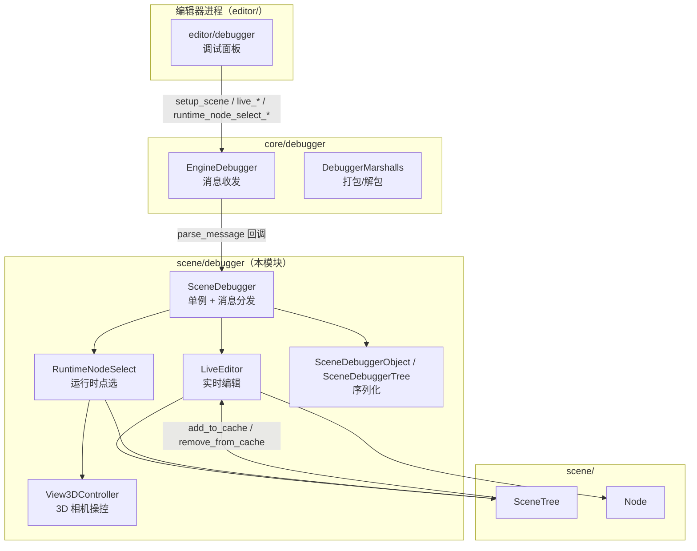
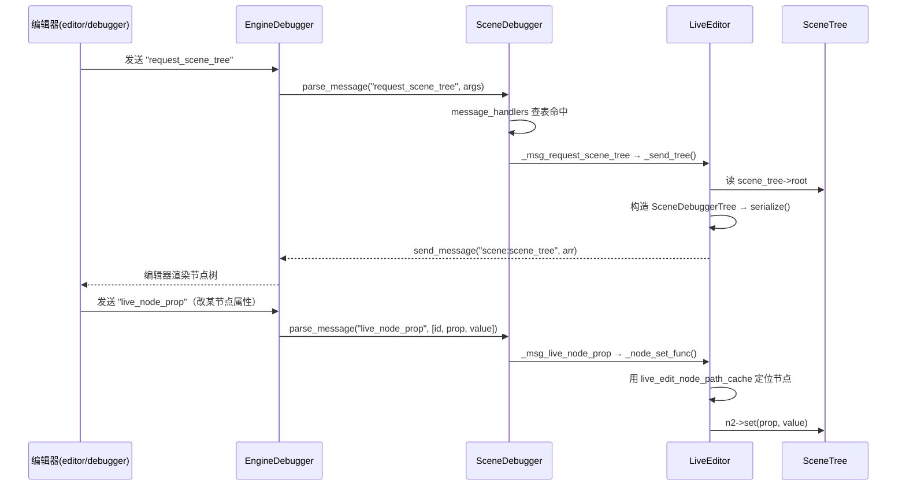

# debugger（scene）

> 一句话：这是「运行中的游戏」和「编辑器」之间的翻译官——编辑器说「把场景树给我」「把第 3 号节点改成红色」，它负责在游戏进程里照办，再把结果用一套扁平的字符串消息发回去。

**结论**：`scene/debugger` 是 Godot 场景层的**远程调试桥**——在游戏进程里挂一个单例 `SceneDebugger`，把编辑器发来的消息翻译成对场景树的操作（查看节点树、改属性、Live 编辑、运行时点选），代价是**全部代码只在 `DEBUG_ENABLED` 下编译**，正式发布版（`template_release`）里这段逻辑根本不存在。

## 是什么 / 不是什么

它负责三件事：**① 把场景树序列化发给编辑器**（`SceneDebuggerTree`），**② 接收编辑器指令并落地到真实节点**（改属性、增删节点、实时编辑场景），**③ 提供「运行时点选」工具**——像调试器一样在跑着的游戏里框选 2D/3D 节点。

它不是 `core/debugger`：`core/debugger` 是**传输层**（`EngineDebugger`、`ScriptDebugger`、`DebuggerMarshalls` 负责消息怎么打包、怎么在 socket 上跑），而 `scene/debugger` 是**业务层**——只关心「消息里说的是场景里的哪个节点、要干什么」。它也不负责渲染和输入本身，那些仍是 `servers/rendering` 和 `core/input` 的活，它只是借用它们的结果。

## 在引擎里的位置



- 上游：编辑器通过 `core/debugger` 的 `EngineDebugger` 把消息送进来，入口是 `SceneDebugger::parse_message`（`scene/debugger/scene_debugger.cpp:585`）。
- 下游：`LiveEditor` / `RuntimeNodeSelect` 直接读写 `SceneTree` 和 `Node`（`scene/main/scene_tree.h`、`scene/main/node.h`）。
- 挂载点：`SceneDebugger::initialize()` 由 `scene/register_scene_types.cpp:1315` 调用，`deinitialize()` 在 `:1323`。

## 关键概念

1. **消息捕获（Message Capture）**：`SceneDebugger` 构造时调 `EngineDebugger::register_message_capture("scene", …)`（`scene_debugger.cpp:74`），相当于在调试总线上注册了一个叫 `scene` 的接线盒，凡是发往 `scene` 的消息都会被转给 `parse_message`。锚点：`EngineDebugger::Capture`。

2. **消息分发表（message_handlers）**：一个 `HashMap<String, ParseMessageFunc>`（`scene_debugger.cpp:583`），把字符串消息名映射到处理函数，如 `"request_scene_tree"` → `_msg_request_scene_tree`。全部登记在 `_init_message_handlers()`（`scene_debugger.cpp:608`），一眼能看完它支持哪些指令。

3. **实时编辑缓存（live_scene_edit_cache）**：`LiveEditor` 里一个 `HashMap<String, HashSet<Node *>>`（`scene_debugger.h:142`），记录「哪些场景文件正在被编辑」。`Node` 进树时调 `SceneDebugger::add_to_cache`（`scene/main/node.cpp:386`），出树时 `remove_from_cache`（`node.cpp:416`），这样编辑器改属性时才知道要同步到哪些节点实例上。

4. **扁平场景树（SceneDebuggerTree）**：把整棵树用栈做**深度优先**遍历压扁成 `List<RemoteNode>`（`scene_debugger_object.cpp:278`），每个节点只存 6 个数：`child_count / name / type_name / id / scene_file_path / view_flags`（`scene_debugger_object.cpp:329-337`），发出去就是一段 `scene:scene_tree` 数组。

5. **运行时点选（RuntimeNodeSelect）**：一个 `Object` 单例（`runtime_node_select.h:53`），在游戏窗口里画选择框、命中 2D CanvasItem 或 3D 节点，把选中的 `ObjectID` 回传给编辑器。3D 部分的相机操控外包给 `View3DController`（`view_3d_controller.h:58`）。

## 核心文件（按阅读顺序）

1. `scene/debugger/SCsub` — 把目录下所有 `*.cpp` 塞进 `scene_sources`，无单独入口文件。
2. `scene/debugger/scene_debugger.h` — `SceneDebugger`（单例 + 一堆 `_msg_*` 处理函数声明）和 `LiveEditor` 的类声明。
3. `scene/debugger/scene_debugger.cpp` — 主战场：构造函数注册消息捕获、`parse_message` 分发、`_init_message_handlers`、Live 编辑的实现（约 1335 行）。
4. `scene/debugger/scene_debugger_object.h/.cpp` — `SceneDebuggerObject`（单个对象属性序列化）和 `SceneDebuggerTree`（整棵树序列化）。
5. `scene/debugger/runtime_node_select.h/.cpp` — 运行时点选：画框、命中检测、2D/3D 选择框绘制（约 1400 行）。
6. `scene/debugger/view_3d_controller.h/.cpp` — 3D 相机操控（orbit/zoom/pan/freelook），`_3D_DISABLED` 时整个文件不编译。

## 数据流 / 调用链

一次「编辑器查看并修改场景」的典型往返：



注意 `parse_message` 的一个守卫（`scene_debugger.cpp:596`）：凡是 `live_` 或 `runtime_node_select_` 前缀但没在表里登记的消息，返回 `ERR_SKIP` 表示「这条我占坑但不处理」，避免被别的捕获器误吞。

## 中文口诀

```
场景调试桥一座，编辑器来游戏去。
EngineDebugger 当总机，parse_message 做分拣。
message_handlers 一张表，名字对上函数跑。
LiveEditor 管实时，增删改属性不重编译。
缓存记录可编辑，进树加、出树删。
SceneDebuggerTree 深度优先压扁平，六个字段发干净。
RuntimeNodeSelect 画框选，3D 相机外包 View3D。
记住全在 DEBUG_ENABLED，发布版里无此身。
```

## 练习（15 分钟）

1. 打开 `scene_debugger.cpp:608` 的 `_init_message_handlers()`，数一数 `live_` 前缀的消息一共几个，各对应 `LiveEditor` 的哪个 `_*_func`。
2. 用 grep 找 `register_message_capture` 的所有调用点，对比 `core/debugger` 里还有哪些模块也注册了捕获器（如 `"scene"` 之外的名字）。
3. 读 `scene_debugger_object.cpp:278` 的 `SceneDebuggerTree` 构造函数，画一棵 3 节点的树（root 带 2 个子节点），手写出它 `serialize` 后数组的前 12 个元素。

## 自测

- [ ] `parse_message` 里 `r_captured` 这个输出参数在哪三种分支下分别被设成什么值？（提示：看 `scene_debugger.cpp:585-606`）
- [ ] 为什么 `SceneDebugger` 的构造函数要在 `EngineDebugger::is_active()` 为真时才被 `memnew`，而不是无条件创建？（看 `scene_debugger.cpp:95-102`）
- [ ] `_msg_save_node` 保存一个节点时，先做什么、再发什么消息？（看 `scene_debugger.cpp:168-175`）

## 一句话总结

> `scene/debugger` 是场景层的「运行时遥控器」：编辑器发消息、它操作场景树、再把结果序列化发回——整套逻辑只在调试构建里活着。
