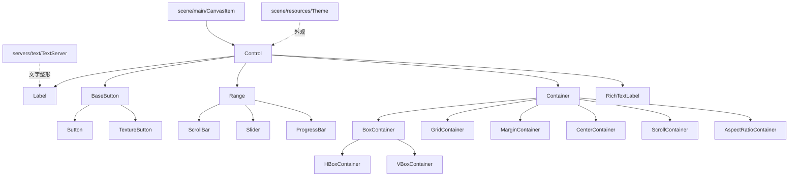
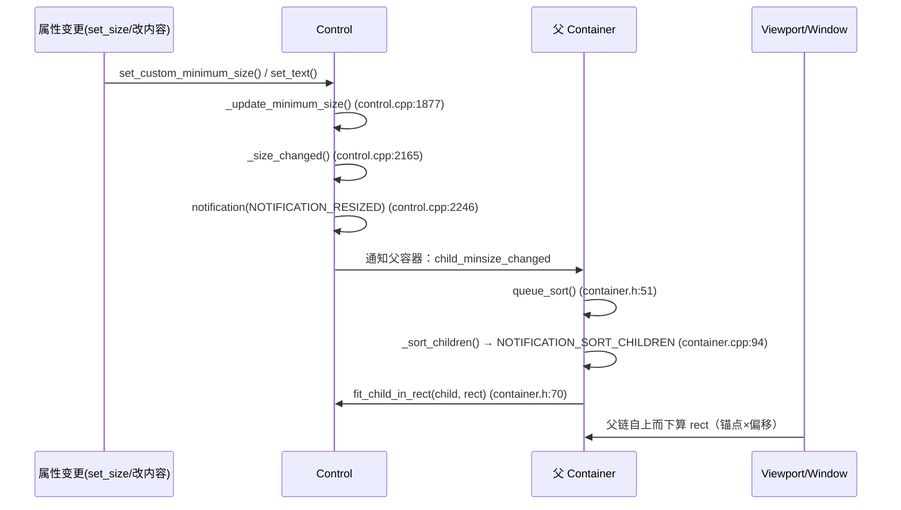

# gui（scene）

> 一句话：GUI 系统像一套「可以伸缩的家具」——每个控件都是能贴在墙（父控件）上的板子，用锚点钉位置、用容器排顺序、用最小尺寸撑大小。

**结论**：`scene/gui` 是 Godot 全部用户界面控件的家，为游戏 UI 和编辑器自身提供从布局（锚点/容器/最小尺寸）到交互（输入/焦点/主题）的统一基础，代价是它不自己画像素也不渲染文字——那些交给 `CanvasItem`、`Theme` 和 `TextServer`。

## 是什么 / 不是什么

`scene/gui` 负责「控件这一层」：`Control` 怎么定位、怎么撑大、怎么响应鼠标键盘、怎么套主题皮肤，以及 `Container` 怎么把子控件排成行、列、网格。它不负责三件事：

1. 不负责真正的绘制：`Control` 继承自 `scene/main/canvas_item.h` 的 `CanvasItem`（control.h:45），最终画到屏幕靠渲染服务器，gui 只算「该画在哪个矩形」。
2. 不负责文字排版：`Label` 把字符串交给 `TextServer`（servers/text），自己做字形缓存与可见字符裁剪（label.h:99-103）。
3. 不负责外观定义：颜色、字体、样式框来自 `Theme`，`Control` 只缓存和查找（control.h:312-331）。

它也不是独立 module：没有 `register_types.cpp`，所有 `.cpp` 被 `SCsub:6` 直接编进 `scene_sources`，类在 `scene/register_scene_types.cpp:390` 的 `register_scene_types()` 里注册。

## 在引擎里的位置

## 关键概念

- **锚点（Anchor）+ 偏移（Offset）= 把控件钉在父矩形上**：四个边各有一个 `anchor`（0~1）和一个 `offset`（像素），`anchor` 决定「这条边跟着父控件哪一格的百分比」，`offset` 决定「再往内缩多少」。见 `Control::set_anchor / set_offset / set_anchor_and_offset`（control.h:564-568），枚举 `Anchor { ANCHOR_BEGIN, ANCHOR_END }`（control.h:55-58）。
- **布局三模式**：`LayoutMode` 枚举区分 `LAYOUT_MODE_POSITION`（手摆坐标）、`LAYOUT_MODE_ANCHORS`（锚点自适应）、`LAYOUT_MODE_CONTAINER`（交给容器）、`LAYOUT_MODE_UNCONTROLLED`（谁都不管）（control.h:149-154）。
- **尺寸三兄弟**：`get_minimum_size()`（控件不挤坏的最小体积，control.h:635）、`get_desired_size()`（它想要多大，control.h:644）、`get_combined_minimum_size()`（含 margin/自定义最小值，control.h:636）。容器算布局就是拿子控件的 combined minimum size 当砝码。
- **SizeFlags = 容器里的「争抢规则」**：`SIZE_SHRINK_BEGIN / SIZE_FILL / SIZE_EXPAND / SIZE_SHRINK_CENTER / SIZE_SHRINK_END`（control.h:79-87）。`FILL` 是占满分配到的空间，`EXPAND` 是去抢多余空间，两者可组合成 `SIZE_EXPAND_FILL`。
- **排序通知**：`Container` 靠 `queue_sort()`（container.h:51）触发一次延迟排序，最终走 `NOTIFICATION_SORT_CHILDREN`（container.h:66-67），每个具体容器在这个通知里用自己的算法 `fit_child_in_rect`（container.h:70）摆孩子。

## 核心文件（按阅读顺序）

1. `scene/gui/control.h` — 整个系统的基类，锚点/偏移/尺寸/焦点/主题/输入全在这里（894 行）。
2. `scene/gui/container.h` — 容器基类，`queue_sort()` 与排序通知的源头（81 行）。
3. `scene/gui/box_container.h` — 行/列容器，含 `HBoxContainer`、`VBoxContainer`（box_container.h:81-98）。
4. `scene/gui/label.h` — 文本控件，演示「控件不做排版、只做整形缓存」的分工（label.h:36）。
5. `scene/gui/range.h` — 数值区间基类，`ScrollBar`/`Slider`/`ProgressBar` 的共同爹（range.h:35）。
6. `scene/gui/base_button.h` — 按钮基类，按下/悬停/焦点/`ButtonGroup` 互斥逻辑（base_button.h:39）。
7. `scene/register_scene_types.cpp` — 注册入口，`register_scene_types()`（:390）里 `GDREGISTER_CLASS(Control)`（:473）等一行行登记。

## 数据流 / 调用链

一次「改属性 → 重新布局」的典型链路：

一句话讲这条链：**叶子控件先算出自己「最小要多大多小」，向上报给容器；容器攒齐后统一排队，再按各自算法把矩形发回每个孩子。**

## 中文口诀

> 锚点钉墙、偏移缩量，
> 容器排队、最小撑梁。
> 填充占满、扩展抢余，
> 排序通知、才落实际。

## 练习（15 分钟）

1. 打开 `scene/gui/box_container.cpp`，找到 `NOTIFICATION_SORT_CHILDREN` 分支（box_container.cpp:339），读它怎么把水平方向剩余空间按 `SIZE_EXPAND` 分给孩子。
2. 打开 `scene/gui/label.cpp` 的 `get_minimum_size()`（搜索 `Label::get_minimum_size`），看它如何用 `_ensure_shaped()` 的结果算出最小宽高。
3. 在 `control.h` 里找 `set_anchor` 的四个 `Side` 参数，画一个「右下角按钮」需要哪两个 anchor 各等于 1。
4. 打开 `scene/register_scene_types.cpp:473-517`，数一下这一段注册了多少个容器类。

## 自测

- [ ] `Container` 为什么用 `queue_sort()` 延迟排序，而不是子控件一变就立刻重排？（提示：找 `pending_sort` 字段，container.h:38）
- [ ] `Control::get_minimum_size()` 和 `get_combined_minimum_size()` 差在哪？容器用哪个？
- [ ] 一个控件的 `anchor` 四边都是 0、offset 四边都是 0，它相对父控件出现在哪？

## 一句话总结

> `scene/gui` 是 Godot UI 的骨架层：`Control` 提供「锚点 + 尺寸」的统一语言，`Container` 提供「排队重排」的统一节奏，叶子控件只需上报最小尺寸、响应排序通知，就能被任何布局算法正确摆放。
