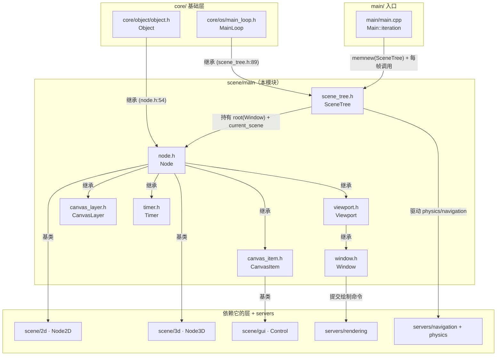
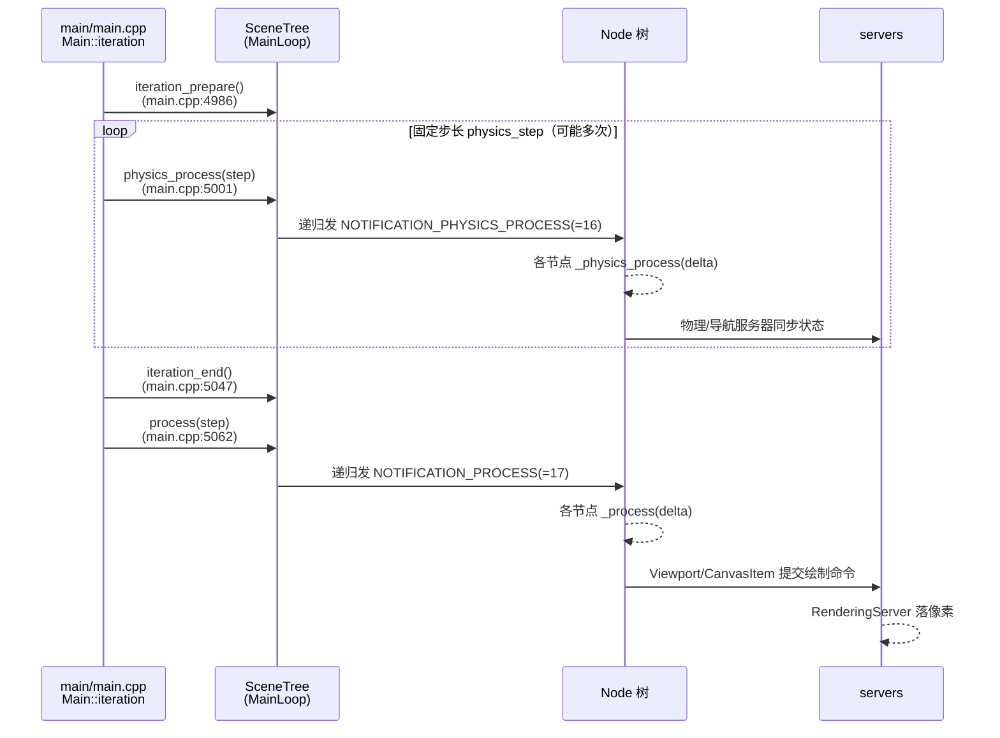

# main（scene）

> 一句话：`scene/main` 是 Godot 的「树 + 心跳」——用 `Node` 树把游戏对象串成一棵家族树，再用 `SceneTree` 这颗心脏把每帧的物理、渲染、输入节奏泵进树里。

**结论**：这个模块定义引擎的运行时主干——`Node`（树的节点，所有场景对象的基类）和 `SceneTree`（继承 `MainLoop` 的主循环，驱动整棵树的处理、输入、场景切换与退出）。它为 `scene/2d`、`scene/3d`、`scene/gui` 提供公共基类；代价是它自己几乎不干具体活，渲染交给 `servers/rendering`，物理交给 `servers/physics_*`，只负责「组织 + 调度」。

## 是什么 / 不是什么

- **是什么**：场景对象的基类层 + 主循环层。`Node` 负责「谁是谁的父/子、谁进没进树、谁这一帧要不要 `_process`」；`SceneTree` 负责「每帧按什么顺序调用它们、输入事件怎么分发、场景怎么切换」。
- **不是什么**：它不是渲染器——`Node`/`Viewport` 只把绘制命令交给 `servers/rendering`（`RenderingServer`），自己不画像素；它也不是物理引擎——`_physics_process` 的回调节奏由 `SceneTree` 发，但碰撞解算在 `servers/physics_*` 里。
- 对比句 3 处：`Viewport` 是「画布」，真正落笔画的是 `RenderingServer`；`SceneTree` 是「节拍器」，真正打拍子的是 `main/Main::iteration`；`Node` 是「户口本」，真正存数据的是它内部 `Data` 结构体（`node.h:199`）。

## 在引擎里的位置

`SceneTree` 由 `main/main.cpp:4362` 一句 `main_loop = memnew(SceneTree)` 创建，挂到 `OS` 的 `MainLoop` 槽位上；此后引擎主循环每一帧都通过 `Main::iteration()`（`main/main.cpp:4921`）调用它覆盖的四个虚方法。

## 关键概念

1. **Node 树（族谱）**：`Node` 靠 `data.parent` / `data.children` 组成树（`node.h:204-206`），每个节点通过 `get_tree()` 摸到它的 `SceneTree`（`node.h:558`）。进树出树会递归发通知：`_propagate_enter_tree` / `_propagate_ready` / `_propagate_exit_tree`（`node.h:311-313`）。
2. **SceneTree 主循环（心脏/节拍器）**：`SceneTree : public MainLoop`（`scene_tree.h:89`），覆盖 `initialize` / `physics_process` / `process` / `finalize`（`scene_tree.h:344-350`）。它持有一个 `root`（`Window *`，`scene_tree.h:133`）和 `current_scene`（`scene_tree.h:203`），帧驱动就从这里出发。
3. **Viewport / Window（画布与窗户）**：`Viewport : public Node`（`viewport.h:96`）是渲染目标，`Window : public Viewport`（`window.h:42`）是带真窗口的那一个，`SubViewport : public Viewport`（`viewport.h:900`）是离屏画布。
4. **CanvasItem + CanvasLayer（纸片与叠层）**：`CanvasItem : public Node`（`canvas_item.h:47`）是所有 2D 可绘制对象的基类，靠 `z_index` 决定前后（`canvas_item.h:110`）；`CanvasLayer : public Node`（`canvas_layer.h:37`）把一批纸片独立成层。
5. **计时回调（闹钟）**：`Timer : public Node`（`timer.h:35`）是场景里的定时器；`SceneTreeTimer`（`scene_tree.h:57`）是 `SceneTree::create_timer()` 返回的轻量版，`SceneTree` 每帧在 `process_timers` 里统一扣时间（`scene_tree.h:234`）。

## 核心文件（按阅读顺序）

1. `scene/main/node.h` — `Node` 全部接口：树操作、通知、处理开关、分组、RPC、线程组，共 952 行，是理解整层的入口。
2. `scene/main/scene_tree.h` — `SceneTree` 与 `SceneTreeTimer` 声明，主循环契约 + 场景切换 + 分组 + 计时 + 网络，477 行。
3. `scene/main/viewport.h` — `Viewport` / `SubViewport` / `ViewportTexture`，渲染目标与缩放/MSAA 等配置。
4. `scene/main/window.h` — `Window`，窗口模式、标志位、内容缩放。
5. `scene/main/canvas_item.h` — `CanvasItem` / `CanvasTexture`，2D 绘制单元的属性和绘制命令。
6. `scene/main/canvas_layer.h` — `CanvasLayer`，绘制分层与跟随视口。
7. `scene/main/timer.h` — `Timer` 定时器节点。
8. `scene/main/multiplayer_api.h` / `multiplayer_peer.h` — 多人对等网络 API 与传输层抽象。
9. `scene/main/instance_placeholder.h` / `missing_node.h` / `resource_preloader.h` — 场景加载的占位、缺失节点兜底、资源预加载。
10. `scene/main/SCsub` — 只有一行 `env.add_source_files(env.scene_sources, "*.cpp")`，说明本模块全部 17 个 `.cpp` 都进 `scene_sources`，无独立注册逻辑（类靠各自的 `GDCLASS` 注册）。

## 数据流 / 调用链

一帧的典型走向（`Main::iteration` 是拍子来源，`SceneTree` 负责把拍子传进树）：

`SceneTree` 内部先 `process_timers` / `process_tweens`（`scene_tree.h:234-235`），再按 `ProcessGroup` 分组驱动节点（`scene_tree.h:100-109`、`_process` 在 `scene_tree.h:242`）。退出则是某处调 `SceneTree::quit()`（`scene_tree.h:360`），把 `_quit` 置位，主循环据此结束。

## 中文口诀

> 树是一户口本，Node 管爹管儿子；
> 心脏叫 SceneTree，继承 MainLoop 打拍子；
> 物理固定步长跑，渲染每帧一次画；
> 画布 Viewport，窗户是 Window，纸片 CanvasItem 叠成层；
> 要延时用 Timer，要心跳用 _process，要退出喊 quit。

## 练习（15 分钟）

1. 在 `node.h` 里找 `NOTIFICATION_ENTER_TREE`、`NOTIFICATION_READY`、`NOTIFICATION_PROCESS`、`NOTIFICATION_PHYSICS_PROCESS` 四个常量的值（约在 `node.h:457-464`），记下编号。
2. 打开 `scene_tree.h`，对照 `MainLoop`（`core/os/main_loop.h:64-69`）确认 `SceneTree` 覆盖了哪几个虚方法。
3. 在 `main/main.cpp:4362` 找到 `memnew(SceneTree)`，再跳去 `Main::iteration`（`main/main.cpp:4921`）看它如何按「prepare → physics → end → process」顺序调用主循环。
4. 用 `grep` 数一下 `scene/main` 目录里有多少个 `class XXX : public Node`，体会「Node 是万物基类」这句话的覆盖面。

## 自测

- [ ] `SceneTree` 是 `Node` 的子类吗？它继承的父类在哪个文件里声明？
- [ ] 一个节点进树时，最先收到哪个通知（看 `_propagate_enter_tree` 和 `NOTIFICATION_ENTER_TREE`）？
- [ ] `_physics_process` 和 `_process` 谁可能在一帧内被调用多次？为什么（回到 `Main::iteration` 的循环找答案）？
- [ ] `Viewport` 和 `Window` 的继承关系是什么？`SubViewport` 呢？

## 一句话总结

> `scene/main` 是 Godot 的运行时中枢：`Node` 树负责「谁是谁」，`SceneTree` 负责「什么时候动」，真正渲染和物理的脏活都外包给 `servers/`。
