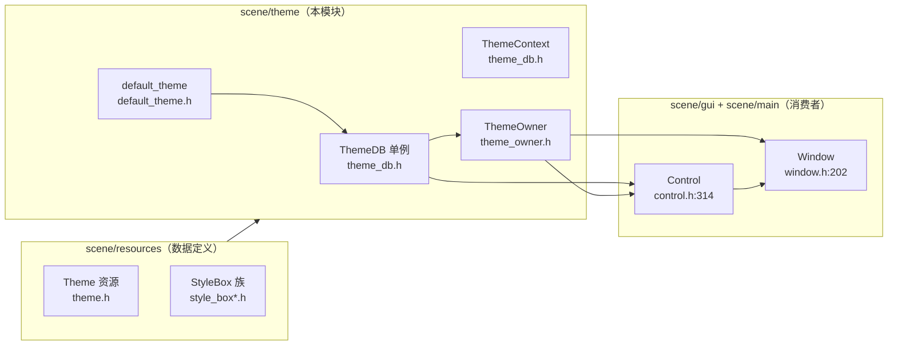
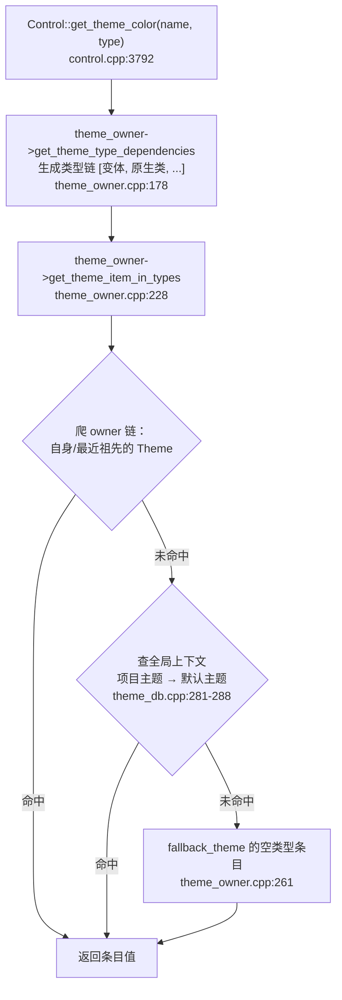

# theme（scene）

> 一句话：把「颜色、字体、图标、九宫格边框」这些零散外观值，按「控件类型」打包成一张可覆盖、可级联的样式表，控件只管按名字取，不用管值从哪来。

**结论**：theme 模块是 GUI 的「皮肤系统」——它用一个全局单例 `ThemeDB`（`scene/theme/theme_db.h:71`）收藏默认主题和项目主题，用一个 `ThemeOwner`（`scene/theme/theme_owner.h:41`）帮每个 Control 沿场景树向上找主题、按类型逐级取条目；代价是这套「谁覆盖谁」的查找链较长，出问题时肉眼不好定位。

## 是什么 / 不是什么

它负责三件事：**收藏全局主题**（默认主题 + 项目主题）、**分发**（把主题沿节点树传播给每个 Control/Window）、**查找**（按「类型 + 名字」返回某个主题条目，找不到就一路 fallback）。

它不负责「怎么画」——颜色、字体、StyleBox 只是数据，最终绘制由 `Control` 的 `_draw` 和各控件自己完成；也不负责「解析 .tres/.theme 文件」，那交给 `ResourceLoader`（`scene/theme/theme_db.cpp:70` 只是调用它）。

注意：真正的 `Theme` 资源类和 `StyleBox` 族住在 `scene/resources/`，`scene/theme/` 目录只有 3 对 `.h/.cpp`（theme_db、theme_owner、default_theme）+ 100 多个默认图标 SVG。

## 在引擎里的位置

`ThemeDB` 通过 `Engine` 注册成全局单例（`scene/register_scene_types.cpp:1384-1386`，`GDREGISTER_CLASS(ThemeDB)` + `add_singleton("ThemeDB", ...)`），因此任何脚本都能直接访问 `ThemeDB`。

## 关键概念

1. **Theme 条目 = 一张「类型 × 名字」的二维表**。一个 `Theme` 内部是 6 张 HashMap：颜色、常量、字体、字号、图标、StyleBox（`scene/resources/theme.h:100-105`），外加一套「类型变体」映射（`variation_map`，`theme.h:106`）。`get_theme_item(DataType, name, type)`（`theme.h:208`）就是查这张表。

2. **ThemeContext = 一个作用域，装一堆主题按优先级叠好**。`ThemeContext`（`theme_db.h:184`）里 `Vector<Ref<Theme>> themes`「按相关度排序，第一个先查，最后一个兜底」（`theme_db.h:192-195`）。默认上下文里，项目主题在前、默认主题在后（`theme_db.cpp:272-289`）。

3. **ThemeOwner = 贴在节点上的「主题代理人」**。每个 Control 持有一个 `ThemeOwner`（`control.h:314`），它记着「谁是我的主题来源节点」（`owner_node`），并在查找时沿着这条链向上爬。

4. **theme_cache = 控件把自己要用的条目提前捞进字段**。控件用 `BIND_THEME_ITEM` 宏声明「我要 icon/color 这些条目」（`theme_db.h:47-59`），`ThemeDB::update_class_instance_items`（`theme_db.cpp:360`）在主题变化时统一刷新缓存，控件绘制时直接读缓存字段，不每次现查。

5. **类型变体（type variation）= 同一类控件的个性化命名**。`set_theme_type_variation`（`control.h:793`）给控件起个别名（如 `Button` 的变体 `MyButton`），查找时先按变体名、再按原生类名取条目，实现「同款控件不同皮肤」。

## 核心文件（按阅读顺序）

1. `scene/resources/theme.h` — `Theme` 资源本体：6 张条目表、类型变体、默认值、`get_type_dependencies`（:229）生成类型链。
2. `scene/theme/theme_db.h` — `ThemeDB` 单例 + `ThemeContext`：全局主题、fallback 值、`BIND_THEME_ITEM` 宏与条目绑定表。
3. `scene/theme/theme_owner.h` — `ThemeOwner`：主题传播与查找的对外接口（`get_theme_item_in_types`、`propagate_theme_changed`）。
4. `scene/theme/theme_owner.cpp` — 查找链的完整实现：先爬 owner 链、再查全局上下文、最后兜底。
5. `scene/theme/default_theme.h` — `make_default_theme` / `fill_default_theme`，生成引擎自带默认皮肤。
6. `scene/gui/control.h` — Control 侧主题 API（`set_theme`、`add_theme_*_override`、`get_theme_*`）与 `NOTIFICATION_THEME_CHANGED`（:498）。

## 数据流 / 调用链

一次「控件取颜色」的完整级联查找：

关键点：查找按「近 → 远」进行，最近的覆盖最远的。先是节点自身或最近祖先挂着的 `Theme`（`theme_owner.cpp:235-246`），再是全局 `ThemeContext` 里叠好的项目/默认主题，最后是空类型名对应的兜底值（`theme_owner.cpp:261`）。`propagate_theme_changed`（`theme_owner.cpp:130`）负责在父节点挂主题时，把这个主题源递归下发给所有子孙，并在变化时发 `NOTIFICATION_THEME_CHANGED`。

## 中文口诀

主题条目按名取，类型变体排在前。
ThemeDB 管全局，项目默认叠一起。
ThemeOwner 会爬树，就近优先远兜底。
BIND 宏绑缓存，改主题发通知刷字段。

## 练习（15 分钟）

1. 打开 `scene/theme/theme_owner.cpp:228` 的 `get_theme_item_in_types`，画出「owner 链 → 全局上下文 → fallback」三层，每层标注文件行号。
2. 在 `scene/gui/control.cpp:3792` 处打断点（或用 grep 追踪），确认 `get_theme_color` 最终调用了 `get_theme_item_in_types`，并观察 `theme_types` 里塞了几个类型名。
3. 读 `scene/theme/theme_db.cpp:272` 的 `_init_default_theme_context`，回答：项目主题和默认主题谁先被 `push_back`，这决定了谁优先被查到。

## 自测

- [ ] `Theme` 资源里 6 种条目类型分别存在哪个 HashMap？（看 `scene/resources/theme.h:100-105`）
- [ ] 一个没有挂任何 Theme 的 Button，它的颜色最终从哪来？（顺着 `theme_owner.cpp:261` 与 `_init_default_theme_context` 回答）
- [ ] `BIND_THEME_ITEM` 宏里 lambda 捕获的 `p_cast->theme_cache.m_prop` 是什么时候被填进去的？（找 `theme_db.cpp:360` 的 `update_class_instance_items` 调用点）

## 一句话总结

> theme 模块把「皮肤」拆成「数据（Theme 资源）+ 分发（ThemeOwner 爬树）+ 全局兜底（ThemeDB）」，让每个 Control 都按「就近优先、逐级 fallback」的规则取到自己的外观值。
