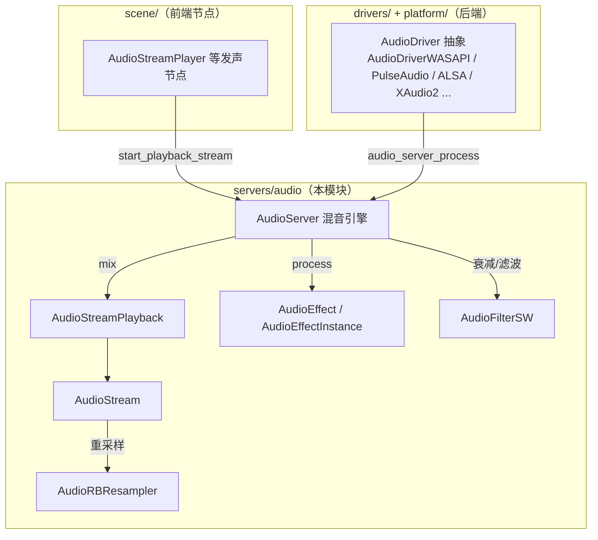
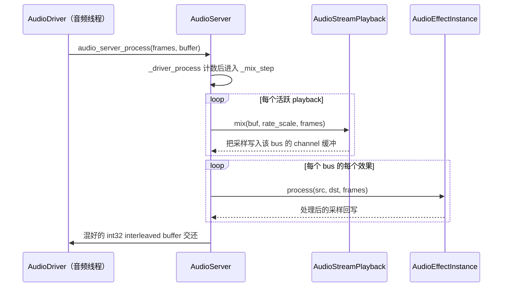

# audio（servers）

> 一句话：音频服务器是引擎的「混音台 + 声卡插座」——`AudioServer` 负责把一堆正在播放的 `AudioStream` 按 bus/效果混成一段 PCM，`AudioDriver` 负责把这段 PCM 塞给操作系统声卡。

**结论**：`servers/audio` 是 Godot 的音频后端，为上层所有发声节点（`AudioStreamPlayer` 等）提供统一的混音服务，代价是它必须自己处理实时线程安全——混音发生在音频驱动线程，而不是主线程。

## 是什么 / 不是什么

这个模块是「声音数据的搬运和加工中心」：

- **负责**：把多个 `AudioStreamPlayback` 的声音按音量、bus、效果（EQ/混响等）实时混合，输出成声卡要的 interleaved 采样缓冲；同时抽象掉具体声卡驱动。
- **不负责**：解码音频文件（`AudioStreamWAV`/OGG/Vorbis 解码在 `scene/` 资源和 `modules/` 里，这里只 forward-declare，见 `audio_server.h:44`）；也不负责场景节点 API——`AudioStreamPlayer` 那层在 `scene/`，它只是本模块的「客户」。
- **不负责**：真正的硬件操作——那是 `AudioDriver` 各平台实现（WASAPI/PulseAudio/ALSA 等）住在 `drivers/` 和 `platform/` 里的活儿。

一句话划界：**`servers/audio` 决定「混出什么声音」，`drivers/*` 决定「怎么把声音送到硬件」。**

## 在引擎里的位置

数据流方向是单行的：**节点（scene）→ 服务器（servers）→ 驱动（drivers）→ 声卡**。`AudioServer` 是被调用的中间层，驱动是被调用的底层。

## 关键概念

- **音频驱动 `AudioDriver`（`audio_server.h:48`）**：比喻「声卡插座」。它定义了一套纯虚接口（`init/start/get_mix_rate/get_speaker_mode/lock/unlock/finish`），真正的 WASAPI/PulseAudio 实现各平台自己写；但它反过来在音频线程里调用 `audio_server_process` 把「混音请求」丢回 `AudioServer`（`audio_server.cpp:72`）。
- **驱动注册表 `AudioDriverManager`（`audio_server.h:159`）**：比喻「插座面板」。最多挂 10 个驱动（`MAX_DRIVERS`），最后一名永远是 `AudioDriverDummy` 兜底；`initialize` 按顺序尝试 `init()`，全失败就退回 dummy 并打印警告（`audio_server.cpp:227`）。默认采样率 `DEFAULT_MIX_RATE = 44100`（`audio_server.h:170`）。
- **混音引擎 `AudioServer`（`audio_server.h:180`）**：比喻「调音台」。它维护一张 `Bus` 列表、每个 bus 挂一堆 `AudioEffect`，以及一张 `playback_list` 活跃播放表。核心入口 `_driver_process` → `_mix_step` → `_mix_step_for_channel`（`audio_server.cpp:272/352/678`）。
- **播放状态 `AudioStreamPlayback`（`audio_stream.h:77`）**：比喻「一个正在出声的喇叭实例」。`AudioStream` 是「乐谱」（可复用资源），`AudioStreamPlayback` 是「正在演奏的那一遍」。它的 `mix(buffer, rate_scale, frames)` 是每个采样周期被调用的核心钩子。
- **效果 `AudioEffect` / `AudioEffectInstance`（`audio_effect.h:51/38`）**：比喻「插在总线上的效果器」。`AudioEffect` 是资源（可配置），`instantiate()` 出 `AudioEffectInstance` 才是真正跑 DSP 的对象，方法 `process(src, dst, frames)` 原地处理一帧音频。

## 核心文件（按阅读顺序）

1. `servers/audio/audio_server.h` — 本模块的「目录页」：`AudioDriver`、`AudioDriverManager`、`AudioServer`、`AudioBusLayout` 四个类一次看全。
2. `servers/audio/audio_server.cpp` — 混音主逻辑：`_driver_process` 收驱动回调，`_mix_step` 逐个播放/逐 bus 混音（约 2275 行）。
3. `servers/audio/audio_stream.h` — 播放模型：`AudioStream`（资源）、`AudioStreamPlayback`（实例）、`AudioStreamPlaybackResampled`（重采样）、麦克风与随机流。
4. `servers/audio/audio_effect.h` — 效果基类，只 61 行，极薄的一层抽象。
5. `servers/audio/audio_driver_dummy.h` — 参考驱动实现，看它怎么继承 `AudioDriver` 并开线程调 `mix_audio`，就懂了一个真实驱动长什么样。
6. `servers/audio/audio_rb_resampler.h` — 环形缓冲 + 定点重采样，流式音频的速率转换。
7. `servers/audio/audio_filter_sw.h` — 软件双二阶（biquad）滤波器，混音时对每个播放做衰减/高架滤波。
8. `servers/audio/effects/` — 17 个效果头文件（EQ、Reverb、Compressor、Delay、Panner 等），每个都成对出现 `AudioEffectXxx` + `AudioEffectXxxInstance`。

## 数据流 / 调用链

一次典型的「声卡要一段音频」的调用链：

注意方向：**驱动先调服务器**（因为采样周期由声卡时钟决定），服务器再反过来驱动所有播放和效果。这是「拉模式」——声卡要多少，服务器就混多少，谁都不抢跑。

## 中文口诀

- 声卡要数据，驱动先敲门：`audio_server_process`。
- 服务器当调音台，bus 里挂效果器。
- 资源是乐谱 `AudioStream`，实例是演奏 `AudioStreamPlayback`。
- 混音走 `_mix_step`，逐 channel 再逐 bus。
- 效果分两层：资源 `AudioEffect`，实例 `AudioEffectInstance`。
- 驱动全挂了，`AudioDriverDummy` 来兜底。
- 混音在音频线程，别在回调里乱加锁。

## 练习（15 分钟）

1. 打开 `audio_server.h`，把 `AudioDriver` 的纯虚函数清单抄一遍，标出哪些是「生命周期」（init/start/finish）、哪些是「查询」（get_mix_rate/get_speaker_mode）。
2. 打开 `audio_driver_dummy.h` + `.cpp`，找到 `thread_func` 和 `mix_audio`，画出 dummy 驱动「开线程 → 调 `audio_server_process` → 写 buffer」的闭环。
3. 打开 `audio_stream.h`，对比 `AudioStream` 和 `AudioStreamPlayback` 的方法列表，写一句话说明为什么一个叫「资源」一个叫「实例」。
4. 打开 `audio_server.cpp` 的 `_mix_step`，找到 `LOOKAHEAD_BUFFER_SIZE` 那段注释，用自己的话解释为什么要「提前多混一点」。

## 自测

- [ ] `AudioServer` 混音发生在哪个线程？证据在哪一行代码？（提示：谁调 `audio_server_process`）
- [ ] 一个正在播放、但马上要被删除的 `AudioStreamPlayback`，`PlaybackState` 会依次经过哪些状态？为什么不能当场 delete？（提示：`audio_server.h:286` 附近的注释）
- [ ] `AudioDriverManager` 为什么把 `AudioDriverDummy` 永远放在驱动数组最后一位？
- [ ] `AudioEffect` 和 `AudioEffectInstance` 各是什么类型（Resource / RefCounted）？为什么这样拆？

## 一句话总结

> `servers/audio` 是 Godot 的音频中间层：向下用 `AudioDriver` 抽象声卡、向上用 `AudioServer` 提供混音服务，用「资源/实例分离 + 效果器总线 + 音频线程拉取」三招，把「多个声音实时混成一段 PCM」这件事管得稳稳当当。
