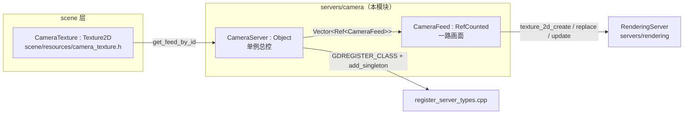
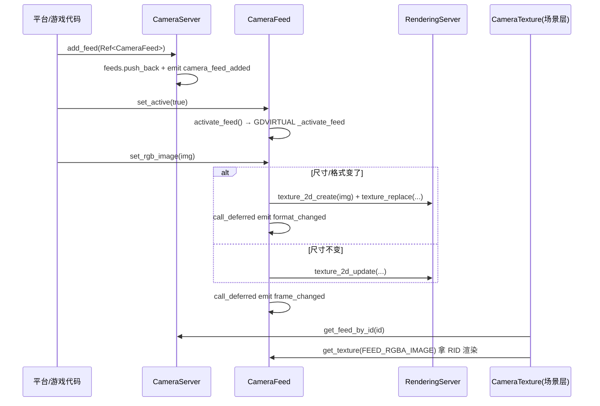

# camera（servers）

> 一句话：摄像头好比「装在家里的监控探头」，`CameraServer` 是总控台，`CameraFeed` 是每一路画面——引擎只负责登记探头、接住画面、把画面变成可渲染的纹理，至于怎么驱动硬件拿到像素，是各平台自己的事。

**结论**：`servers/camera` 是一个极小的服务层（4 个源文件、约 770 行代码），对外提供两个类 `CameraServer`（单例总控）和 `CameraFeed`（一路画面），把「物理摄像头」抽象成「可当背景/纹理用的渲染纹理（RID）」，供 `scene` 层的 `CameraTexture` 消费；代价是它**不碰任何硬件采集逻辑**，真正的取流实现被拆到各平台/驱动层去填充。

## 是什么 / 不是什么

这个模块只管三件事：登记与查寻 feed、把外部像素塞进 GPU 纹理、通知上层「画面变了」。

- **是**「摄像头流的登记处 + 纹理搬运工」：`CameraServer::add_feed()` 登记一路 feed（`camera_server.cpp:117`），`CameraFeed::set_rgb_image()` 把一张 `Image` 写成渲染纹理（`camera_feed.cpp:189`）。
- **不是**硬件驱动：没有打开摄像头、没有采集线程、没有视频编解码。这些由各平台自己实现后，通过 `CameraServer::make_default<T>()`（`camera_server.h:84`）注入一个自定义子类，或直接调 `add_feed()` 塞进来。
- **不是**场景节点：它不挂在场景树上，也不直接画到屏幕。真正把它接到渲染的是 `scene/resources/camera_texture.h:36` 的 `CameraTexture`（`Texture2D` 子类），那属于 `scene` 层，不在本模块范围。

## 在引擎里的位置

- `CameraServer` 拥有 `Vector<Ref<CameraFeed>> feeds`（`camera_server.h:69`），是 feed 的唯一持有者。
- `CameraFeed` 持有 2 个 `RID texture[FEED_IMAGES]`（`camera_feed.h:86`），其纹理的创建、更新、销毁全部走 `RenderingServer`（`camera_feed.cpp:164-165、200、185-186`）。
- 注册入口在 `servers/register_server_types.cpp:170`（`GDREGISTER_CLASS(CameraServer)`）和 `:398`（`Engine` 单例 `CameraServer`）。

## 关键概念

1. **总控台 `CameraServer`**：像物业的监控室，所有探头都在它这里登记。它是 `Object` 单例（`camera_server.h:48`），用 `get_singleton()` 拿（`camera_server.h:81`），带 `_THREAD_SAFE_CLASS_` 标记。
2. **一路画面 `CameraFeed`**：像某一个探头。它是 `RefCounted`（`camera_feed.h:42`），用 `Ref<CameraFeed>` 引用计数管理，避免裸指针悬空。
3. **开关 `monitoring_feeds`**：像监控室的总闸。所有 `get_feed / get_feed_by_id / get_feed_count` 都先检查它，没开就返回空并打日志（`camera_server.cpp:94、106、147`），防止「没开闸却问有没有画面」。
4. **数据形态 `FeedDataType`**：画面有五种形态——`FEED_NOIMAGE / FEED_RGB / FEED_YCBCR / FEED_YCBCR_SEP / FEED_EXTERNAL`（`camera_feed.h:46-52`），决定像素怎么被填进纹理（RGB 直传、YCbCr 需转、Y 和 CbCr 分两张纹理等）。
5. **虚实接口 `activate_feed / set_format / get_formats`**：像「留给各平台的填空题」。基类只有 `GDVIRTUAL_CALL` 空壳（`camera_feed.cpp:304-324`），真正的激活/选格式由平台子类或 GDScript 重载 `_activate_feed` 等虚拟方法完成（`camera_feed.h:127-130`）。

## 核心文件（按阅读顺序）

1. `servers/camera/camera_server.h` — 总控单例的接口：feed 登记/查寻、工厂函数、生命周期回调，共 123 行。
2. `servers/camera/camera_server.cpp` — 总控的实现：`get_free_id` 从 1 起找空 id（`:75-91`），`add/remove_feed` 发信号（`:117-144`）。
3. `servers/camera/camera_feed.h` — 单路画面的接口：数据形态/位置枚举、`FeedFormat` 结构体、纹理 RID 数组、GDVIRTUAL 钩子，共 134 行。
4. `servers/camera/camera_feed.cpp` — 单路画面的实现：四种写像素入口（`set_rgb_image / set_ycbcr_image / set_ycbcr_images / set_external`）与信号延迟发射。
5. `servers/camera/SCsub` — 只有一行 `env.add_source_files(env.servers_sources, "*.cpp")`，把本目录所有 `.cpp` 编进 servers 源。

## 数据流 / 调用链

一次「把一帧 RGB 画面喂进引擎」的典型调用：

要点：`set_rgb_image` 只在「datatype 或尺寸变化」时才重建纹理（`texture_replace`），否则原地更新（`texture_2d_update`）——`camera_feed.cpp:195-208`。两个信号 `format_changed` / `frame_changed` 都用 `call_deferred` 延迟到主线程再发（`camera_feed.cpp:202-213`），因为摄像头像素常来自非主线程。

## 中文口诀

> 总控单例 `CameraServer`，登记画面一排排；
> 每路画面 `CameraFeed`，引用计数不悬空；
> 先开闸 `monitoring_feeds`，再问 feed 在不在；
> RGB 直传、YCbCr 转，尺寸变了才重建；
> 信号延迟主线程发，纹理 RID 交渲染。

## 练习（15 分钟）

1. 打开 `camera_server.cpp:93-103`，手写 `get_feed_index` 的查找逻辑，确认「没开闸」时返回什么、日志字符串是什么。
2. 读 `camera_feed.cpp:189-215`，指出 `set_rgb_image` 里 `if` 与 `else` 两条分支分别调了 `RenderingServer` 的哪两个方法。
3. 打开 `camera_feed.cpp:154-180`，对比两个构造函数的差异：默认 `datatype` 各是什么？`transform` 的初值是什么？用一句话解释为什么 Y 轴是 -1（画面上下翻转）。
4. 用 `grep` 在 `servers/register_server_types.cpp` 里找到 `CameraServer` 的类注册与引擎单例注册两行，读出它们的行号。

## 自测

- [ ] `CameraServer` 和 `CameraFeed` 分别继承自哪个基类？（提示：`camera_server.h:48` 与 `camera_feed.h:42`）
- [ ] `CameraFeed` 里有几个纹理 `RID`？`FEED_IMAGES` 的值是几？（提示：`camera_feed.h:86` 与 `camera_server.h:58`）
- [ ] `set_ycbcr_images` 相比 `set_ycbcr_image` 多做了什么？它把像素分别填进哪两个 `FeedImage`？（提示：`camera_feed.cpp:245-282`）
- [ ] 为什么 `frame_changed` 信号要用 `call_deferred` 而不是直接 `emit_signal`？（提示：`camera_feed.cpp:210-213` 注释）
- [ ] `CameraTexture` 在本模块里吗？它属于哪一层、继承谁？（提示：`scene/resources/camera_texture.h:36`）

## 一句话总结

> `servers/camera` 是摄像头流的「前台登记处 + 纹理搬运工」：`CameraServer` 统一登记各路 `CameraFeed`，`CameraFeed` 把平台塞来的像素写成 `RenderingServer` 纹理并用信号通知上层，硬件采集本身则留给平台层实现。
