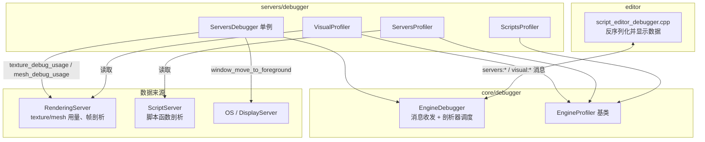
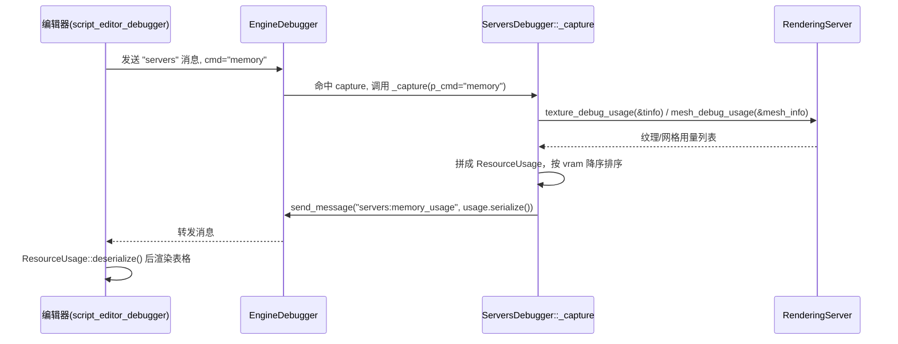

# debugger（servers）

> 一句话：它是引擎「性能仪表盘」的数据采集端——把显存占用、脚本函数耗时、各服务器 CPU/GPU 时间收集起来，打包成消息发给编辑器显示。

**结论**：`servers/debugger` 是 Godot 服务器层的性能剖析（profiling）前端，只做「采集 + 序列化 + 上报」三件事，为编辑器调试面板提供内存与性能数据；代价是它自己没有任何 GUI 和网络，采集与展示都依赖 `core/debugger` 与 `editor/debugger`。

## 是什么 / 不是什么

- **是**：一个名为 `ServersDebugger` 的单例（`servers/debugger/servers_debugger.h:43`），负责从渲染/脚本等服务器收集性能数据，包装成 `Array` 发出去。
- **是**：三个剖析器的宿主。它内部挂了 `ScriptsProfiler`、`ServersProfiler`、`VisualProfiler` 三个私有类（`servers_debugger.cpp:186/273/356`）。
- **不是**：它不负责把数据画成图表，也不负责和调试器客户端通信。图表渲染在 `editor/debugger/script_editor_debugger.cpp`，消息管道在 `core/debugger/engine_debugger.h`。

> 注意：模块名虽叫 `debugger`，但这里**不是** Debug Adapter Protocol（DAP）服务器。DAP 协议实现在 `core/debugger/debug_adapter.cpp`，属于 `core/debugger` 模块，本模块不涉及。

## 在引擎里的位置



- 上游：`ServersDebugger::initialize()` 由 `servers/register_server_types.cpp:273` 调用，随服务器类型注册启动。
- 下游：采集结果经 `EngineDebugger::get_singleton()->send_message(...)` 发到编辑器，由 `editor/debugger/script_editor_debugger.cpp` 反序列化（如 `ResourceUsage` 在 `:481`、`ServersProfilerFrame` 在 `:789`）。

## 关键概念

- **消息采集点（Capture）**：一条「命令 → 处理函数」的登记。构造函数里 `EngineDebugger::register_message_capture("servers", ...)`（`servers_debugger.cpp:534`）把 `memory`、`draw`、`foreground` 三个命令绑到 `_capture`。
- **剖析器绑定（bind）**：三个剖析器都继承 `EngineProfiler`（`core/debugger/engine_profiler.h:36`），通过 `bind("servers")` / `bind("visual")`（`servers_debugger.cpp:527/531`）向 `EngineDebugger` 报名，之后每帧的 `toggle/add/tick` 就由引擎自动驱动。
- **帧数据包（Frame）**：一帧性能快照的载体。`ServersProfilerFrame`（`servers_debugger.h:91`）装着各服务器耗时与脚本函数信息，`VisualProfilerFrame`（`:106`）装着 `FrameProfileArea` 的 CPU/GPU 毫秒数。
- **序列化协议（serialize/deserialize）**：所有帧数据都是 `Array` 的紧凑排列（`[数量, 数据...]`），靠 `CHECK_SIZE`/`CHECK_END` 宏防畸形消息（`servers_debugger.cpp:43-44`），是编辑器与引擎之间的无类型契约。

## 核心文件（按阅读顺序）

1. `servers/debugger/SCsub` — 把目录下所有 `.cpp` 编进 `servers_sources`（仅 3 行实际逻辑）。
2. `servers/debugger/servers_debugger.h` — 单例类 `ServersDebugger` 与全部数据结构（`ResourceInfo`、`ServersProfilerFrame` 等）的声明，共 137 行。
3. `servers/debugger/servers_debugger.cpp` — 全部实现：序列化、三个剖析器、命令分发 `_capture`、资源统计 `_send_resource_usage`，共 540 行。

## 数据流 / 调用链

以「编辑器查看内存占用」为例：



剖析数据（profiler）的路径类似：`EngineDebugger` 每帧调 `ServersProfiler::tick(...)` → 内部汇总 `script_functions`、`server_data` → `send_message("servers:profile_frame", frame.serialize())`（`servers_debugger.cpp:311`）。

## 中文口诀

```
引擎仪表盘，采数不画图；
三个剖析器，全挂单例里。
脚本排耗时，服务器算帧，
渲染报显存，序列化成组。
capture 管命令，bind 管报名，
serialize 打包，deserialize 拆包。
消息带前缀，servers 加 visual，
editor 来解包，面板亮数据。
```

## 练习（15 分钟）

1. 打开 `servers_debugger.cpp`，找到 `_send_resource_usage()`（第 430 行），数一数它统计了几类资源（纹理 / 网格），各调用了 `RenderingServer` 的哪个 `*_debug_usage` 函数。
2. 在 `_capture()`（第 403 行）里找出三个被处理的命令字符串，各写一行说明它们做什么。
3. 对照 `ServersProfilerFrame::serialize()`（第 90 行）和 `deserialize()`（第 114 行），画出数组元素的前 7 个位置分别是什么字段。

## 自测

- [ ] `ServersDebugger` 是单例吗？它的实例指针存在哪个静态成员里，何时被赋值？
- [ ] `bind("servers")` 和 `register_message_capture("servers", ...)` 里的 `"servers"` 是同一个东西吗？分别起什么作用？
- [ ] 为什么 `ScriptsProfiler::write_frame_data` 里要把 `total_time` 除以 `1000000.0`？（提示：看 `ScriptLanguage::ProfilingInfo` 的时间单位）

## 一句话总结

> `servers/debugger` 是引擎服务器层的性能数据采集器——把内存、脚本、各服务器耗时打包成 `Array` 消息交给 `EngineDebugger` 中转，最终喂给编辑器的剖析面板。
