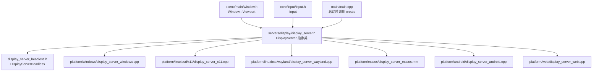
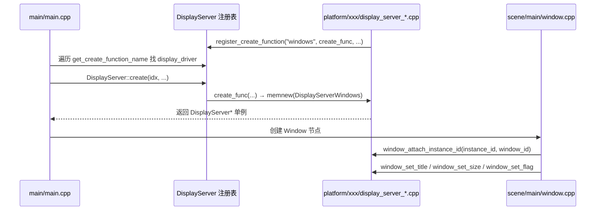

# display（servers）

> 一句话：DisplayServer 是「引擎和操作系统之间那根 HDMI 线」——窗口、屏幕、鼠标、剪贴板、原生对话框这些平台专属能力，全由它对外统一、对内分派到各平台实现。

**结论**：`DisplayServer` 是 Godot 的窗口/显示抽象层——向上给 `Window` 等场景节点和 `Input` 提供一套平台无关的接口，向下在运行时按 `display_driver` 把调用分派给 windows / x11 / wayland / macos / android / web / headless 等具体实现。代价是它必须维持一张「创建函数注册表」和几十个纯虚函数签名，任何平台实现都得把接口全部补齐。

## 是什么 / 不是什么

`DisplayServer` 负责窗口和显示设备的抽象：建窗口、切全屏/窗口化、读写鼠标状态、设光标形状、读写剪贴板、弹出原生对话框、文字转语音（TTS）、状态栏指示器，以及把这些事件回调回引擎。它不是渲染器——真正的像素画图在 `servers/rendering/`，它只负责「把窗口交给谁画」和「什么时候交换缓冲区」（`swap_buffers()`）。它也不是 `OS`——`OS` 管的是文件系统、命令行、环境变量这类更底层的进程级事情，窗口事务归 `DisplayServer`。

## 在引擎里的位置

`Window`（`scene/main/window.h:42`）是场景侧的门面，它把 `window_id` 通过 `window_attach_instance_id`（`scene/main/window.cpp:732`）挂到 DisplayServer；`Input` 则通过函数指针反向接住鼠标模式、光标形状这些能力（`display_server.cpp:2256-2267`）。

## 关键概念

- **抽象接口 + 单例**：`DisplayServer` 是个纯抽象类（`display_server.h:62`），进程里只有一个实例（`singleton`，`display_server.h:65`），用 `get_singleton()` 全局取用。绝大多数窗口/屏幕方法都是 `virtual ... = 0`，逼每个平台实现自己填。
- **创建函数注册表**：静态数组 `server_create_functions`（`display_server.h:88`，上限 `MAX_SERVERS = 64`），每个平台在启动时用 `register_create_function("windows", ...)` 往表里登记「名字 + 工厂函数 + 支持的渲染驱动列表」。headless 作为兜底，一开始就预置在表里且永远排最后（`display_server.cpp:67-71`）。
- **平台实现分派**：真正干活的是 `platform/` 下那一堆 `DisplayServer*` 子类，如 `DisplayServerWindows`（`platform/windows/display_server_windows.cpp:8460` 注册）、`DisplayServerX11`、`DisplayServerWayland`、`DisplayServerMacOS`、`DisplayServerAndroid`、`DisplayServerWeb`。`DisplayServer::create(int p_index, ...)` 只是按索引调对应工厂函数（`display_server.cpp:2051-2054`）。
- **WindowID 句柄**：窗口不传对象指针，只传一个 `int` 句柄 `WindowID`（`typedef int WindowID`，`display_server_enums.h:177`），主窗口固定为 `MAIN_WINDOW_ID = 0`（`display_server_enums.h:180`）。场景侧 `Window` 和 server 侧靠这个 ID 对上号。
- **能力探测 `has_feature`**：每个平台实现要回答自己支持哪些能力（`FEATURE_CLIPBOARD`、`FEATURE_NATIVE_DIALOG` 等，枚举在 `display_server_enums.h:43-83`），上层据此决定走原生路径还是回退。

## 核心文件（按阅读顺序）

1. `servers/display/display_server_enums.h` — 所有枚举：`Context`、`Feature`、`WindowMode`、`WindowFlags`、`VSyncMode`、`WindowEvent`、`WindowID` 等，是接口的「词汇表」。
2. `servers/display/display_server.h` — 抽象类 `DisplayServer` 本体：单例、注册表、几十个纯虚接口，是理解全模块的主入口。
3. `servers/display/display_server.cpp` — 静态注册表初始化（headless 预置）、`register_create_function`、`create` 分派、`_bind_methods` 脚本绑定、构造时与 `Input` 的接线。
4. `servers/display/display_server_headless.h` / `.cpp` — 无头实现 `DisplayServerHeadless`：所有窗口方法都是空桩，`process_events()` 只刷 `Input` 缓冲，供 CI、服务器、测试用。
5. `servers/display/native_menu.h` / `.cpp` — 平台原生菜单（macOS 菜单栏、Windows 托盘菜单）的抽象，`NativeMenu` 类。
6. `servers/display/accessibility_server.h` / `.cpp` — 无障碍/屏幕阅读器接口，`AccessibilityServer` 类，同样走「注册创建函数」的模式（`accessibility_server.cpp:233`）。
7. `servers/display/SCsub` — 只一行 `env.add_source_files(env.servers_sources, "*.cpp")`，编译目录下全部 `.cpp`。

## 数据流 / 调用链

下面是一次「程序启动 → 建窗口」的典型路径，重点看抽象接口怎么落到具体平台：

`DisplayServer::create` 本身不做任何平台逻辑，只查表转发（`display_server.cpp:2051`）；找不到匹配驱动时，`main.cpp:3382` 会退到 headless 兜底，保证引擎永远能「无声」跑起来。

## 中文口诀

注册表里排排坐，headless 垫底永不挪。
create 只查表，工厂函数真干活。
窗口不传对象，WindowID 对暗号。
has_feature 先探路，能走原生不绕路。
DisplayServer 管窗口，画像素交给渲染器。

## 练习（15 分钟）

1. 打开 `servers/display/display_server.h`，数一数 `/* WINDOW */` 区块里带 `= 0` 的纯虚函数有几个，感受「平台必须全实现」的分量。
2. 对比 `display_server_headless.h` 里同名方法的空桩实现（如 `window_set_size`、`clipboard_set`），理解为什么 headless 能当兜底。
3. 在 `platform/windows/display_server_windows.cpp` 里 grep `register_create_function`，看它上报的渲染驱动列表字符串是什么。
4. 读 `main/main.cpp:3368` 附近的 `DisplayServer::create` 调用，找出「启动参数里指定 display_driver」对应哪个变量。

## 自测

- [ ] `DisplayServer` 抽象类里哪些方法声明成纯虚（`= 0`），哪些是带默认实现的虚函数？为什么 `swap_buffers()` 有默认实现而 `process_events()` 是纯虚？
- [ ] `register_create_function` 为什么要把 headless 固定在数组最后一个位置（看 `display_server.cpp:2027-2035` 的插入逻辑）？
- [ ] `Window` 场景节点是怎么和 server 侧某个具体 `WindowID` 对上号的（提示：`window_attach_instance_id`）？

## 一句话总结

> `DisplayServer` 用「一份抽象接口 + 一张创建函数注册表」把 Godot 的窗口/显示需求与 10 来个平台实现解耦，让上层只认 `WindowID` 和 `get_singleton()`，而不用关心背后是 Windows 消息循环还是 Wayland 协议。
