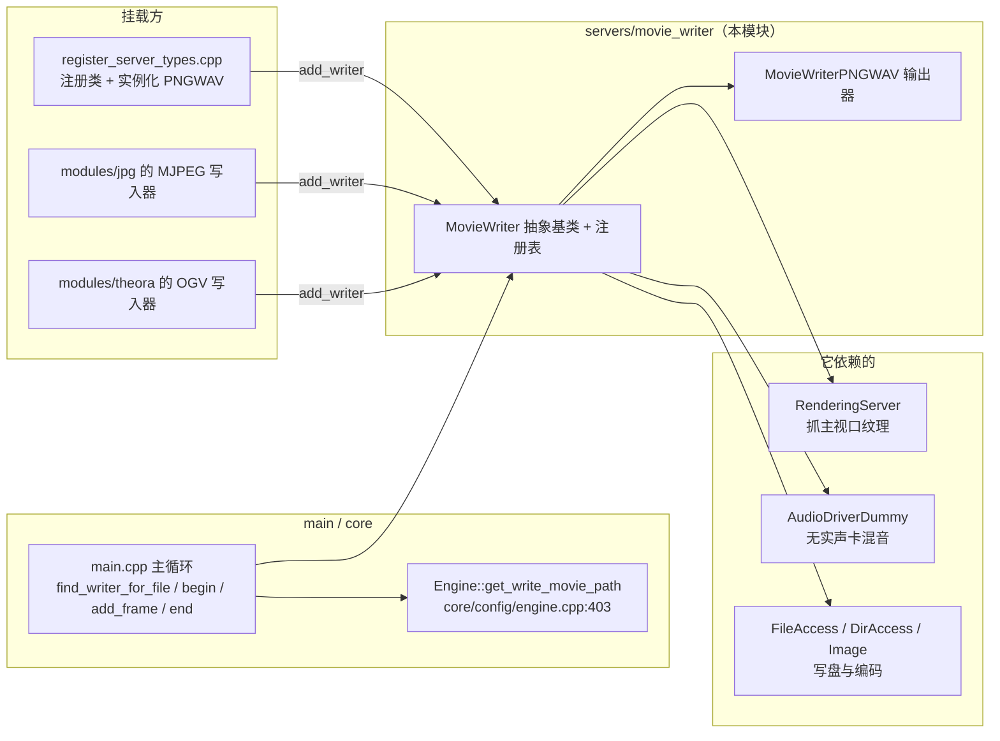
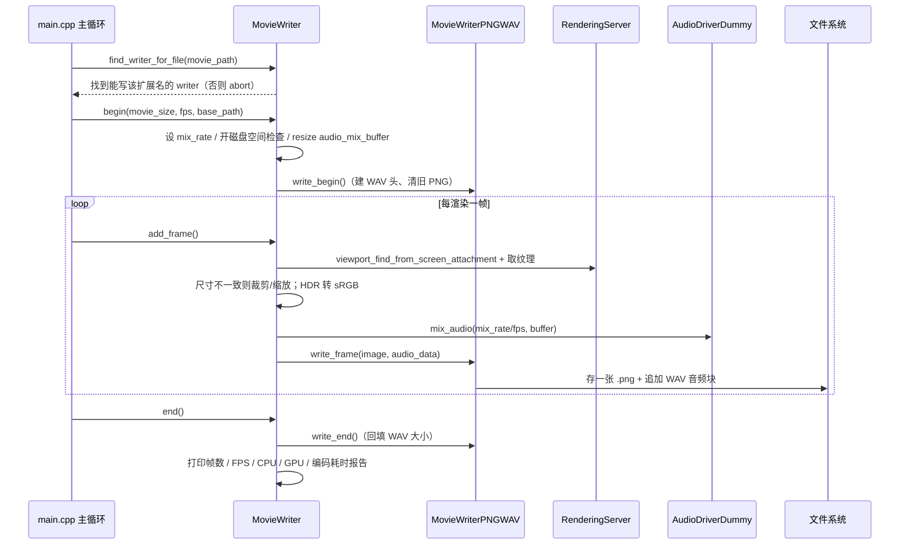

# movie_writer（servers）

> 一句话：MovieWriter 是引擎的「非实时录屏器」——它把渲染出来的画面逐帧按固定时间步长抓下来，配上混好的音频，交给一个「编码器」写进文件。

**结论**：`movie_writer` 提供录屏的抽象基类 `MovieWriter`（`movie_writer.h:37`）和一个内置输出实现 `MovieWriterPNGWAV`（输出 PNG 图片序列 + WAV 音频），为「拍电影 / 做宣传片」服务，代价是**放弃实时性**——帧率与真实时间解耦，录制速度取决于编码快慢。

## 是什么 / 不是什么

**是什么**：一个编码器抽象 + 一张「编码器电话簿」 + 一个默认的 PNG/WAV 输出器。它负责「每帧抓图、混音、交给谁写盘」这三件事。

**不是什么**：

- 不是玩家在游戏里的实时录屏工具（那种活是 OBS Studio 干的，`doc/classes/MovieWriter.xml:14` 明确写了）。
- 不是视频播放器（`VideoStreamPlayer` 才管播放）。
- 不是多格式转码器。AVI（MJPEG）和 OGV（Theora）这两个编码器分别在 `modules/jpg/` 和 `modules/theora/` 里，它们只是通过 `MovieWriter::add_writer()` 挂到这张电话簿上，**实现不在本目录**（本目录只有 PNG/WAV 一种实现）。

一句话对比：`MovieWriter` 是「调度中枢」，`MovieWriterPNGWAV` 是它麾下唯一的「本地产线」。

## 在引擎里的位置



关键外部锚点：`MovieWriter` 通过 `GDREGISTER_VIRTUAL_CLASS(MovieWriter)` 注册为脚本可见的虚拟类（`servers/register_server_types.cpp:271`），`MovieWriterPNGWAV` 在引擎启动时被 `memnew` 并塞进注册表（`register_server_types.cpp:373-376`）。

## 关键概念

1. **编码器电话簿（注册表）**：一个静态数组 `writers[MAX_WRITERS]`（上限 `MAX_WRITERS = 8`，`movie_writer.h:56-58`），靠 `add_writer()` 登记、`find_writer_for_file()` 按文件扩展名反查「谁能写这个文件」。查找从数组尾部往前扫，所以**后注册的能覆盖先注册的**（`movie_writer.cpp:52-59`）。

2. **三个虚拟钩子**：`write_begin()` / `write_frame()` / `write_end()`（`movie_writer.h:66-68`）是子类要填的接口，分别对应「开档、写一帧、收档」。基类默认返回 `ERR_UNCONFIGURED`（`movie_writer.cpp:72-86`），并把它们映射成 GDExtension 可覆写的 `_write_begin` / `_write_frame` / `_write_end`。

3. **非实时固定帧率**：`fps` 来自项目设置或 `--fixed-fps` 命令行参数，`add_frame()` 里用 `Engine::get_frames_drawn()` 除以 `fps` 算出「电影时间戳」，与真实渲染耗时无关（`movie_writer.cpp:186-193`）。

4. **哑音频驱动混音**：录制时用 `AudioDriverDummy` 这个「假声卡」来 mix 音频，`audio_mix_buffer` 按 `mix_rate / fps` 分配一段缓冲（`movie_writer.cpp:124-133`）。采样率若不能被帧率整除会打同步警告（`movie_writer.cpp:128-130`）。

5. **PNG 序列 + WAV 双文件**：`MovieWriterPNGWAV` 每帧把画面存成一张 `.png`（8 位补零编号，`MAX_TRAILING_ZEROS = 8`），同时把音频往一个 `.wav` 里追加（`movie_writer_pngwav.cpp:144-156`）。收尾时回填 WAV 头部的大小字段（`movie_writer_pngwav.cpp:158-167`）。

## 核心文件（按阅读顺序）

1. `servers/movie_writer/SCsub` — 只有一行 `env.add_source_files(env.servers_sources, "*.cpp")`，把本目录两个 `.cpp` 编进 servers 层。
2. `servers/movie_writer/movie_writer.h` — 抽象基类：注册表、虚拟接口、GDVIRTUAL 宏、`begin/add_frame/end` 公开方法。
3. `servers/movie_writer/movie_writer.cpp` — 主干实现：注册表查找、`begin/add_frame/end` 流程、`_bind_methods` 里定义的一批 `editor/movie_writer/*` 项目设置。
4. `servers/movie_writer/movie_writer_pngwav.h` — PNG/WAV 输出器的类声明（继承 `MovieWriter`）。
5. `servers/movie_writer/movie_writer_pngwav.cpp` — 真正的写盘逻辑：PNG 序列 + WAV 文件头/数据块。
6. `servers/register_server_types.cpp`（引用，不在本目录）— 注册 `MovieWriter` 虚拟类、实例化 `MovieWriterPNGWAV` 并 `add_writer`。

## 数据流 / 调用链

一次典型的「拍电影」流程：



## 中文口诀

```
MovieWriter 是总调度，电话簿里查扩展名；
add_writer 来挂号，find 从后往前翻。
begin 开档验磁盘，add_frame 每帧抓图又混音；
采样率不整除帧率，音频迟早不同步。
PNGWAV 本地产，PNG 序列加 WAV；
八位补零编序号，收尾回填头大小。
```

## 练习（15 分钟）

1. 打开 `movie_writer.cpp:186-250`，找出「抓图 → 裁剪/缩放 → HDR 转换 → 混音 → 编码」这五步各对应哪几行，写一句注释。
2. 在 `movie_writer.cpp:138-163` 里列出所有 `editor/movie_writer/*` 项目设置键名及其默认值。
3. 打开 `movie_writer_pngwav.cpp:63-142`，逐行追踪一个 WAV 文件的 RIFF / fmt / data 三个 chunk 是怎么被写进去的。
4. 修改 `movie_writer_pngwav.cpp:48-50` 的 `handles_file`，让它也接受 `.jpg`（只改这里，不要动其他文件），思考为什么这样还不够让引擎录出 JPG。

## 自测

- [ ] `find_writer_for_file()` 为什么要从 `writer_count - 1` 往前遍历，而不是从 0 开始？（提示：看 `movie_writer.cpp:53` 的注释）
- [ ] 如果 `mix_rate` 是 48000、`fps` 是 60，`audio_mix_buffer` 会 `resize` 成多少个元素？（提示：看 `movie_writer.cpp:132-133`，注意通道数）
- [ ] `MovieWriterPNGWAV` 支持的唯一扩展名是什么？在哪个方法里返回？
- [ ] 引擎在哪个文件里把 `MovieWriterPNGWAV` 实例化并 `add_writer`？给出文件:行号。

## 一句话总结

> `movie_writer` 是引擎的「非实时录屏调度中枢」：抽象基类 `MovieWriter` 管理编码器注册与逐帧抓图/混音流程，本目录唯一的内置实现 `MovieWriterPNGWAV` 把结果落成 PNG 图片序列 + WAV 音频文件。
