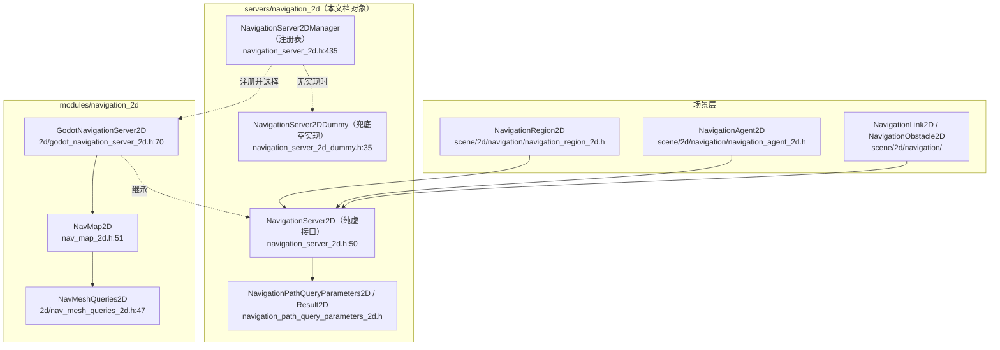
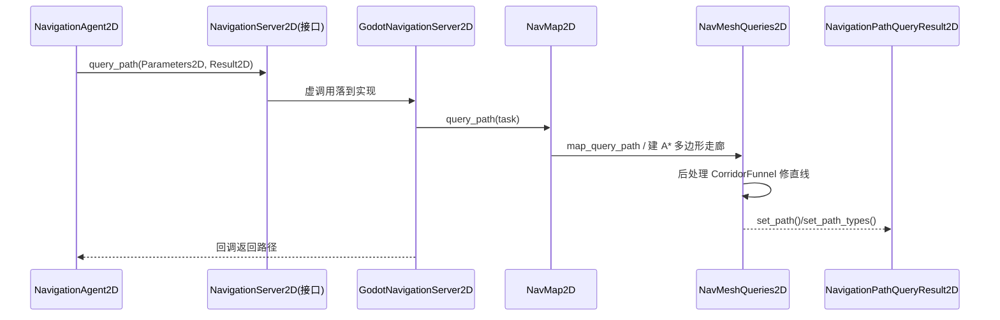

# navigation_2d（servers）

> 一句话：它是「2D 导航的前台电话总机」——场景节点只打这个电话，真正寻路的员工（`NavMap2D` 那帮人）在后面 `modules/navigation_2d` 上班。

**结论**：`servers/navigation_2d` 是 2D 导航系统的**对外接口层**——定义 `NavigationServer2D` 这套纯虚 API、负责按名字注册/挑选具体实现、并提供寻路查询的入参/出参对象；它不实现寻路算法，算法实现在 `modules/navigation_2d`（`NavMap2D`/`NavMeshQueries2D`）。

## 是什么 / 不是什么

它是一个**接口 + 注册表 + 查询对象**，不是算法库：

- 它负责：定义 `NavigationServer2D` 的完整 API（Map / Region / Link / Agent / Obstacle / Query 六组，`navigation_server_2d.h:63-259`）；用 `NavigationServer2DManager` 按名字注册服务器实现并挑默认（`navigation_server_2d.cpp:606`）；给出 `NavigationPathQueryParameters2D`/`NavigationPathQueryResult2D` 两个查询载体。
- 它不负责：真正的网格寻路与 RVO 避障算法——那是 `modules/navigation_2d` 里 `NavMap2D`（`modules/navigation_2d/nav_map_2d.h:51`）和 `NavMeshQueries2D`（`modules/navigation_2d/2d/nav_mesh_queries_2d.h:47`）的活。
- 它不负责：3D 导航——那在 `servers/navigation_3d`，是另一个模块。

本目录只有 10 个文件（含 `SCsub` 与 `navigation_server_2d.compat.inc`），其中唯一的「真实现」是空转的 `NavigationServer2DDummy`；`SCsub` 只在 `disable_navigation_2d` 为假时编译 `*.cpp`（`SCsub:6-7`）。

## 在引擎里的位置

场景节点（`NavigationRegion2D` 等）只对着 `NavigationServer2D` 单例说话（`scene/2d/navigation/navigation_agent_2d.cpp:239`）；具体对象是 `modules/navigation_2d` 注册进来的 `GodotNavigationServer2D`。

## 关键概念

- **服务器 = 电话总机**：`NavigationServer2D` 是纯虚基类（`navigation_server_2d.h:50`），所有方法 `= 0`，谁实现都能插进来。
- **注册表 = 员工花名册**：`NavigationServer2DManager` 维护 `Vector<ClassInfo>`，`register_server("名字", 回调)` 登记（`navigation_server_2d.cpp:606`），`set_default_server` 挑优先级最高的当默认（`navigation_server_2d.cpp:612`）。
- **兜底 = 空转替身**：`NavigationServer2DDummy` 每个接口返回空值（`navigation_server_2d_dummy.h:41-193`），保证「没导航也能跑起来」。
- **查询载体 = 点餐单**：`NavigationPathQueryParameters2D` 装起点/终点/寻路层/后处理/返回上限（`navigation_path_query_parameters_2d.h:62-79`），`NavigationPathQueryResult2D` 装结果路径与元数据（`navigation_path_query_result_2d.h:41-45`）。
- **常量 = 默认刻度**：`navigation_constants_2d.h` 里 `NAV_MESH_CELL_SIZE = 1.0f`、`path_search_max_polygons = 4096`（`navigation_constants_2d.h:65,73`），是网格与寻路预算的出厂值。

## 核心文件（按阅读顺序）

1. `servers/navigation_2d/navigation_constants_2d.h` — 枚举（A*、CorridorFunnel 后处理、段类型、元数据标志）与默认常量。
2. `servers/navigation_2d/navigation_path_query_parameters_2d.h` — 寻路查询入参（`RefCounted`）。
3. `servers/navigation_2d/navigation_path_query_result_2d.h` — 寻路查询出参（`RefCounted`）。
4. `servers/navigation_2d/navigation_server_2d.h` — 核心：`NavigationServer2D` 纯虚接口 + `NavigationServer2DManager`。
5. `servers/navigation_2d/navigation_server_2d_dummy.h` — 空实现，兜底。
6. `servers/navigation_2d/navigation_server_2d.cpp` — `_bind_methods`、`initialize_server`/`finalize_server`、注册表逻辑（`navigation_server_2d.cpp:556`）。
7. `servers/navigation_2d/SCsub` — 编译规则。

## 数据流 / 调用链

以「场景里一个 agent 要一条路」为例：

关键锚点：`NavigationServer2D::query_path` 声明于 `navigation_server_2d.h:253`；`NavMap2D::query_path` 于 `modules/navigation_2d/nav_map_2d.h:184`；A* 走廊与漏斗后处理在 `modules/navigation_2d/2d/nav_mesh_queries_2d.h:139-145`。

## 中文口诀

- 接口管对外，算法藏在后（servers 定义，modules 实现）
- Manager 是花名册，register 把名挂
- 没实现也不慌，Dummy 空转来兜底
- 参数问路点单，结果带路收钱
- 一格一米是默认，四千多边形是预算
- 走廊 A* 搜，漏斗直线修

## 练习（15 分钟）

1. 打开 `servers/navigation_2d/navigation_server_2d.h`，数出接口里分了几组 API（Map/Region/Link/Agent/Obstacle/Query/烘培）。
2. 在 `navigation_server_2d.cpp` 里找到 `initialize_server`，按顺序读它「取默认实现 → 回退 dummy → `init()`」三步（`navigation_server_2d.cpp:556-576`）。
3. 打开 `modules/navigation_2d/register_types.cpp`，看它注册的服务器名字和回调（`register_types.cpp:50`）。
4. 在 `navigation_constants_2d.h` 里把 6 个 Agent 默认值（半径/速度/时间视野/邻居数等）抄一遍，理解避障的参数尺度。

## 自测

- [ ] `NavigationServer2D` 为什么是纯虚类？它的方法体都在哪里被实现？
- [ ] 注册表里 `set_default_server` 靠什么字段选默认？（读 `navigation_server_2d.cpp:612-619`）
- [ ] 一条 `query_path` 调用最终在哪个类里执行 A* 搜多边形、又在哪个类里做 CorridorFunnel 后处理？

## 一句话总结

> `servers/navigation_2d` 是 2D 导航的「接口总机 + 注册表 + 查询单」三层薄壳，把真正的寻路与避障交给 `modules/navigation_2d` 的 `NavMap2D`/`NavMeshQueries2D` 去干。
