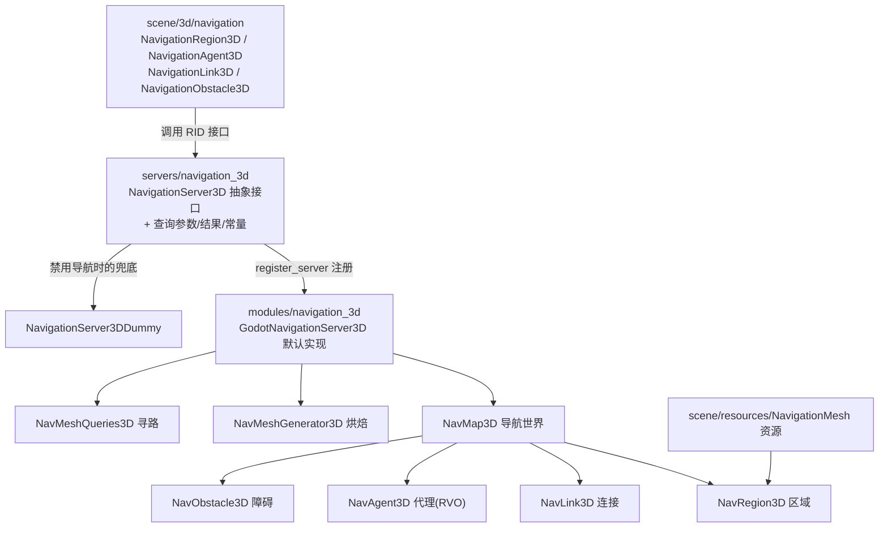
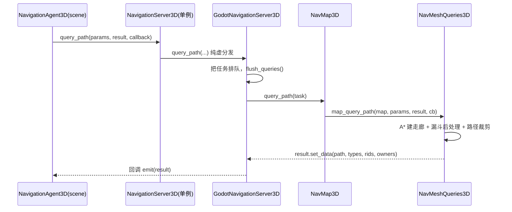

# navigation_3d（servers）

> 一句话：这是「3D 导航系统」的**服务端骨架**——像一家快递公司的总调度台，只定规矩、派单、收结果，真正跑腿的（烘焙网格、A* 寻路、躲人）都外包给默认实现 `GodotNavigationServer3D`。

**结论**：`servers/navigation_3d` 定义 3D 导航的**抽象服务接口 `NavigationServer3D` + 寻路查询数据结构（参数/结果/常量/哑实现）**，为「场景里的导航节点」和「modules 里的真实实现」当中间人；代价是这一层自己一行寻路算法都不写，全是纯虚方法，性能与正确性完全取决于下层实现。

## 是什么 / 不是什么

- **是什么**：一个 `Object` 单例抽象基类，把 3D 导航的全部能力（建地图、贴区域、架连接、放代理、避障、寻路、烘焙）拆成一堆 `virtual ... = 0` 的纯虚接口（`servers/navigation_3d/navigation_server_3d.h:46`）。
- **不是**：它**不烘焙**导航网格（交给 `NavMeshGenerator3D`）、**不跑 A\***（交给 `NavMeshQueries3D`）、**不存多边形**（交给 `NavMap3D`）。默认实现 `GodotNavigationServer3D` 在 `modules/navigation_3d/`，场景前端节点在 `scene/3d/navigation/`——这就是 Godot 的「servers 模式」：场景节点是薄前端，服务器是后端，本目录是两者之间的**契约**。

## 在引擎里的位置

依赖链真实来源：`navigation_server_3d.h:33-37` include 了 `navigation_mesh.h` 和查询参数/结果；`modules/navigation_3d/register_types.cpp:60-61` 用 `NavigationServer3DManager::register_server("GodotNavigation3D")` 注册默认实现。

## 关键概念

- **NavMap（导航世界）**：一张挂满区域的「总地图」，持有 cell_size/cell_height 栅格参数与 RVO 避障世界。术语：`NavMap3D`（`modules/navigation_3d/nav_map_3d.h:53`）。
- **NavRegion + NavigationMesh（可走面片）**：一块块「贴上去的可行走地板」，由 `NavigationMesh` 资源（顶点+多边形，`scene/resources/navigation_mesh.h:37`）经 `NavRegion3D` 变换到世界（`modules/navigation_3d/nav_region_3d.h:41`）。
- **NavLink（手动桥接）**：两个不相连区域之间的「传送带」，靠 start/end 两端点和 `link_connection_radius` 找落脚多边形。术语：`NavLink3D`（`modules/navigation_3d/nav_link_3d.h:59`）。
- **NavAgent（会躲人的小人）**：寻路之外还参与 RVO 避障，`NavMap3D` 内置 `RVOSimulator3D`（`nav_map_3d.h:85`）。术语：`NavAgent3D`（`modules/navigation_3d/nav_agent_3d.h:46`）。
- **寻路查询（订单 + 小票）**：`NavigationPathQueryParameters3D`（起点/终点/算法/后处理）是订单，`NavigationPathQueryResult3D`（路径点/RID/类型/长度）是小票（`navigation_path_query_parameters_3d.h:37`、`navigation_path_query_result_3d.h:38`）。

## 核心文件（按阅读顺序）

1. `servers/navigation_3d/navigation_server_3d.h` — 抽象服务基类，`MAP/REGION/LINK/AGENT/OBSTACLE/QUERY/BAKE` 七组纯虚接口 + 调试接口，`NavigationServer3DManager` 负责注册各实现。
2. `servers/navigation_3d/navigation_constants_3d.h` — `NavigationEnums3D`（A*、漏斗/边中心后处理等枚举）与 `NavigationDefaults3D`（cell_size 0.25、最大搜索 4096 多边形等默认值）。
3. `servers/navigation_3d/navigation_path_query_parameters_3d.h` — 寻路入参：`pathfinding_algorithm`（目前仅 `PATHFINDING_ALGORITHM_ASTAR`）、`path_postprocessing`（`CORRIDORFUNNEL`/`EDGECENTERED`/`NONE`）、`navigation_layers`、排除/包含区域。
4. `servers/navigation_3d/navigation_path_query_result_3d.h` — 寻路出参：`path`、`path_types`（`REGION`/`LINK`）、`path_rids`、`path_owner_ids`、`path_length`。
5. `servers/navigation_3d/navigation_server_3d_dummy.h` — `NavigationServer3DDummy`：全方法空实现，导航被禁用（`disable_navigation_3d`）时顶替。
6. `servers/navigation_3d/SCsub` — 编译脚本，未禁用时编 `*.cpp`，禁用时只编 `navigation_server_3d.cpp`。

（默认实现与算法本体在 `modules/navigation_3d/`：`GodotNavigationServer3D`、`NavMap3D`、`NavMeshGenerator3D`、`NavMeshQueries3D`。）

## 数据流 / 调用链

一次异步寻路（`query_path`）的调用链：

烘焙（`bake_from_source_geometry_data`）走另一条线：`NavigationRegion3D::bake_navigation_mesh`（`scene/3d/navigation/navigation_region_3d.h:108`）→ 服务器 `parse_source_geometry_data` 采集源几何 → `bake_from_source_geometry_data[_async]` → `NavMeshGenerator3D` 用 Recast 管线分阶段跑（`nav_mesh_generator_3d.h:57` 的 `NavMeshBakeState`：高度场 → 标记可行走三角形 → 紧凑高度场 → 侵蚀 → 划分 → 轮廓 → 多边形网格 → 原生网格）。

## 中文口诀

> 服务器管接口，模块里跑算法。
> 地图挂区域，区域贴网格，链接架桥，代理避障。
> 寻路先 A* 建走廊，再漏斗把边收直。
> 参数下订单，结果拿小票，异步回调别阻塞。
> 关导航用哑巴，开导航才真干活。

## 练习（15 分钟）

1. 打开 `servers/navigation_3d/navigation_server_3d.h`，数一数 `map_` / `region_` / `link_` / `agent_` / `obstacle_` 五组纯虚接口各有多少个方法，验证「服务器只定契约」。
2. 读 `navigation_constants_3d.h:33-58`，把 `PathPostProcessing` 三个枚举值写下来，再在 `nav_mesh_queries_3d.h` 里找到对应后处理函数 `_query_task_post_process_*`。
3. 读 `navigation_server_3d_dummy.h:35`，对比它和真实实现 `godot_navigation_server_3d.h:67` 的 `map_create()`，说明「哑实现」为什么能零成本替换。

## 自测

- [ ] `NavigationServer3D` 用哪个类把「参数/结果」打包成一个查询？答案是否在 `navigation_server_3d.h:280` 的 `query_path` 签名里。
- [ ] 默认实现 `GodotNavigationServer3D` 是在哪个文件、用哪句代码把自己注册成默认服务器的？
- [ ] `NavMeshGenerator3D` 的 `NavMeshBakeState` 枚举里，哪个状态代表「标记可行走三角形」（`MARK_WALKABLE_TRIANGLES`）？

## 一句话总结

> `servers/navigation_3d` 是 3D 导航的「接口契约层」——定义 `NavigationServer3D` 与查询数据结构、默认真实工作交给 `modules/navigation_3d` 的 `GodotNavigationServer3D`，场景节点只当薄前端。
