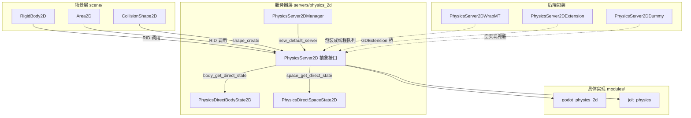
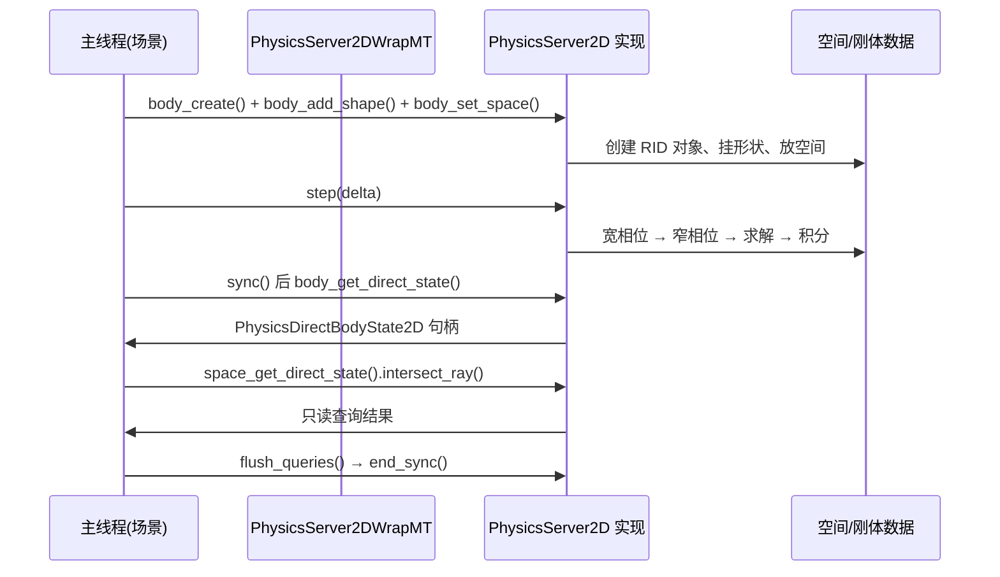

# physics_2d（servers）

> 一句话：这是 2D 物理的「点菜台」——场景节点想加个刚体、查根射线，都来这里下单，真正的做饭（碰撞求解）在后厨（modules/ 里的具体物理引擎）完成。

**结论**：`servers/physics_2d` 定义 2D 物理服务器的**抽象契约**（space / body / area / shape / joint / query 六组 API 和它们的直接状态句柄），供场景层调用、供具体物理引擎实现；它自己几乎不做物理计算，代价是每类对象都抽象成 `RID` + 纯虚接口。

## 是什么 / 不是什么

它是一个**接口层 + 生命周期框架**：用纯虚的 `PhysicsServer2D` 把「世界（space）、刚体（body）、区域（area）、形状（shape）、关节（joint）、查询（query）」的 API 固定下来，再提供 `PhysicsServer2DManager` 按项目设置选择具体后端。

它**不是**碰撞求解器：宽相位/窄相位/约束求解器都在 `modules/godot_physics_2d` 等模块里实现（`PhysicsServer2D` 里所有方法都是 `= 0` 纯虚，`physics_server_2d.h:243-616` 没有一行求解逻辑）。

它**不是**场景节点：`RigidBody2D`、`Area2D`、`CollisionShape2D` 这些挂在 `scene/` 下的节点只是前端壳，它们把数据翻译成 `RID` 调用本目录的接口。

## 在引擎里的位置

## 关键概念

1. **Space（空间）**——物理世界的「宇宙边界」。所有 body/area 必须先挂进某个 space 才会参与计算，`space_create()` 开空间、`space_set_active()` 开关它（`physics_server_2d.h:264`）。
2. **Body（刚体）**——有质量的「物」。分四种模式：静态 / 运动学 / 刚体 / 刚体线性（`BodyMode`，`physics_server_2d.h:363`），用 `body_create()` 创建。
3. **Shape（形状）**——纯几何「模具」，没有位置和速度，只有 9 种类型（圆形、矩形、凸多边形等，`ShapeType`，`physics_server_2d.h:231`），被 body/area 复用。
4. **Direct State（直接状态）**——物理帧内的「读写句柄」。`body_get_direct_state()` / `space_get_direct_state()` 只在物理步进期间有效，其他时候返回 null（`physics_server_2d.h:284`、`physics_server_2d.h:496`）。
5. **Query（查询）**——只读「探针」，对着世界射一条线、放一个形状问「碰没碰到」，不动任何物体，由 `PhysicsDirectSpaceState2D` 提供（`physics_server_2d.h:123`）。

## 核心文件（按阅读顺序）

1. `servers/physics_2d/SCsub` — 编译清单，仅当 `disable_physics_2d` 未设时把 `*.cpp` 加进 `servers_sources`（`SCsub:6`）。
2. `servers/physics_2d/physics_server_2d.h` — **入口头文件**：`PhysicsServer2D`、`PhysicsDirectSpaceState2D`、`PhysicsDirectBodyState2D`、`PhysicsServer2DManager` 和全部查询参数类都在这里。
3. `servers/physics_2d/physics_server_2d.cpp` — 绑定层：把接口方法 `ClassDB::bind_method` 暴露给 GDScript，并实现 `PhysicsServer2DManager` 的注册/选择逻辑。
4. `servers/physics_2d/physics_server_2d_wrap_mt.h` — `PhysicsServer2DWrapMT`，把主线程的调用装进 `CommandQueueMT` 交给物理线程执行。
5. `servers/physics_2d/physics_server_2d_extension.h` — `PhysicsServer2DExtension`，用 `GDVIRTUAL`/`EXBIND` 宏把接口暴露给 GDExtension，允许第三方写自定义后端。
6. `servers/physics_2d/physics_server_2d_dummy.h` — `PhysicsServer2DDummy`，空实现，编译期禁用物理时兜底。

## 数据流 / 调用链

一句话概括这条链：**先 `step` 算世界，再 `sync` 拿句柄，查询用 `space state`，最后 `flush_queries` 收尾**（生命周期五件套见 `physics_server_2d.h:611-616`）。

## 中文口诀

- 空间是宇宙，刚体是物件，形状是模具，挂上才有效。
- 先 step 后 sync，句柄只在帧里活。
- 查射线找 space state，读数据走 direct state。
- 管理器选后端，wrap_mt 开线程，dummy 空壳来兜底。
- 这里只有契约，没有求解器——求解在 modules 里找。

## 练习（15 分钟）

1. 打开 `physics_server_2d.h`，从 `PhysicsServer2D` 的 `space_create` 一路往下读，列出 space / body / area / joint / query 五组 API 的分界注释行（`/* SPACE API */` 等）。
2. 在 `physics_server_2d.cpp` 里搜 `_bind_methods`，数一数 `PhysicsDirectBodyState2D::_bind_methods` 绑定了多少个方法，感受「接口 → GDScript」的映射量。
3. 对比 `physics_server_2d_wrap_mt.h` 和 `physics_server_2d_extension.h`：前者用 `FUNCRID` 宏、后者用 `EXBIND` 宏，各挑一个 `body_create` 看它们分别怎么转发。

## 自测

- [ ] `space_get_direct_state()` 什么时候返回 null？为什么查询要走 `PhysicsDirectSpaceState2D` 而不是直接调 `PhysicsServer2D`？

## 一句话总结

> `servers/physics_2d` 是 2D 物理的接口契约与生命周期框架：用 `PhysicsServer2D` 定死「空间/刚体/区域/形状/关节/查询」六组 API，用 `PhysicsServer2DManager` 选后端，把真正的碰撞求解留给 `modules/` 里的引擎实现。
