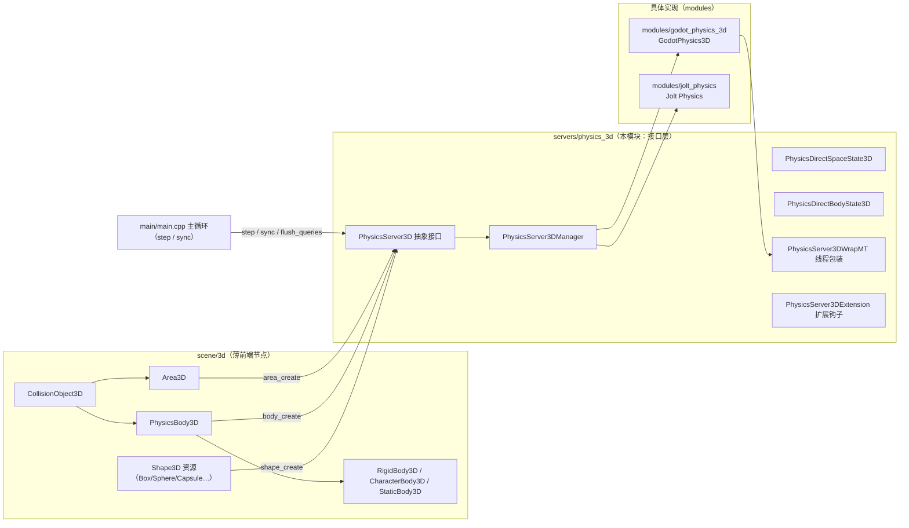
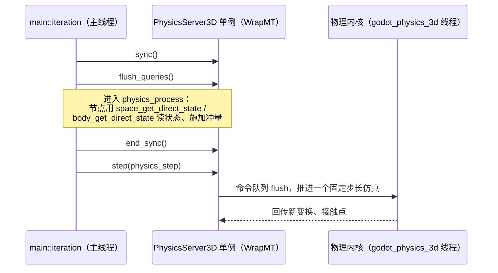

# physics_3d（servers）

> 一句话：这里是 3D 物理的「接口柜台」——它给 scene 节点和脚本发号码牌（RID），把「创建空间/刚体/形状/查询」这些活儿写成一份谁都签字的契约，但真正的碰撞计算不在柜台里，而在隔壁模块的「加工车间」。

**结论**：`physics_3d` 定义 3D 物理服务器的抽象接口 `PhysicsServer3D`（一套纯虚函数 + RID 句柄 + 单例管理器），为 scene/3d 的薄前端节点和第三方物理引擎之间当中间人；代价是多一层虚函数调用与 RID 间接寻址，且线程安全靠命令队列引入「设置」到「生效」的延迟。

## 是什么 / 不是什么

- **它负责**：3D 物理的接口契约——`space`（空间）、`body`（刚体）、`area`（区域）、`shape`（形状）、`joint`（关节）、`soft_body`（软体）、`query`（空间查询）七类对象的 `create/set/get` 全套方法，外加单例管理 `PhysicsServer3DManager`、多线程包装 `PhysicsServer3DWrapMT`、GDExtension 钩子 `PhysicsServer3DExtension`。
- **它不负责**：真正的碰撞检测、接触求解、约束迭代——那些在 `modules/godot_physics_3d`（或 `modules/jolt_physics`）里实现。本目录只有 8 个文件，全是接口层。
- **它不负责**：scene 节点的生命周期与场景树管理——那是 `scene/3d` 里 `CollisionObject3D`、`PhysicsBody3D` 等节点的事，它们只是把参数转手调到这里。
- 3D 之外它不管：2D 有完全同构的兄弟模块 `servers/physics_2d`，代码模式几乎一一对应。

## 在引擎里的位置

读图：scene 节点只认 `PhysicsServer3D` 这一份接口；`PhysicsServer3DManager` 决定「具体用哪家引擎」，默认是 `modules/godot_physics_3d` 注册的 `GodotPhysics3D`（`modules/godot_physics_3d/register_types.cpp:56`），再用 `PhysicsServer3DWrapMT` 包一层线程安全。主循环 `main/main.cpp` 每帧调用 `step`/`sync` 驱动它。

## 关键概念

1. **RID（资源句柄）＝ 存包柜的号码牌**。所有 create 方法都返回一个 `RID`，不是裸指针，也不是对象引用。它只告诉你「东西在哪一格」，真正内容在服务器内部。锚点：`shape_create` 返回 `RID`（`servers/physics_3d/physics_server_3d.h:263`）。
2. **Space（空间）＝ 物理世界的舞台**。所有 body/area 都要 `set_space` 挂进某个空间才参与碰撞；空间有自己的重力、迭代次数等参数。锚点：`space_create` / `space_set_param`（`physics_server_3d.h:289`、`:304`）。
3. **Body vs Area ＝ 会撞的演员 vs 只当传感器的门帘**。body 有质量、有速度、参与碰撞响应，分 4 种模式 `BodyMode`（STATIC/KINEMATIC/RIGID/RIGID_LINEAR）；area 不产生碰撞响应，只负责「有东西进来/出去就通知我」。锚点：`BodyMode`（`physics_server_3d.h:389`）、`area_create`（`:337`）。
4. **Shape（形状）＝ 只描述几何轮廓的戏服**。形状本身没有质量、没有速度，只是碰撞用的轮廓，10 种 `ShapeType`（平面/球/盒/胶囊/圆柱/凸多边形/凹多边形/高度图/软体/自定义）。锚点：`ShapeType`（`physics_server_3d.h:249`）。
5. **DirectState（直接状态）＝ 只在同步窗口内能用的「此刻快照」**。`PhysicsDirectSpaceState3D` 做射线/点/形状查询，`PhysicsDirectBodyState3D` 读写速度、施加冲量——都只能在物理帧的 `sync` 之后、`step` 之前的窗口里用。锚点：`PhysicsDirectSpaceState3D`（`:125`）、`PhysicsDirectBodyState3D`（`:42`）。

## 核心文件（按阅读顺序）

1. `servers/physics_3d/physics_server_3d.h` — 主接口（1074 行），`PhysicsServer3D` 的全部纯虚 API 和 20+ 个枚举，以及 DirectState、三类查询参数类、`PhysicsServer3DManager`。先读这个。
2. `servers/physics_3d/physics_server_3d.cpp` — 接口的实现侧：`_bind_methods` 把方法暴露给脚本，`PhysicsServer3DManager` 的注册/新建逻辑，`get_singleton()`。
3. `servers/physics_3d/physics_server_3d_wrap_mt.h` — `PhysicsServer3DWrapMT`：用 `CommandQueueMT` 把调用排队，让非线程安全的内核跑在独立线程，主线程不阻塞。
4. `servers/physics_3d/physics_server_3d_extension.h` — `PhysicsServer3DExtension` 等三个类：把同一份接口通过 GDVIRTUAL 暴露给 GDExtension，第三方物理引擎（如 Jolt）由此接入。
5. `servers/physics_3d/physics_server_3d_dummy.h` — `PhysicsServer3DDummy`：所有方法返回空的空实现，物理被关闭（`disable_physics_3d`）时兜底用。
6. `servers/physics_3d/SCsub` — 一行：`env.add_source_files(env.servers_sources, "*.cpp")`，编译本目录全部 `.cpp`。

## 数据流 / 调用链

一帧物理的固定节拍（顺序来自 `main/main.cpp:4990-5035`）：

要点：`sync` 先让服务器把上一步结果同步回来；`flush_queries` 处理排队中的异步查询；随后 `physics_process` 阶段节点通过 DirectState 读取「此刻」状态并施加力/冲量；`end_sync` 关闭读取窗口；`step(dt)` 才真正推进仿真。因为 `WrapMT` 把命令塞进队列，脚本里 `set_linear_velocity` 之类的写操作不会立即生效，要等下一次 `step`。

## 中文口诀

- 空间是舞台，body 是演员，shape 是戏服，query 是问路。
- RID 是号牌不是针，内容都在柜子里存。
- 接口在 servers，求解在 modules，换引擎只换实现不动契约。
- 想读状态先进窗：sync 打开、end_sync 关上。
- 静动三态定角色：static 钉死、kinematic 听脚本、rigid 交给力。
- 面积 area 只报警不推人，body 才管碰撞响应的账。

## 练习（15 分钟）

1. 打开 `servers/physics_3d/physics_server_3d.h`，从 `shape_create`（`:263`）一路往下，圈出 `/* SHAPE API */`、`/* SPACE API */`、`/* AREA API */`、`/* BODY API */`、`/* JOINT API */`、`/* QUERY API */` 六个分块注释，对照上面的主线。
2. 打开 `main/main.cpp:4990-5035`，把 `sync → flush_queries → physics_process → end_sync → step` 的调用顺序抄下来，并给每一步写一句话用途。
3. 打开 `modules/godot_physics_3d/register_types.cpp:56`，看 `GodotPhysics3D` 是怎么通过 `PhysicsServer3DManager::register_server` + `set_default_server` 成为默认实现的。
4. 打开 `servers/physics_3d/physics_server_3d_wrap_mt.h:63`，找到 `CommandQueueMT command_queue` 成员，确认「命令排队」的说法落在哪里。

## 自测

- [ ] `PhysicsServer3D::ShapeType` 有哪 10 种？为什么 `SHAPE_CUSTOM` 不能用 `shape_create` 创建？
- [ ] `body` 的 4 种 `BodyMode` 分别是什么？哪种模式「位置由脚本控制、物理只管撞不撞」？
- [ ] 为什么 `space_get_direct_state` 和 `body_get_direct_state` 的注释都写着「only works on physics process」？
- [ ] 第三方物理引擎（如 Jolt）是通过本模块的哪个类、哪个机制接入的？

## 一句话总结

> `physics_3d` 是 3D 物理的「合同工中介」：它不干体力活，只负责把 scene 节点的诉求翻译成一份稳定的接口契约，再派发给背后可替换的物理引擎实现。
