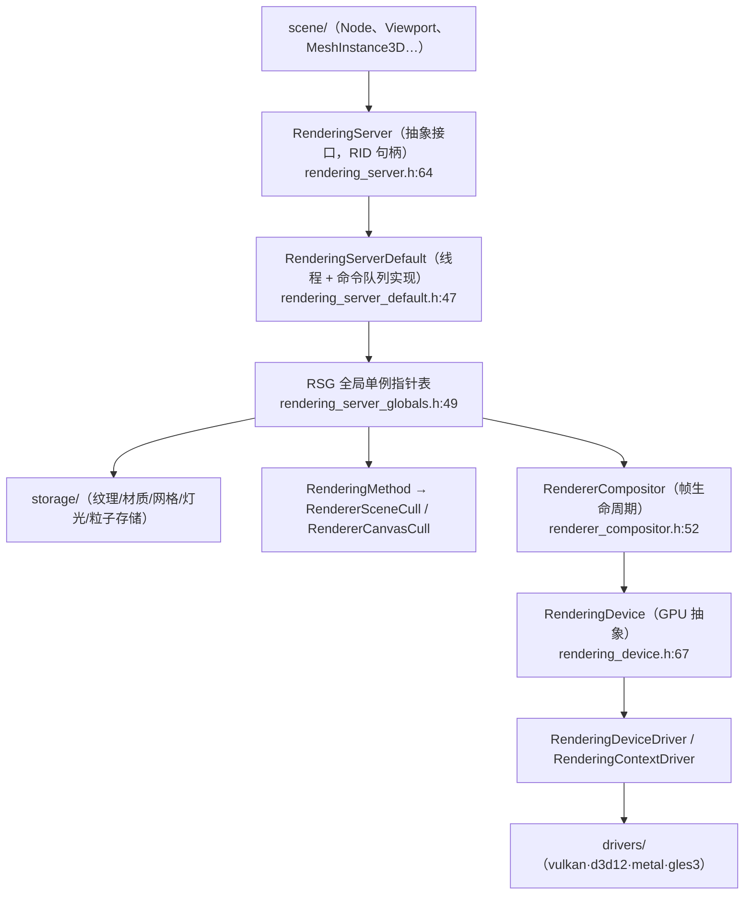
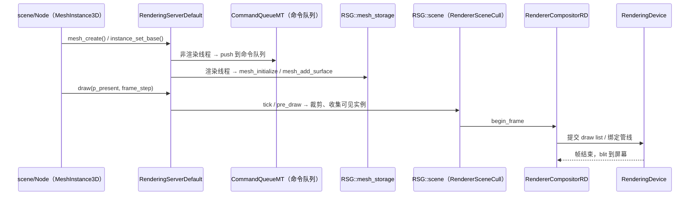

# rendering（servers）

> 一句话：渲染服务器就像一家「画图纸 + 发订单」的画坊——scene 层把「要画什么」写成一份份订单（RID 资源），rendering 层负责记账、排序，再把这些订单翻译成 GPU 听得懂的命令。

**结论**：rendering 模块是 Godot 的「GPU 调度中枢」，把 scene 层送来的纹理/网格/灯光/相机等资源登记成 RID 句柄，在渲染线程上按帧批量提交给图形 API 后端（Vulkan/D3D12/Metal/GLES3），代价是引入一层 RID 间接寻址和线程命令队列，换来了「场景逻辑与 GPU 后端解耦」。

## 是什么 / 不是什么

rendering 模块负责：资源的创建/更新/释放（`RID ..._create()` 一族，见 `rendering_server.h:108` 起）、把渲染命令路由到正确的存储与渲染器、以及每帧的绘制循环（`draw`/`sync`，见 `rendering_server_default.h:1204-1205`）。

它**不**负责：具体调用 Vulkan/Metal 的 API（那是 `drivers/vulkan`、`drivers/d3d12`、`drivers/metal`、`drivers/gles3` 的活）；也不负责场景树、节点脚本这些 game 层逻辑（那是 `scene/` 的活）。它只提供一份「写命令的接口」和「执行命令的编排」。

## 在引擎里的位置



scene 层只认识 `RenderingServer`；`RenderingServerDefault` 把每个调用派发到 `RSG` 表里对应的存储/渲染器；最底下才是 `RenderingDevice` 这条通向真实 GPU 后端的通道。

## 关键概念

- **RID（资源身份证）**：像「工牌号」，scene 层拿到的不是对象指针，而是一个 `RID`。真正的数据锁在 rendering 层的存储里，谁想操作都得拿工牌号来取。锚点：`core/templates/rid.h`，所有 `RID ..._create()` 返回它（`rendering_server.h:110`）。
- **Storage（存储层）**：像「仓库」，只管把数据按类型收好，不管怎么画。`RendererTextureStorage` / `RendererMaterialStorage` / `RendererMeshStorage` 等（`storage/` 目录，`rendering_server_globals.h:53-58`）。
- **RenderingMethod（画法层）**：像「画师班」，管相机、环境、天空、场景与实例的裁剪。`RenderingMethod` 是抽象基类，`RendererSceneCull` 是它的 3D 实现（`renderer_scene_cull.h:52`）。
- **RendererCompositor（帧管家）**：像「放映员」，管 `begin_frame` / `end_frame` / `blit_render_targets_to_screen` 这套帧节奏（`renderer_compositor.h:80-86`），RD 后端是 `RendererCompositorRD`（`renderer_rd/renderer_compositor_rd.h:48`）。
- **RenderingDevice（GPU 直通车）**：像「机要员」，绕过 RID 抽象、直接下 GPU 命令，供 compute shader 和 RD 渲染器用。它手里攥着 `context`（`RenderingContextDriver*`）和 `driver`（`RenderingDeviceDriver*`）（`rendering_device.h:85-86`）。

## 核心文件（按阅读顺序）

1. `servers/rendering/rendering_server.h` — 抽象接口 `RenderingServer`，几千个纯虚 `RID ..._create()`，是模块对外的「总目录」（800+ 行）。
2. `servers/rendering/rendering_server_default.h` — 具体实现 `RenderingServerDefault`，用宏把每个调用投递到 `RSG` 单例或命令队列（1249 行）。
3. `servers/rendering/rendering_server_globals.h` — `RSG` 全局指针表，存放所有 storage / renderer / compositor 单例（70 行，先读它建立地图）。
4. `servers/rendering/rendering_method.h` — 场景/相机/环境/天空的抽象接口 `RenderingMethod`（377 行）。
5. `servers/rendering/renderer_compositor.h` — 帧生命周期接口 `RendererCompositor`（99 行）。
6. `servers/rendering/rendering_device.h` — GPU 抽象 `RenderingDevice`，全模块最大头文件（2067 行）。
7. `servers/rendering/renderer_rd/` — RD 后端渲染器（`RendererCompositorRD`、`RendererCanvasRenderRD`、`RendererSceneRenderRD`、`storage_rd/`）。
8. `servers/rendering/storage/` — 各类型存储层（纹理/材质/网格/灯光/粒子/工具）。
9. `servers/rendering/dummy/` — 无渲染后端的桩实现（`RasterizerDummy`），供无 GPU 环境启动。
10. `servers/rendering/SCsub` — 编译入口，聚合 `*.cpp` 并递归 `dummy/`、`renderer_rd/`、`storage/`。

## 数据流 / 调用链

一次典型的 3D 绘制，从 scene 层到 GPU 后端：



关键在 `RenderingServerDefault` 的双轨：调用方线程不是渲染线程时，命令进 `CommandQueueMT` 排队（`rendering_server_default.h:80`、`command_queue.push(...)`），渲染线程在 `draw` 时统一消费——这是「多线程安全提交」与「单线程 GPU 消费」的分界。

## 中文口诀

```
scene 发单给 RS，句柄 RID 不传指针；
Default 派单分两路，存储画法各就位；
RSG 表里找单例，storage 管料不管画；
Method 管景 Camera，Compositor 管帧速；
真要摸到 GPU，还得 Device 走直路；
驱动藏在 drivers，Vulkan 金属 D3D。
```

## 练习（15 分钟）

1. 打开 `rendering_server_globals.h`，把 `RSG` 里每个静态指针（`texture_storage`、`scene`、`rasterizer`…）和它对应的类名一一抄下来。
2. 在 `rendering_server_default.h` 里找 `FUNCRIDSPLIT(mesh)`，展开这个宏，说明 `mesh_create()` 最终调到了哪个类、哪个方法。
3. 打开 `renderer_compositor.h`，写出 `RendererCompositor` 从 `begin_frame` 到 `end_frame` 之间会经过哪几个公开方法。

## 自测

- [ ] `RenderingServer` 和 `RenderingServerDefault` 谁是抽象接口、谁是具体实现？判断依据在哪一行？
- [ ] `RenderingMethod` 的 3D 具体实现类叫什么名字？它在哪个文件里被声明？
- [ ] 从 `RSG::mesh_storage` 到 `RenderingDevice`，中间隔了几层抽象？各层的职责分别是什么？

## 一句话总结

> rendering 模块是 Godot 的渲染「总装车间」：用 RID 抽象收单、用 RSG 单例分派、用 `RenderingDevice` 直连 GPU 后端，把 scene 层的场景描述变成每帧一叠可提交的图形命令。
