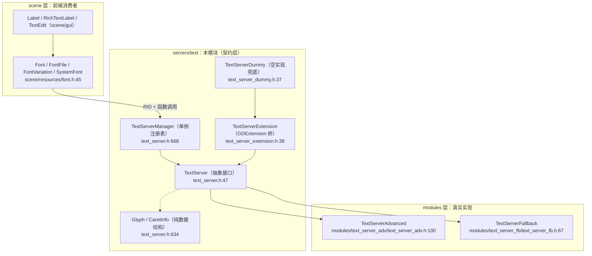

# text（servers）

> 一句话：text 是 Godot 的「文字排版翻译官」——上层只丢一句 Unicode 字符串，它负责翻译成一排带位置、带字形的可绘制像素（术语：文本塑形 text shaping + 字体栅格化 font rasterization）。

**结论**：`servers/text` 定义了所有文字处理的后端接口 `TextServer` 和它的注册中心 `TextServerManager`，为 `scene` 层的 `Font`/`Label`/`RichTextLabel` 提供统一的字形与排版服务；代价是「只定契约、不干活」——真正的塑形和栅格化由 `modules/text_server_adv`、`modules/text_server_fb` 两个实现模块完成。

## 是什么 / 不是什么

它**是什么**：一套抽象接口 + 一个注册表。任何「把字符串变成能画的字形」这件事，都必须走这里定义的函数签名；引擎启动时挑一个功能最全的实现当「主实现」（`main/main.cpp:851-875`）。

它**不是什么**：

- 它不是塑形算法本身（连字 ligature、双向文本 BiDi、复杂脚本），那由 `TextServerAdvanced` 干（`modules/text_server_adv/text_server_adv.h:100`，内部用 HarfBuzz + FreeType）。
- 它不是字体文件的解析器（FreeType 在 `modules/freetype/`，是独立模块）。
- 它也不是 UI 控件（`Label`/`RichTextLabel`/`TextEdit` 都在 `scene/gui/`），那些控件只是它的「顾客」。

一句话边界：`servers/text` 是「菜单和厨房的传菜口」，做菜（塑形/栅格化）在厨房（modules 实现），点菜（UI 控件）在前厅（scene）。

## 在引擎里的位置



读这张图的要点：箭头都汇聚到 `TextServer` 接口上。上层（Font）不关心具体是哪个实现；实现（Advanced/Fallback）都继承同一个接口；GDExtension 想自定义文字后端，就从 `TextServerExtension` 继承。

## 关键概念

1. **文本塑形（text shaping）= 排座位**：把一串 Unicode 字符翻译成「谁在前、谁在后、间隔多大」的字形序列。入口是 `shaped_text_add_string`（`text_server.h:502`）填字符串，`shaped_text_shape`（`text_server.h:531`）执行塑形，结果存在一个 `RID` 指向的 shaped text 缓冲区里。

2. **字体栅格化（font rasterization）= 冲印照片**：把矢量字形轮廓渲染成位图，缓存进纹理图集供绘制。入口是 `font_render_glyph` / `font_render_range`（`text_server.h:437-438`），结果用 `font_get_glyph_texture_rid`（`text_server.h:418`）取回纹理。

3. **`Glyph` = 排好座位的「单个人」**：一个结构体装下起始偏移、前进量 advance、所属字体 RID、字形索引（`text_server.h:634-657`）。塑形的最终产出就是一堆 `Glyph`。

4. **`TextServerManager` = 前台总机**：所有实现先 `add_interface` 注册进来（`text_server.cpp:62`），运行时用 `TS` 宏一行拿到主实现（`text_server.h:703`）。

5. **`RID` 就是「取餐号」**：font 和 shaped text 都不直接给对象，而是给一个 `RID` 整数句柄，具体存储由实现自己管，接口层保持无状态。

## 核心文件（按阅读顺序）

1. `servers/text/text_server.h` — 核心抽象：`TextServer` 接口、`TextServerManager`、`Glyph`/`CaretInfo` 结构、几十个枚举（Direction、Feature、LineBreakFlag 等）。
2. `servers/text/text_server.cpp` — 接口的非虚部分实现：注册表增删查、`Glyph` 比较运算、兼容层方法。
3. `servers/text/text_server_extension.h` — GDExtension 桥：把每个虚函数包一层 `GDVIRTUAL`，让第三方语言也能实现 TextServer。
4. `servers/text/text_server_dummy.h` — 空实现兜底：所有方法返回空值/0/false，保证没有真实现时程序不崩。
5. `servers/text/text_server.compat.inc` — 历史 API 的兼容胶水（.gen 类的生成文件，不手改）。
6. `servers/register_server_types.cpp:151-159` — 注册 `TextServerManager`、`TextServer`、`TextServerExtension`、`TextServerDummy` 并把 manager 挂成 `TextServerManager` 单例。

## 数据流 / 调用链

一次「画一行字」的完整链路（以 `Font::draw_string` 为例）：

```mermaid
sequenceDiagram
    participant App as 场景代码
    participant Font as Font（scene/resources/font.h）
    participant TSM as TextServerManager
    participant Impl as TextServer 实现（Advanced/Fallback）
    participant GPU as 纹理缓存

    App->>Font: draw_string("Hello", ...)
    Font->>TSM: get_primary_interface()
    TSM-->>Font: Ref&lt;TextServer&gt;（功能最全的实现）
    Font->>Impl: create_shaped_text()
    Impl-->>Font: RID shaped
    Font->>Impl: shaped_text_add_string(shaped, "Hello", fonts, size)
    Font->>Impl: shaped_text_shape(shaped)
    Impl-->>Font: 塑形完成，Glyph[] 就绪
    Font->>Impl: shaped_text_draw(shaped, canvas, pos)
    Impl->>Impl: 按需 font_render_glyph() 生成位图
    Impl->>GPU: 写入字形纹理图集
    Impl-->>Font: 绘制命令已提交
```

两条主线在这张图里交叉：**塑形主线**在 `create_shaped_text → shaped_text_add_string → shaped_text_shape`（把字符变成 `Glyph`）；**栅格化主线**在 `shaped_text_draw → font_render_glyph → 纹理图集`（把 `Glyph` 变成能上屏的像素）。塑形先于栅格化，栅格化结果被缓存复用，避免每帧重新冲印。

## 中文口诀

```
接口定契约，实现来干活；
Manager 是总机，TS 宏一键拿；
字符进 shaping，出来是 Glyph；
Glyph 进 render，出来是纹理；
RID 当取餐号，状态实现自己管；
Dummy 兜底不报错，Advanced 才是主力。
```

## 练习（15 分钟）

1. 打开 `servers/text/text_server.h:47`，从 `Font interface`（`:271`）读到 `Shaped text buffer interface`（`:471`），把两大段注释里出现的「动词」各抄 5 个（font 段：create/render/get；shaped 段：add/shape/draw），体会两段接口各自在管什么。
2. 打开 `servers/register_server_types.cpp:151-159`，数一数 `GDREGISTER_CLASS` 注册了几个类、挂成了哪个名字的单例。
3. 打开 `main/main.cpp:851-875`，读懂「选主实现」的循环：它是按什么指标（`get_features` 里 1 的个数）选出 `text_driver_idx` 的？

## 自测

- [ ] `TextServer` 是抽象类吗？它继承自哪个基类（看 `text_server.h:47`）？
- [ ] 塑形的入口函数是哪两个（一个填字符串、一个执行塑形）？它们的行号在 `text_server.h` 哪里？
- [ ] `TS` 宏展开后是什么（`text_server.h:703`）？为什么它能「一行拿到主实现」？
- [ ] `Glyph` 里的 `advance` 字段是干什么的（`text_server.h:644`）？为什么它必须放在 glyph 里而不是 char 里？

## 一句话总结

> `servers/text` 是 Godot 文字系统的「契约中枢」：上层用它排字、下层替它干活，而它自己只负责把「字符到字形、字形到像素」这两条主线的接口和注册关系钉牢。
