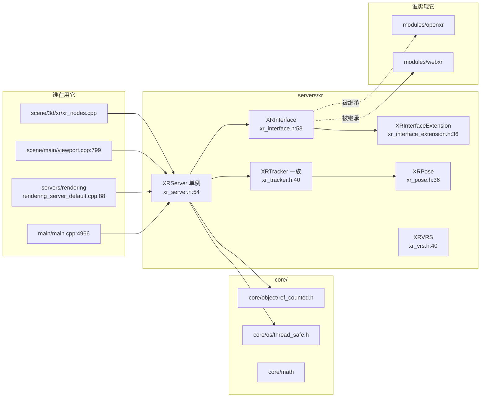
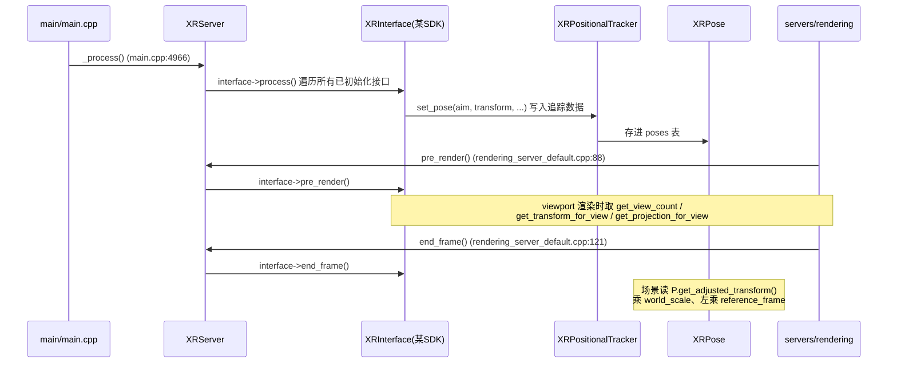

# xr（servers）

> 一句话：XR 服务器是 Godot 与各家 VR/AR SDK（OpenXR、OpenVR、OpenHMD……）之间的「总接线板 + 追踪数据中转站」，把「头戴显示器朝向哪儿、手柄在哪、手和脸长什么样」这些真实世界数据，统一翻译成引擎内部可用的姿态与关节数据。

**结论**：`servers/xr` 只做两件事——**抽象 XR 运行时**（用 `XRServer` 单例管一堆 `XRInterface` 胶水对象）和**承接追踪数据**（用 `XRTracker` 一族 + `XRPose` 存 SDK 喂进来的姿态/输入），代价是它本身不实现任何 SDK、不碰渲染细节，具体 SDK 的落地在 `modules/`（如 `modules/openxr`）里。

## 是什么 / 不是什么

这个模块是**运行时抽象层 + 追踪数据容器**，不是 SDK 实现。它负责：统一注册/选择 XR 接口、按帧驱动接口更新、存追踪姿态并按世界缩放/参考帧换算。它不负责：某个具体 SDK 的初始化与图形提交（那是 `modules/openxr` 等子类的事）、也不负责场景里的 `XROrigin3D` 节点行为（那是 `scene/3d/xr/xr_nodes.cpp` 的事，它只是反过来读这里的 `XRServer`）。

换句话说：`servers/xr` 是「插座和管道」，`modules/openxr` 是「插头」，`scene/3d/xr` 是「用电的电器」。三者分层，别混。

## 在引擎里的位置

阅读方向：`XRServer`（中央单例）左手牵着 `core/` 的引用计数和线程安全，右手管着 `XRInterface` 数组和 `XRTracker` 字典；渲染/主循环/场景节点都通过 `XRServer::get_singleton()` 进来取数据。

## 关键概念

- **接口（胶水）**：`XRInterface`（`xr_interface.h:53`）是「Godot 与某个 SDK 之间的黏合剂」。它声明了一堆纯虚函数——`initialize()`（`xr_interface.h:110`）、`get_view_count()`（`:140`）、`get_transform_for_view()`（`:143`）、`get_projection_for_view()`（`:144`）。每个 SDK 子类填这些空位，自己不当数据源。`XRInterfaceExtension`（`xr_interface_extension.h:36`）把它变成 GDExtension 可继承的类，虚函数全包一层 `_xxx` 供脚本覆写。
- **服务器（接线板）**：`XRServer`（`xr_server.h:54`）是唯一入口。它存一个 `LocalVector<Ref<XRInterface>> interfaces` 和 `Dictionary trackers`（`xr_server.h:88-89`），另指定一个 `primary_interface`（`:91`）供渲染用。脚本里 `XR` 就是它的别名（`xr_server.h:230`）。
- **追踪器（数据容器）**：`XRTracker`（`xr_tracker.h:40`）是所有追踪器的公共基类，只带「类型 + 名字 + 描述」。`XRPositionalTracker`（`xr_positional_tracker.h:44`）在其上加两张表：`HashMap<StringName, Ref<XRPose>> poses` 和 `HashMap<StringName, Variant> inputs`（`:60-61`），姿态和按键输入都挂这里。
- **姿态（一帧的数据快照）**：`XRPose`（`xr_pose.h:36`）是「某个命名姿态的一次测量值」——`transform` + 线速度 + 角速度 + `TrackingConfidence`（`xr_pose.h:41`）。`get_adjusted_transform()`（`xr_pose.cpp:90`）在读出时乘上 `world_scale`、左乘 `reference_frame`，把 SDK 原始坐标换算到游戏世界。
- **追踪类型（分类标签）**：`XRServer::TrackerType`（`xr_server.h:65`）用位掩码给追踪器分类：`TRACKER_HEAD`/`TRACKER_CONTROLLER`/`TRACKER_ANCHOR`/`TRACKER_HAND`/`TRACKER_BODY`/`TRACKER_FACE`…… 它决定了 `XRBodyTracker`、`XRHandTracker`、`XRFaceTracker` 这些子类分别负责哪种数据。

## 核心文件（按阅读顺序）

1. `servers/xr/SCsub` — 编译开关，仅当未定义 `disable_xr` 时把 `*.cpp` 加进 `servers_sources`。
2. `servers/xr/xr_server.h` — 中央单例 `XRServer`：接口/追踪器管理、世界缩放、参考帧、每帧驱动入口。
3. `servers/xr/xr_interface.h` — `XRInterface` 抽象基类，定义 SDK 必须实现的全部虚函数。
4. `servers/xr/xr_interface_extension.h` — `XRInterfaceExtension`，把接口开放给脚本/GDExtension 覆写。
5. `servers/xr/xr_tracker.h` / `xr_positional_tracker.h` — 追踪器基类与「姿态 + 输入」版追踪器。
6. `servers/xr/xr_pose.h` — 单个姿态的 transform/速度/置信度。
7. `servers/xr/xr_controller_tracker.h` / `xr_body_tracker.h` / `xr_hand_tracker.h` / `xr_face_tracker.h` — 四种具体追踪器：手柄（空子类，仅设类型）、全身关节、手关节、表情 blend shape。
8. `servers/xr/xr_vrs.h` — `XRVRS`，为立体渲染生成 VRS（变速率着色）贴图的辅助类。

## 数据流 / 调用链

一帧里，XR 数据这样流动：

三个驱动点分工明确：`_process()`（`main/main.cpp:4966`）在主循环最前更新输入/手柄数据；`pre_render()`（`rendering_server_default.cpp:88`）在画 viewport 前更新定位数据（很多 SDK 在这里做预测同步）；`end_frame()`（`:121`）在 Vulkan 队列提交后收尾。

## 中文口诀

- 一个单例管接口，接口后面是 SDK。
- 追踪器存姿态，姿态里藏速度和置信。
- 世界缩放乘坐标，参考帧把原点搬。
- 主循环更新输入，渲染前再校定位。
- 场景节点别硬读，先走服务器拿接口。

## 练习（15 分钟）

1. 打开 `servers/xr/xr_server.h`，找到 `TrackerType` 枚举，数一数一共定义了几种追踪器类型（含 `TRACKER_UNKNOWN`）。
2. 在 `xr_positional_tracker.h` 里找到 `set_pose` 的完整签名，写出它的 5 个参数各是什么。
3. 打开 `servers/rendering/rendering_server_default.cpp` 第 88 行附近，确认 `pre_render()` 和 `end_frame()` 各在渲染的什么阶段被调用。
4. 用 grep 搜 `get_adjusted_transform`，看它除了 `servers/xr` 内部，还被哪些 scene 节点调用。

## 自测

- [ ] `XRServer` 是 `Object` 还是 `RefCounted` 的子类？`XRInterface`、`XRPose`、`XRTracker` 呢？
- [ ] `XRPose::get_adjusted_transform()` 对 transform 依次做了哪两步换算？
- [ ] `XRPositionalTracker` 和 `XRTracker` 相比，多存了哪两张表？
- [ ] `XRFaceTracker` 和 `XRHandTracker` 都继承自 `XRPositionalTracker` 吗？为什么表情追踪器不需要「位置」？

## 一句话总结

> `servers/xr` 是 XR 的「总接线板」：用 `XRServer` 单例抽象运行时、用 `XRInterface` 抽象 SDK、用 `XRTracker` + `XRPose` 承接追踪数据，其余交给 modules 和 scene 两层。
